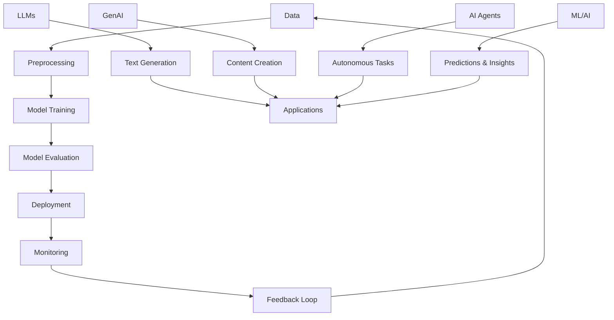
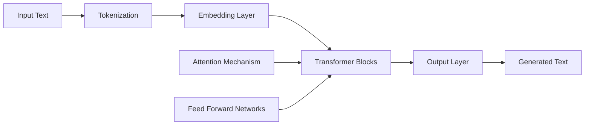

# GenAI Learning Repository

## Introduction

Welcome to the **GenAI Learning Repository**! This repository is designed as a comprehensive resource for developers interested in exploring and mastering Generative AI (GenAI), Large Language Models (LLMs), AI Agents, Machine Learning (ML), and Artificial Intelligence (AI) concepts. From a developer's perspective, this repo focuses on practical implementations, code examples, best practices, and hands-on projects to help you build, deploy, and integrate AI-powered applications.

Whether you're a beginner looking to understand the fundamentals or an experienced developer aiming to implement cutting-edge AI solutions, this repository provides structured notes, tutorials, and code snippets tailored for developers. All content is presented in Markdown files for easy reading and reference.

## Learning Objectives

By the end of this learning journey, you will be able to:
- Understand the core concepts of LLMs, GenAI, and AI agents
- Implement basic to advanced AI models using popular frameworks
- Build and deploy AI-powered applications
- Integrate AI agents into software systems
- Apply machine learning techniques in real-world scenarios
- Follow best practices for AI development and deployment

## Topics Covered

This repository covers the following key areas:

1. **Large Language Models (LLMs)**: Fundamentals, architectures, fine-tuning, and applications
2. **Generative AI (GenAI)**: Techniques for generating text, images, and other content
3. **AI Agents**: Building autonomous agents, multi-agent systems, and agent frameworks
4. **Machine Learning (ML) and AI**: Core ML concepts, deep learning, and AI integration
5. **Practical Projects**: Hands-on implementations and case studies
6. **Tools and Frameworks**: Popular libraries, APIs, and development tools

## Repository Structure

The repository is organized as follows:

- `README.md`: This main file providing an overview and introduction
- `notes/`: Directory containing detailed notes on various topics
  - `ai.md`: Notes on Artificial Intelligence
  - `supervised-learning.md`: Comprehensive guide to supervised learning algorithms
  - `large-ai-models/`: Directory with detailed notes on Large AI Models
    - `index.md`: Overview and index of large AI models
    - `architecture-nodes.md`: Building blocks and layers for neural networks
    - `rnn.md`: Recurrent Neural Networks
    - `lstm.md`: Long Short-Term Memory
    - `transformers.md`: Transformer architecture
    - `variational-autoencoders.md`: VAEs for generative modeling
    - `waveform-models.md`: WaveNet, WaveRNN, WaveGlow
    - `siamese-networks.md`: Similarity learning networks
    - `cnn.md`: Convolutional Neural Networks
    - `yolo.md`: YOLO object detection
    - `audio-speech-models.md`: Overview of audio and speech models
    - `vision-models.md`: Overview of vision models
    - `best-practices.md`: Best practices for large AI models
- `projects/`: Directory for code examples and projects (to be created)
- `diagrams/`: Visual diagrams explaining concepts (to be created)
- `resources.md`: Additional resources, links, and references (to be created)

*Note: Topic-specific files will be created as you provide the topics. Each file will contain detailed notes from a developer's perspective, including code examples, implementation guides, and practical tips. The structure will be updated accordingly.*

## Detailed Notes and Concepts

### Large Language Models (LLMs)

Large Language Models are the backbone of modern AI applications. From a developer's standpoint, understanding LLMs involves:

- **Architecture**: Transformer-based models like GPT, BERT
- **Training and Fine-tuning**: Techniques for adapting models to specific tasks
- **Integration**: APIs and libraries for using LLMs in applications
- **Optimization**: Performance tuning and deployment strategies

### Generative AI (GenAI)

Generative AI focuses on creating new content. Developers need to grasp:

- **Text Generation**: Using models like GPT for natural language generation
- **Image and Media Generation**: Tools like DALL-E, Stable Diffusion
- **Ethical Considerations**: Bias, safety, and responsible AI development
- **Frameworks**: Hugging Face, OpenAI API, etc.

### AI Agents

AI Agents are autonomous systems that can perform tasks. Key developer aspects include:

- **Agent Design**: Planning, reasoning, and action execution
- **Frameworks**: LangChain, AutoGen for building agents
- **Multi-Agent Systems**: Coordination and communication between agents
- **Deployment**: Integrating agents into applications and workflows

### Machine Learning and AI

Core ML and AI concepts for developers:

- **Supervised Learning**: Regression, classification, decision trees, random forest ([detailed guide](notes/supervised-learning.md))
- **Unsupervised Learning**: Clustering, dimensionality reduction
- **Deep Learning**: Neural networks, CNNs, RNNs
- **Model Deployment**: Serving models in production
- **MLOps**: Best practices for ML lifecycle management

## Diagrams

### AI Ecosystem Overview

*This diagram illustrates the interconnected nature of AI technologies and the development lifecycle.*

### LLM Architecture Flow

*Understanding the flow of data through an LLM helps developers optimize and customize models.*

## Getting Started

1. Clone this repository
2. Start with the introduction notes in each topic directory
3. Follow the code examples and projects
4. Contribute by adding your own implementations or improvements

## Prerequisites

- Basic programming knowledge (Python recommended)
- Familiarity with command-line tools
- Access to cloud platforms (Google Colab, AWS, Azure) for larger models

## Contributing

This repository is open for contributions! If you have:
- Additional notes or tutorials
- Code examples
- Bug fixes or improvements
- New project ideas

Please create a pull request or open an issue.

## Resources

For additional learning:
- [OpenAI Documentation](https://platform.openai.com/docs)
- [Hugging Face Course](https://huggingface.co/course)
- [Google AI](https://ai.google/)
- [PyTorch Tutorials](https://pytorch.org/tutorials/)

## License

This repository is licensed under the MIT License. See LICENSE file for details.

---

*This README will be updated as new topics and files are added. Stay tuned for more detailed notes and projects!*
