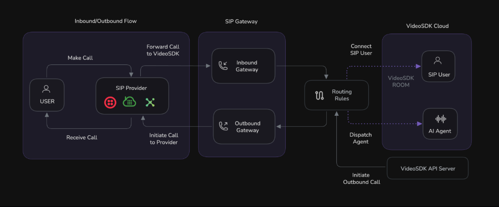

# AI Telephony Agent Quick Start (VideoSDK)

This guide walks you through creating a fully functional AI telephony agent using the VideoSDK Agent SDK. You will run the agent locally, connect it to the phone network using SIP, and handle both inbound and outbound calls.

By the end, you will have a working AI assistant you can call from any phone.

## Architecture

At a high level:

1. A phone call enters through your SIP provider (for example Twilio, Vonage, Telnyx, Plivo, Exotel).
2. The call is forwarded to VideoSDK telephony infrastructure.
3. A VideoSDK Routing Rule dispatches the call to your self-hosted AI agent (`MyTelephonyAgent`).
4. Your Python agent processes audio and responds in real time.





## What You Will Build

This project uses the following files:

```text
.
|-- main.py            # Core AI voice agent logic
|-- requirements.txt   # Python dependencies
`-- .env               # Secret credentials
```

## Prerequisites

- Python 3.12+
- A VideoSDK account and token (`VIDEOSDK_AUTH_TOKEN`)
- A Google API key (`GOOGLE_API_KEY`) for Gemini realtime voice
- A SIP provider phone number (for example Twilio/Vonage/Telnyx/Plivo/Exotel)

## Part 1: Build and Run Locally

### 1) Configure environment variables

Create `.env` in this folder:

```env
VIDEOSDK_AUTH_TOKEN="your_videosdk_token_here"
GOOGLE_API_KEY="your_google_api_key_here"
```

### 2) Install dependencies

Your `requirements.txt` should contain:

```txt
videosdk-agents
videosdk-plugins-google
python-dotenv
```

Create and activate a virtual environment, then install packages.

Linux/macOS:

```bash
python3 -m venv .venv
source .venv/bin/activate
pip install -r requirements.txt
```

Windows PowerShell:

```powershell
python -m venv .venv
.\.venv\Scripts\Activate.ps1
pip install -r requirements.txt
```

### 3) Run the agent

```bash
python main.py
```

Keep this terminal open. The process must stay running to receive routed calls.

## Part 2: Connect to the Phone Network

### 1) Configure an inbound gateway (VideoSDK)

In VideoSDK Dashboard:

1. Open `Telephony > Inbound Gateways`.
2. Click `Add` and create a gateway using your SIP number.
3. Copy the generated `Inbound Gateway URL`.

In your SIP provider dashboard:

1. Open the purchased phone number settings.
2. Paste the Inbound Gateway URL into the Origination SIP URI field.

This forwards inbound PSTN/SIP calls to VideoSDK.

### 2) Configure an outbound gateway (VideoSDK)

In VideoSDK Dashboard:

1. Open `Telephony > Outbound Gateways`.
2. Click `Add`.
3. Enter your SIP provider Termination SIP URI and credentials.

This allows your agent to place external outbound calls.

### 3) Create a routing rule

In VideoSDK Dashboard:

1. Open `Telephony > Routing Rules`.
2. Click `Add` and configure:
	 - Gateway: your inbound gateway
	 - Numbers: the phone number attached to that gateway
	 - Dispatch: `Agent`
	 - Agent Type: `Self Hosted`
	 - Agent ID: `MyTelephonyAgent`
3. Save the rule.

`Agent ID` must exactly match the value in `main.py`:

```python
agent_id="MyTelephonyAgent"
```

## Part 3: Test Calls

### Inbound call test

1. Make sure `python main.py` is still running.
2. Dial your SIP phone number.
3. The agent should answer and say:
	 `Hello! I'm your real-time assistant. How can I help you today?`
4. Speak normally and verify real-time responses.

### Outbound call test

Trigger an outbound call using VideoSDK API:

```bash
curl --request POST \
	--url https://api.videosdk.live/v2/sip/call \
	--header 'Authorization: YOUR_VIDEOSDK_TOKEN' \
	--header 'Content-Type: application/json' \
	--data '{
		"gatewayId": "gw_123456789",
		"sipCallTo": "+14155550123"
	}'
```

Replace:

- `YOUR_VIDEOSDK_TOKEN` with your VideoSDK token
- `gw_123456789` with your configured outbound gateway ID
- `+14155550123` with the destination phone number

## Geographic Optimization

Run your self-hosted agent in a region close to your SIP provider to reduce latency and improve call quality.

Examples:

- US East for many Twilio workloads
- US West for many Telnyx workloads
- Europe for many Plivo workloads

## Troubleshooting

- No inbound calls reaching agent:
	- Verify SIP provider Origination SIP URI points to your VideoSDK inbound gateway URL.
	- Verify routing rule number and gateway match.
	- Verify `agent_id` in routing rule equals `MyTelephonyAgent`.
- Agent starts but does not speak:
	- Confirm `GOOGLE_API_KEY` is valid in `.env`.
	- Reinstall dependencies from `requirements.txt`.
- Outbound call fails:
	- Confirm outbound gateway credentials and SIP termination URI.
	- Confirm API token and `gatewayId` are correct.

## Next Steps

- Deploy this agent to a cloud host for production uptime.
- Add call logging and analytics.
- Add domain-specific prompts and tools for your use case.

