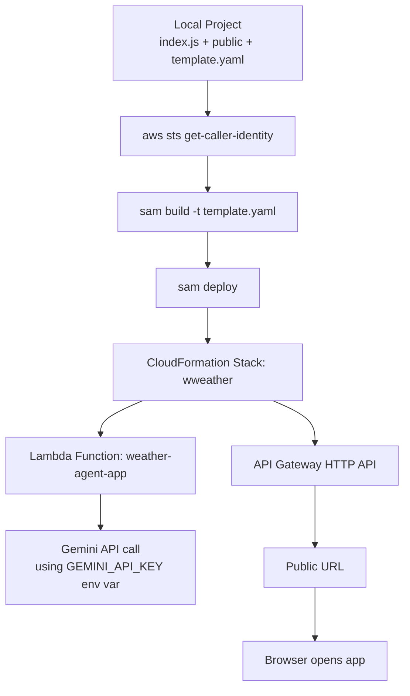
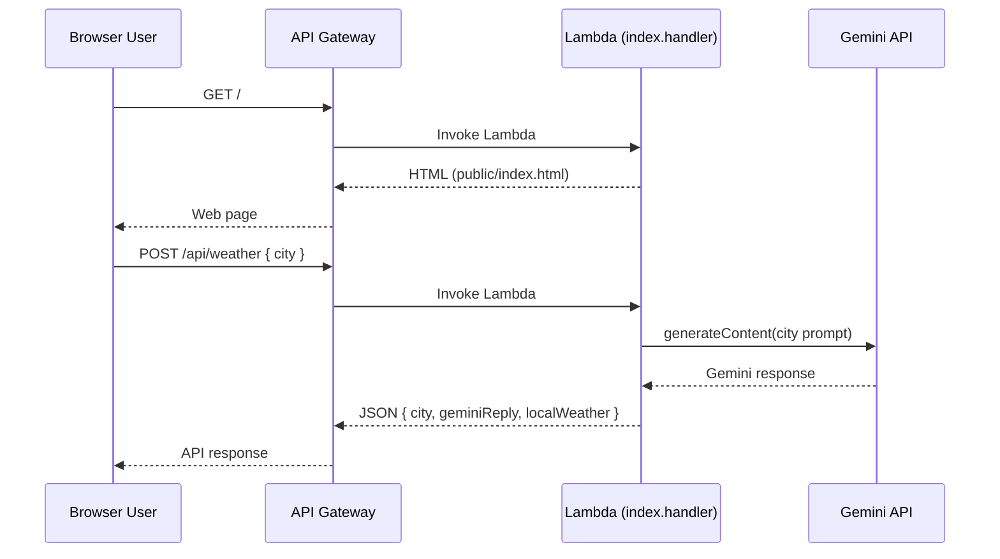

# Weather App Deployment Guide (AWS Lambda + API Gateway)

This guide deploys your project (`index.js`, `public/index.html`, `template.yaml`) to AWS using SAM.

## Deployment Flow (Diagram)



## Runtime Architecture (Diagram)



## 1) Prerequisites

- AWS CLI installed and configured.
- AWS SAM CLI installed (`sam --version` works).
- Node.js 20+.
- Valid Gemini API key.
- IAM permissions for deploy user:
  - CloudFormation
  - Lambda
  - API Gateway
  - S3 (SAM artifact uploads)
  - IAM role create/pass-role for SAM-managed roles

## 2) Verify AWS Credentials

Run:

```bash
aws sts get-caller-identity
```

Expected: JSON with `Account` and `Arn`.

If this fails with `InvalidClientTokenId`, reconfigure credentials:

```bash
aws configure
aws sts get-caller-identity
```

## 3) Configure Environment

In `ai-agents/weather/.env`:

```env
GEMINI_API_KEY=YOUR_NEW_VALID_KEY
PORT=3000
```

## 4) Build and Deploy (Recommended)

From `ai-agents/weather`:

```bash
npm install
npm run sam:build
npm run sam:deploy
```

When prompted in guided deploy:

- Stack Name: `wweather`
- Region: `ap-south-1` (or your preferred region)
- Parameter `GeminiApiKey`: paste your Gemini key
- Confirm changeset: `Y`
- Allow IAM role creation: `Y`
- Disable rollback: `N` (recommended for cleaner failures)
- Function has no authentication: `Y` (for public demo app)
- Save config: `Y`

## 5) One-Command Deploy (Already Added)

You can also use your script:

```bash
npm run deploy:aws
```

This does:

- `sam build -t template.yaml`
- `sam deploy ... --parameter-overrides GeminiApiKey=...`

## 6) Get the Deployed URL

After deploy, get API URL:

```bash
aws cloudformation describe-stacks \
  --stack-name wweather \
  --query "Stacks[0].Outputs[?OutputKey=='ApiUrl'].OutputValue" \
  --output text
```

Open that URL in browser.

## 7) Test API from Terminal

```bash
API_URL="<paste_api_url_here>"

curl "$API_URL/"

curl -X POST "$API_URL/api/weather" \
  -H "Content-Type: application/json" \
  -d '{"city":"Pune"}'
```

## 8) Update Deployment Later

If code changes:

```bash
npm run sam:build
sam deploy -t template.yaml
```

If Gemini key changes:

```bash
sam deploy -t template.yaml --parameter-overrides GeminiApiKey=NEW_KEY
```

## 9) Common Errors and Fixes

### `sam: not found`
Install SAM CLI, then verify `sam --version`.

### `InvalidClientTokenId`
AWS credentials invalid/expired:

```bash
aws configure
aws sts get-caller-identity
```

### `Security Constraints Not Satisfied`
You selected `N` for unauthenticated endpoint prompt. Re-run deploy and select `Y`.

### `Parameter GeminiApiKey` blank
Re-run deploy and provide key, or use `npm run deploy:aws` with `.env` key.

## 10) Cleanup (Optional)

```bash
aws cloudformation delete-stack --stack-name wweather
```

## Security Notes

- Rotate any Gemini key that was exposed in logs/chat.
- Do not commit `.env`.
- For production, add authentication/authorization to API Gateway.
