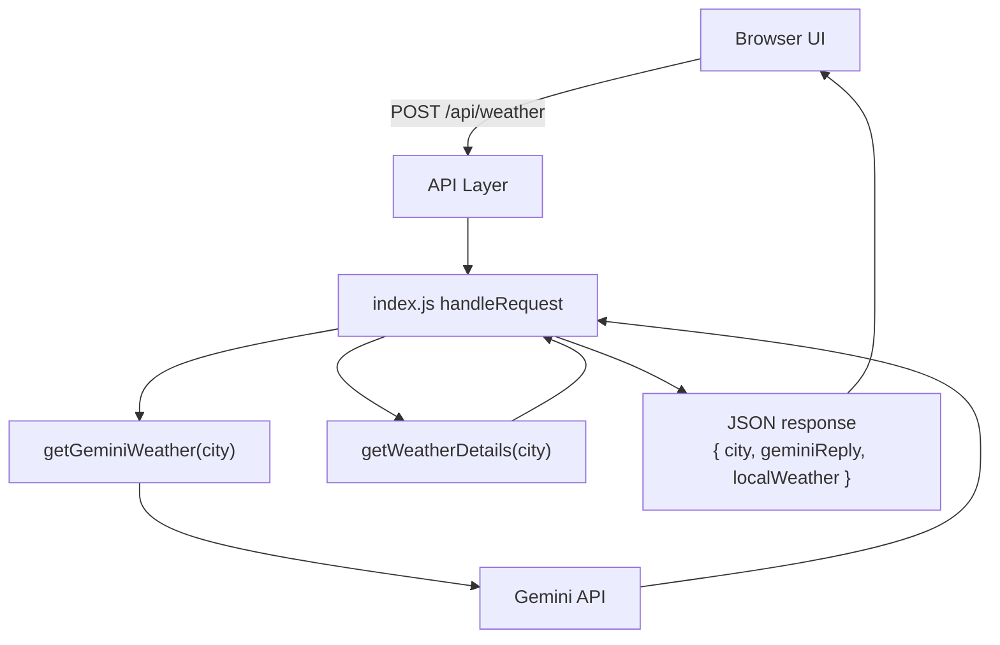
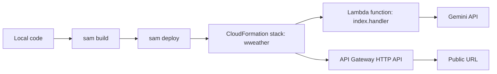

# Weather Agent Web App (Gemini + AWS Lambda)

A basic weather web application that:
- serves a frontend UI (`public/index.html`)
- accepts city input
- calls Gemini for natural-language response
- returns local tool output from a deterministic weather function
- can run both locally and on AWS Lambda (single `index.js` codebase)

## What This Project Is

This project demonstrates a practical AI agent-style workflow:
1. User asks weather for a city.
2. Backend generates an AI response via Gemini.
3. Backend also runs a local weather tool function.
4. Both outputs are returned to UI/API response.

## Tools and Technologies Used

- Runtime: Node.js 20.x
- AI SDK: `@google/genai`
- Config loader: `dotenv`
- Local server: Node `http` module
- Frontend: plain HTML/CSS/JS (`public/index.html`)
- Cloud deployment: AWS SAM + Lambda + API Gateway HTTP API
- IaC files:
  - `template.yaml` (SAM template)
  - `samconfig.toml` (SAM defaults)
  - `deploy.sh` (one-command deployment wrapper)

## Project Structure

```text
ai-agents/weather/
├── index.js                 # Core backend (local server + Lambda handler)
├── public/index.html        # Web UI
├── template.yaml            # SAM template for Lambda + API Gateway
├── samconfig.toml           # SAM CLI defaults
├── deploy.sh                # Build + deploy helper script
├── .env                     # Local secrets/config (not committed)
├── .env.example             # Safe env template
├── LAMBDA_DEPLOY.md         # Detailed SAM deployment guide
├── MANUAL_LAMBDA_DEPLOY.md  # CLI-only manual deployment guide
└── AWS_CONSOLE_DEPLOY.md    # AWS Console deployment guide
```

## Workflow Diagram



## Lambda Deployment Flow Diagram



## Core Function Code (Key Parts)

### 1) Local weather tool function

```js
function getWeatherDetails(city = "") {
  const normalized = city.trim().toLowerCase();

  if (normalized === "pune") return "The weather in Pune is currently sunny with a temperature of 25 C.";
  if (normalized === "mumbai") return "The weather in Mumbai is currently rainy with a temperature of 15 C.";
  if (normalized === "ahmedabad") return "The weather in Ahmedabad is currently cloudy with a temperature of 20 C.";

  return `Sorry, I don't have weather information for ${city}.`;
}
```

### 2) Gemini call function

```js
async function getGeminiWeather(city) {
  const prompt = [
    "You are a helpful weather assistant.",
    `User asks: What is the weather in ${city}?`,
    "Give a short 2-3 line response in plain English.",
  ].join(" ");

  const response = await client.models.generateContent({
    model: "gemini-2.5-flash",
    contents: prompt,
  });

  return response.text ?? "No response from Gemini.";
}
```

### 3) Shared request router

```js
async function handleRequest(method, pathname, parsedBody = {}) {
  if (method === "GET" && (pathname === "/" || pathname === "/index.html")) {
    const html = await fs.readFile(path.join(publicDir, "index.html"), "utf8");
    return htmlResponse(200, html);
  }

  if (method === "POST" && pathname === "/api/weather") {
    const { city } = parsedBody;
    if (!city || typeof city !== "string") return jsonResponse(400, { error: "Please provide a city name." });

    const [geminiReply, localWeather] = await Promise.all([
      getGeminiWeather(city),
      Promise.resolve(getWeatherDetails(city)),
    ]);

    return jsonResponse(200, { city, geminiReply, localWeather });
  }

  return jsonResponse(404, { error: "Route not found" });
}
```

### 4) Lambda handler entrypoint

```js
export async function handler(event) {
  const method = event?.requestContext?.http?.method || event?.httpMethod || "GET";
  const pathname = event?.rawPath || event?.path || "/";
  // parse body and delegate to handleRequest(...)
}
```

## Local Development

1. Create env file:

```bash
cp .env.example .env
```

2. Add key in `.env`:

```env
GEMINI_API_KEY=YOUR_GEMINI_API_KEY
PORT=3000
```

3. Run app:

```bash
npm install
npm start
```

4. Open URL printed in terminal.

## API Contract

### `POST /api/weather`

Request:

```json
{ "city": "Pune" }
```

Response:

```json
{
  "city": "Pune",
  "geminiReply": "...",
  "localWeather": "The weather in Pune is currently sunny with a temperature of 25 C."
}
```

## AWS Lambda Deployment (SAM)

### Quick deployment

```bash
npm run sam:build
npm run sam:deploy
```

or one command:

```bash
npm run deploy:aws
```

### Required deploy inputs

- Stack name: `wweather`
- Region: `ap-south-1` (or your preferred region)
- Parameter `GeminiApiKey`: your Gemini key
- IAM role creation: `Y`

### Get deployed URL

```bash
aws cloudformation describe-stacks \
  --stack-name wweather \
  --query "Stacks[0].Outputs[?OutputKey=='ApiUrl'].OutputValue" \
  --output text
```

For full step-by-step, see:
- `LAMBDA_DEPLOY.md`
- `MANUAL_LAMBDA_DEPLOY.md`
- `AWS_CONSOLE_DEPLOY.md`

## Common Issues

- `sam: not found`: install SAM CLI.
- `InvalidClientTokenId`: AWS credentials invalid/expired (`aws configure`, `aws sts get-caller-identity`).
- `EADDRINUSE`: local port busy; app retries with a random free port.
- Gemini `429 RESOURCE_EXHAUSTED`: free-tier quota/rate limit exceeded.

## References and Study Links

### Project Docs (This Repo)

- `README.md`: `ai-agents/weather/README.md`
- SAM deployment guide: `ai-agents/weather/LAMBDA_DEPLOY.md`
- Manual AWS CLI deployment: `ai-agents/weather/MANUAL_LAMBDA_DEPLOY.md`
- Console deployment guide: `ai-agents/weather/AWS_CONSOLE_DEPLOY.md`

### Gemini API (Official)

- API key setup: https://ai.google.dev/gemini-api/docs/api-key
- Quickstart: https://ai.google.dev/gemini-api/docs/quickstart
- SDK libraries: https://ai.google.dev/gemini-api/docs/libraries
- API reference overview: https://ai.google.dev/api
- Rate limits and quotas: https://ai.google.dev/gemini-api/docs/rate-limits
- Troubleshooting/errors: https://ai.google.dev/gemini-api/docs/troubleshooting
- Prompt best practices: https://ai.google.dev/guide/prompt_best_practices
- Google AI Studio: https://aistudio.google.com/
- JS SDK docs: https://googleapis.github.io/js-genai/
- npm package (`@google/genai`): https://www.npmjs.com/package/@google/genai

### AWS Lambda / API Gateway / SAM (Official)

- SAM CLI install: https://docs.aws.amazon.com/serverless-application-model/latest/developerguide/install-sam-cli.html
- SAM CLI manage versions: https://docs.aws.amazon.com/serverless-application-model/latest/developerguide/manage-sam-cli-versions.html
- `sam deploy` command reference: https://docs.aws.amazon.com/serverless-application-model/latest/developerguide/sam-cli-command-reference-sam-deploy.html
- SAM `HttpApi` event source property: https://docs.aws.amazon.com/serverless-application-model/latest/developerguide/sam-property-function-httpapi.html
- Lambda handler in Node.js: https://docs.aws.amazon.com/lambda/latest/dg/nodejs-handler.html
- Lambda execution role: https://docs.aws.amazon.com/lambda/latest/dg/lambda-intro-execution-role.html
- Lambda permissions overview: https://docs.aws.amazon.com/lambda/latest/dg/lambda-permissions.html
- API Gateway HTTP API + Lambda integration: https://docs.aws.amazon.com/apigateway/latest/developerguide/http-api-develop-integrations-lambda.html
- API Gateway HTTP API CORS: https://docs.aws.amazon.com/apigateway/latest/developerguide/http-api-cors.html
- AWS CLI `configure`: https://docs.aws.amazon.com/cli/latest/reference/configure/
- AWS CLI config/credentials files: https://docs.aws.amazon.com/cli/latest/userguide/cli-configure-files.html
- CloudFormation stack outputs (`describe-stacks`): https://docs.aws.amazon.com/cli/latest/reference/cloudformation/describe-stacks.html

### Node.js / Runtime Docs

- Node HTTP module (`node:http`): https://nodejs.org/download/release/v20.18.1/docs/api/http.html
- Node URL module (`node:url`): https://nodejs.org/docs/latest-v20.x/api/url.html
- Node Path module (`node:path`): https://nodejs.org/download/release/latest-v20.x/docs/api/path.html
- Node process/env docs: https://nodejs.org/download/release/v20.18.2/docs/api/process.html
- Node env file guide: https://nodejs.org/en/learn/command-line/how-to-read-environment-variables-from-nodejs
- npm `dotenv`: https://www.npmjs.com/package/dotenv

### Diagram and Markdown (for docs)

- Mermaid syntax reference: https://mermaid.js.org/intro/syntax-reference.html
- Mermaid flowcharts: https://mermaid.js.org/syntax/flowchart.html
- Mermaid sequence diagrams: https://mermaid.js.org/syntax/sequenceDiagram.html

## Security Notes

- Never commit real API keys.
- `.env` is ignored via `.gitignore`.
- If a key was exposed, rotate it immediately.
