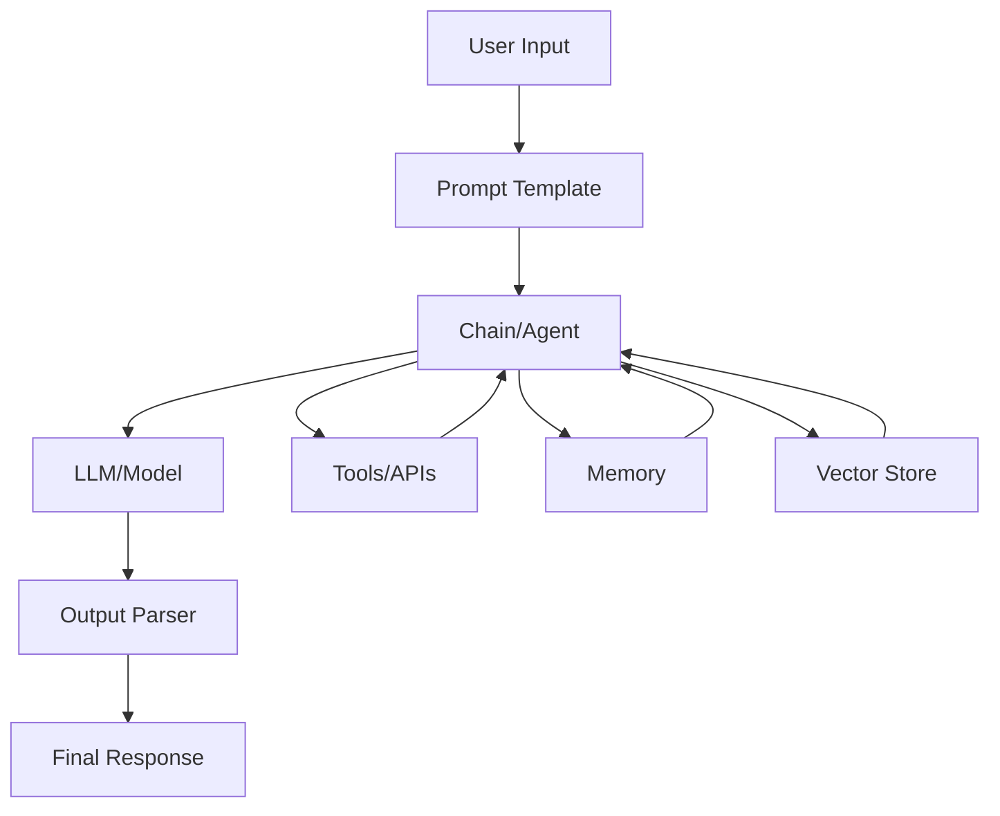
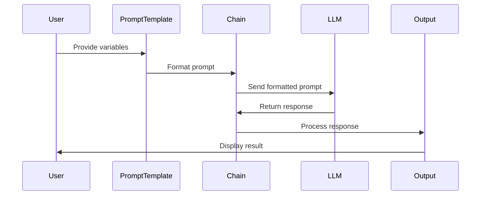
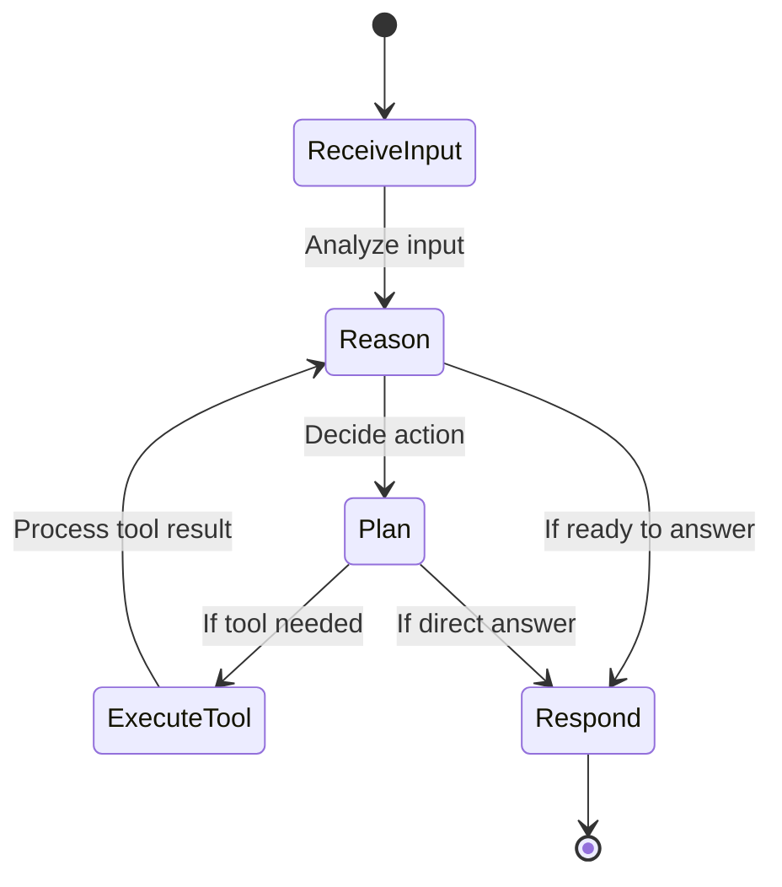
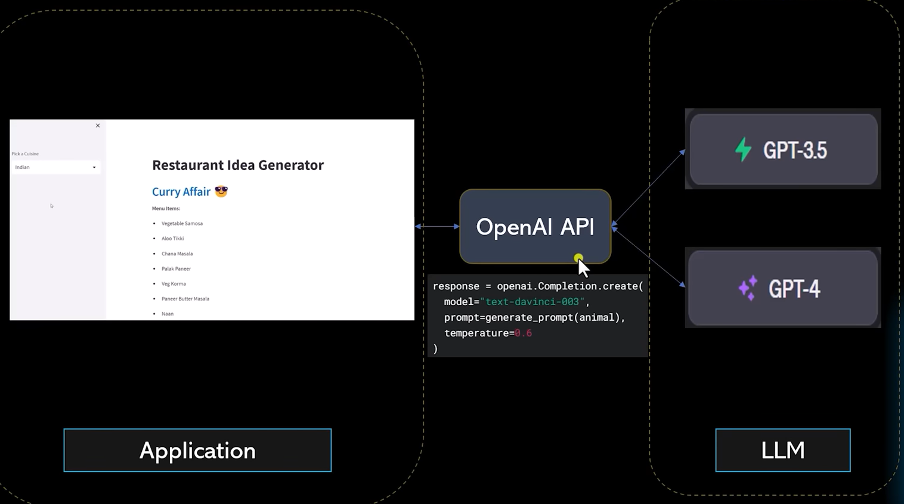
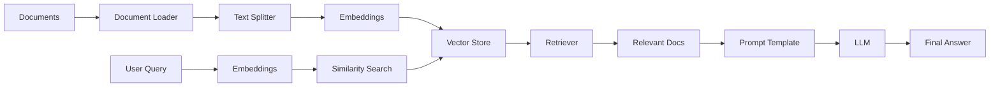

# LangChain Learning Notes

## Introduction to LangChain

LangChain is an open-source framework designed to simplify the development of applications powered by large language models (LLMs). It provides a modular architecture that allows developers to build complex AI applications by chaining together different components like prompts, models, and data sources.

### Why LangChain?
- **Modularity**: Break down complex AI workflows into reusable components
- **Integration**: Connect LLMs with external data sources, APIs, and tools
- **Flexibility**: Support for multiple LLM providers (OpenAI, Hugging Face, etc.)
- **Production-Ready**: Built for scalable, real-world applications

## LangChain Architecture and Workflows

### Overall Architecture


**Workflow Explanation:**
1. User provides input to the system
2. Input is formatted using a Prompt Template
3. The Chain or Agent processes the formatted prompt
4. The LLM generates a response
5. Output Parser structures the response if needed
6. Final response is returned to user
7. Tools/APIs can be called by agents for additional functionality
8. Memory maintains conversation state
9. Vector Stores enable retrieval-augmented generation

### Basic Chain Workflow


### Agent Workflow




### RAG (Retrieval-Augmented Generation) Pipeline


## Core Concepts

### 1. Chains
Chains are the fundamental building blocks of LangChain. They represent sequences of operations that process inputs through multiple steps.

**Types of Chains:**
- **LLMChain**: Basic chain that takes input, formats it with a prompt, and passes it to an LLM
- **SequentialChain**: Chains multiple chains together in sequence
- **RouterChain**: Routes inputs to different chains based on conditions

### 2. Agents
Agents are dynamic chains that can make decisions about which tools to use based on the input. They combine reasoning with action.

**Key Components:**
- **Tools**: Functions that agents can call (e.g., search, calculator, API calls)
- **Toolkits**: Collections of related tools
- **Agent Types**: ReAct, OpenAI Functions, etc.

### 3. Memory
Memory allows chains and agents to maintain state across multiple interactions.

**Types of Memory:**
- **ConversationBufferMemory**: Stores entire conversation history
- **ConversationSummaryMemory**: Summarizes conversation to save space
- **ConversationBufferWindowMemory**: Keeps only recent messages

### 4. Prompts
Prompts are templates that format inputs for LLMs.

**Features:**
- **Prompt Templates**: Reusable templates with variables
- **Few-Shot Prompting**: Include examples in prompts
- **Output Parsers**: Structure LLM outputs

### 5. Indexes and Retrievers
For working with large datasets and implementing Retrieval-Augmented Generation (RAG).

**Components:**
- **Document Loaders**: Load data from various sources (PDF, web, databases)
- **Text Splitters**: Break documents into manageable chunks
- **Vector Stores**: Store and search embeddings (Pinecone, FAISS, etc.)
- **Retrievers**: Fetch relevant documents based on queries

## Installation

```bash
pip install langchain
```

For specific integrations:
```bash
pip install langchain[all]  # All integrations
pip install langchain[openai]  # OpenAI integration
pip install langchain[huggingface]  # Hugging Face integration
```

## Basic Examples

### 1. Simple LLM Chain

```python
# Import necessary modules from LangChain
from langchain.llms import OpenAI  # For OpenAI LLM integration
from langchain.prompts import PromptTemplate  # For creating reusable prompt templates
from langchain.chains import LLMChain  # For creating chains that combine prompts and LLMs

# Initialize the OpenAI LLM with a temperature setting
# Temperature controls randomness: 0.0 = deterministic, 1.0 = very random
llm = OpenAI(temperature=0.7)

# Create a prompt template with a placeholder variable
# This template will be filled with actual values when the chain runs
prompt = PromptTemplate(
    input_variables=["topic"],  # List of variables that will be substituted
    template="Explain {topic} in simple terms."  # The template string with placeholders
)

# Create an LLMChain that combines the prompt template and the LLM
# This chain will format the prompt and send it to the LLM
chain = LLMChain(llm=llm, prompt=prompt)

# Run the chain with a specific topic
# This substitutes "machine learning" into the template and gets a response
result = chain.run("machine learning")

# Print the result to see the LLM's explanation
print(result)
```

### 2. Conversation with Memory

```python
# Import memory and conversation chain modules
from langchain.memory import ConversationBufferMemory  # Stores full conversation history
from langchain.chains import ConversationChain  # Pre-built chain for conversations

# Create a memory object to store conversation history
# This allows the LLM to remember previous messages in the conversation
memory = ConversationBufferMemory()

# Create a conversation chain with the LLM, memory, and verbose output
# Verbose=True will show detailed information about what's happening
conversation = ConversationChain(
    llm=llm,  # The language model to use
    memory=memory,  # The memory system to maintain conversation state
    verbose=True  # Enable detailed logging
)

# Start the conversation with an initial message
# The chain will remember this and use it for context in future responses
conversation.predict(input="Hi, I'm learning about AI.")

# Continue the conversation - the LLM will remember the previous message
# This creates a natural, contextual conversation flow
conversation.predict(input="What are the main types of machine learning?")
```

### 3. Using Tools with Agents

```python
# Import agent and tool-related modules
from langchain.agents import initialize_agent, Tool  # For creating agents and defining tools
from langchain.tools import DuckDuckGoSearchRun  # A pre-built tool for web searching

# Create an instance of the search tool
# This tool can perform web searches using DuckDuckGo
search = DuckDuckGoSearchRun()

# Define a list of tools that the agent can use
# Each tool has a name, function, and description for the agent to understand its purpose
tools = [
    Tool(
        name="Search",  # Human-readable name for the tool
        func=search.run,  # The actual function to call when using this tool
        description="Useful for searching the web"  # Description to help agent decide when to use it
    )
]

# Initialize an agent with the tools, LLM, and agent type
# "zero-shot-react-description" means the agent can use tools without prior examples
agent = initialize_agent(
    tools,  # List of available tools
    llm,  # The language model for reasoning
    agent="zero-shot-react-description",  # Agent type that can reason and act
    verbose=True  # Show detailed execution steps
)

# Run the agent with a query that requires tool use
# The agent will decide to use the search tool and then provide an answer
result = agent.run("What is the capital of France?")

# The result will include the agent's reasoning and the final answer
print(result)
```

## Advanced Features

### 1. Custom Chains
Create your own chains by inheriting from `Chain` class.

```python
# Import base Chain class and typing hints
from langchain.chains.base import Chain  # Base class for all chains
from typing import Dict, List  # Type hints for better code clarity

# Define a custom chain class that inherits from Chain
class CustomChain(Chain):
    # Define input keys that this chain expects
    @property
    def input_keys(self) -> List[str]:
        return ["input"]  # This chain expects an "input" key

    # Define output keys that this chain will produce
    @property
    def output_keys(self) -> List[str]:
        return ["output"]  # This chain will output an "output" key

    # Implement the core logic of the chain
    def _call(self, inputs: Dict[str, str]) -> Dict[str, str]:
        # Your custom logic here - this is where you process the input
        # For this example, we just prepend "Processed:" to the input
        processed_output = f"Processed: {inputs['input']}"
        # Return a dictionary with the expected output key
        return {"output": processed_output}

# Usage example:
# custom_chain = CustomChain()
# result = custom_chain({"input": "Hello World"})
# print(result["output"])  # Output: "Processed: Hello World"
```

### 2. Retrieval-Augmented Generation (RAG)

```python
# Import modules for document processing and RAG
from langchain.document_loaders import TextLoader  # Load text documents
from langchain.text_splitter import CharacterTextSplitter  # Split text into chunks
from langchain.vectorstores import FAISS  # Vector database for similarity search
from langchain.embeddings import OpenAIEmbeddings  # Convert text to embeddings
from langchain.chains import RetrievalQA  # Chain for question-answering with retrieval

# Step 1: Load documents from a file
loader = TextLoader("your_document.txt")  # Create a loader for text files
documents = loader.load()  # Load the document content

# Step 2: Split the document into smaller chunks for processing
text_splitter = CharacterTextSplitter(
    chunk_size=1000,  # Maximum size of each chunk in characters
    chunk_overlap=0  # No overlap between chunks
)
docs = text_splitter.split_documents(documents)  # Split the loaded documents

# Step 3: Create embeddings for the document chunks
embeddings = OpenAIEmbeddings()  # Initialize embedding model
vectorstore = FAISS.from_documents(docs, embeddings)  # Create vector store from docs

# Step 4: Create a retrieval-based QA chain
qa_chain = RetrievalQA.from_chain_type(
    llm=llm,  # Language model for generating answers
    chain_type="stuff",  # Method for combining retrieved docs with question
    retriever=vectorstore.as_retriever()  # Retriever to find relevant documents
)

# Step 5: Ask a question and get an answer based on the document
result = qa_chain.run("What is the main topic of the document?")
print(result)  # The answer will be generated using retrieved context
```

### 3. Streaming and Async
LangChain supports streaming responses and async operations for better performance.

```python
# Streaming example - get responses in real-time chunks
# This is useful for long responses or real-time user experience
for chunk in chain.stream({"topic": "AI"}):
    print(chunk, end="")  # Print each chunk as it arrives

# Async example - run chains asynchronously for better performance
import asyncio  # For asynchronous programming

# Define an async function to run the chain
async def run_async():
    # Use arun() for async execution of the chain
    result = await chain.arun({"topic": "AI"})
    print(result)  # Print the final result

# Run the async function
asyncio.run(run_async())
```

## Best Practices

1. **Error Handling**: Always wrap LLM calls in try-except blocks
2. **Rate Limiting**: Implement rate limiting for API calls
3. **Cost Management**: Monitor token usage, especially with paid APIs
4. **Security**: Never expose API keys in client-side code
5. **Testing**: Use mock LLMs for unit testing
6. **Version Control**: Keep track of prompt versions
7. **Monitoring**: Log chain executions for debugging

## Common Use Cases

- **Chatbots**: Build conversational AI with memory
- **Question Answering**: RAG systems for document Q&A
- **Code Generation**: AI-powered coding assistants
- **Data Analysis**: Natural language interfaces for databases
- **Content Creation**: Automated writing and summarization
- **Research**: Literature review and information synthesis

## Resources

- [Official Documentation](https://python.langchain.com/)
- [GitHub Repository](https://github.com/langchain-ai/langchain)
- [Discord Community](https://discord.gg/langchain)
- [LangChain Hub](https://smith.langchain.com/hub) - Prompt templates and chains
- [Cookbook](https://python.langchain.com/docs/guides/cookbook/) - Practical examples

## Next Steps

1. Experiment with basic chains
2. Try building a simple chatbot
3. Implement RAG for document Q&A
4. Explore different LLM providers
5. Build custom tools and agents
6. Deploy your first LangChain application

Remember: LangChain is evolving rapidly. Stay updated with the latest releases and best practices!