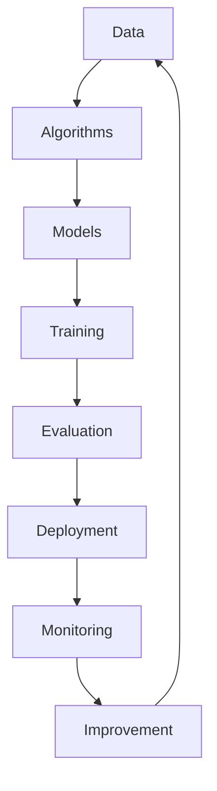
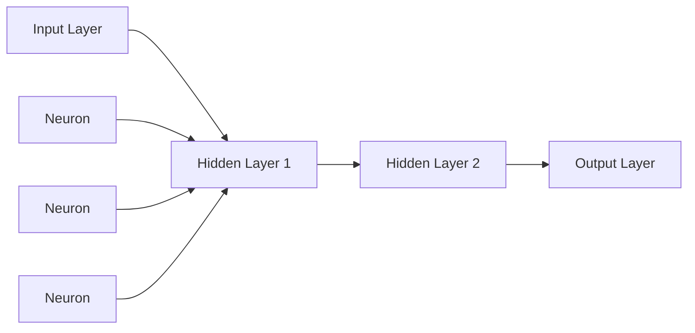

# Artificial Intelligence (AI) - Developer Notes

## Introduction

Artificial Intelligence (AI) is a broad field encompassing the development of systems that can perform tasks that typically require human intelligence. From a developer's perspective, AI involves creating algorithms, models, and applications that can learn, reason, perceive, and make decisions. This document provides a comprehensive overview of AI concepts, focusing on practical implementation and development aspects.

### Hinglish Explanation
AI ka matlab hai Artificial Intelligence, jo ek broad field hai jismein hum machines ko human intelligence jaisa behavior dilaate hain. Developer ke perspective se, yeh algorithms, models aur applications banana hota hai jo learn kar sakein, reason kar sakein, perceive (samajh) kar sakein aur decisions le sakein. Yeh document AI concepts ka overview deta hai, focus practical implementation aur development aspects pe.

## What is AI?

AI refers to the simulation of human intelligence in machines that are programmed to think like humans and mimic their actions. Key characteristics include:

- **Learning**: Ability to improve performance over time
- **Reasoning**: Making logical deductions and decisions
- **Perception**: Interpreting sensory inputs
- **Problem-solving**: Finding solutions to complex problems
- **Language understanding**: Processing and generating human language

### Hinglish Explanation
AI ka matlab hai human intelligence ka simulation in machines, jo programmed hote hain humans ki tarah sochne aur actions mimic karne ke liye. Key characteristics hain:

- **Learning**: Time ke saath performance improve karne ki ability
- **Reasoning**: Logical deductions aur decisions lena
- **Perception**: Sensory inputs ko interpret karna
- **Problem-solving**: Complex problems ke solutions dhundhna
- **Language understanding**: Human language ko process aur generate karna

## Types of AI

### 1. Narrow AI (Weak AI)
- Designed for specific tasks
- Most common type in current applications
- Examples: Voice assistants, recommendation systems, image recognition

### 2. General AI (Strong AI)
- Hypothetical AI with human-like intelligence
- Can perform any intellectual task a human can
- Not yet achieved, but goal of AGI research

### 3. Superintelligent AI
- AI that surpasses human intelligence in all domains
- Theoretical concept with significant ethical implications

### Hinglish Explanation
AI ke types hain:

### 1. Narrow AI (Weak AI)
- Specific tasks ke liye design kiya gaya
- Current applications mein sabse common type
- Examples: Voice assistants, recommendation systems, image recognition

### 2. General AI (Strong AI)
- Hypothetical AI jo human-like intelligence rakhta hai
- Koi bhi intellectual task kar sakta hai jo human kar sakta hai
- Abhi tak achieve nahi hua, par AGI research ka goal

### 3. Superintelligent AI
- AI jo saare domains mein human intelligence se zyada hai
- Theoretical concept with significant ethical implications

## AI Development Fundamentals

### Core Components



### Key Technologies

1. **Machine Learning (ML)**: Algorithms that learn from data
2. **Deep Learning**: Neural networks with multiple layers
3. **Natural Language Processing (NLP)**: Understanding and generating human language
4. **Computer Vision**: Interpreting visual information
5. **Robotics**: Physical systems with AI capabilities

### Hinglish Explanation
AI Development ke fundamentals mein core components hain: Data se shuru, algorithms, models, training, evaluation, deployment, monitoring aur improvement. Yeh ek cycle hai.

Key technologies:
1. **Machine Learning (ML)**: Data se learn karne wale algorithms
2. **Deep Learning**: Multiple layers wale neural networks
3. **Natural Language Processing (NLP)**: Human language ko understand aur generate karna
4. **Computer Vision**: Visual information ko interpret karna
5. **Robotics**: Physical systems with AI capabilities

## Machine Learning Basics

### Supervised Learning
- Uses labeled data to train models
- Predicts outcomes based on input features
- Examples: Classification, Regression

```python
# Example: Simple Linear Regression with scikit-learn
from sklearn.linear_model import LinearRegression
from sklearn.model_selection import train_test_split
import numpy as np

# Sample data
X = np.array([[1], [2], [3], [4], [5]])
y = np.array([2, 4, 6, 8, 10])

# Split data
X_train, X_test, y_train, y_test = train_test_split(X, y, test_size=0.2)

# Train model
model = LinearRegression()
model.fit(X_train, y_train)

# Make prediction
prediction = model.predict([[6]])
print(f"Prediction for x=6: {prediction[0]}")
```

### Unsupervised Learning
- Finds patterns in unlabeled data
- Clustering, dimensionality reduction
- Examples: K-means clustering, PCA

### Reinforcement Learning
- Learns through trial and error
- Agent-environment interaction
- Examples: Game playing, robotics

### Hinglish Explanation
Machine Learning Basics:

**Supervised Learning**: Labeled data use karta hai models train karne ke liye. Input features ke basis pe outcomes predict karta hai. Examples: Classification, Regression. Code mein linear regression ka example hai.

**Unsupervised Learning**: Unlabeled data mein patterns dhundhta hai. Clustering, dimensionality reduction. Examples: K-means, PCA.

**Reinforcement Learning**: Trial and error se learn karta hai. Agent aur environment ke interaction se. Examples: Games, robotics.

## Deep Learning Concepts

### Neural Networks



### Popular Architectures

1. **Convolutional Neural Networks (CNNs)**: Image processing
2. **Recurrent Neural Networks (RNNs)**: Sequential data
3. **Transformers**: Attention-based models for NLP

### Hinglish Explanation
Deep Learning Concepts:

**Neural Networks**: Layers se bane hote hain - Input, Hidden, Output. Diagram mein flowchart hai.

**Popular Architectures**:
1. **CNNs**: Image processing ke liye
2. **RNNs**: Sequential data ke liye
3. **Transformers**: NLP ke liye attention-based models

## AI Development Workflow

### 1. Problem Definition
- Clearly define the AI problem
- Identify data requirements
- Set success metrics

### 2. Data Collection and Preparation
- Gather relevant data
- Clean and preprocess data
- Feature engineering

### 3. Model Selection and Training
- Choose appropriate algorithm
- Train model on prepared data
- Hyperparameter tuning

### 4. Evaluation and Validation
- Test model performance
- Cross-validation techniques
- Metrics: Accuracy, Precision, Recall, F1-score

### 5. Deployment and Monitoring
- Deploy model to production
- Monitor performance
- Retrain as needed

### Hinglish Explanation
AI Development Workflow:

1. **Problem Definition**: AI problem ko clearly define karo, data requirements identify karo, success metrics set karo
2. **Data Collection and Preparation**: Relevant data gather karo, clean aur preprocess karo, feature engineering karo
3. **Model Selection and Training**: Appropriate algorithm choose karo, prepared data pe train karo, hyperparameter tuning karo
4. **Evaluation and Validation**: Model performance test karo, cross-validation use karo, metrics check karo (Accuracy, Precision, etc.)
5. **Deployment and Monitoring**: Production mein deploy karo, performance monitor karo, retrain as needed

## Popular AI Frameworks and Libraries

### Python Ecosystem
- **TensorFlow**: Google's ML framework
- **PyTorch**: Facebook's deep learning library
- **scikit-learn**: Machine learning algorithms
- **Keras**: High-level neural networks API

### Other Languages
- **Java**: Deeplearning4j, DL4J
- **JavaScript**: TensorFlow.js, Brain.js
- **R**: caret, randomForest

### Hinglish Explanation
Popular AI Frameworks:

**Python Ecosystem**:
- **TensorFlow**: Google's ML framework
- **PyTorch**: Facebook's deep learning library
- **scikit-learn**: ML algorithms
- **Keras**: High-level neural networks API

**Other Languages**:
- **Java**: Deeplearning4j, DL4J
- **JavaScript**: TensorFlow.js, Brain.js
- **R**: caret, randomForest

## AI Ethics and Best Practices

### Ethical Considerations
- **Bias and Fairness**: Ensure models don't perpetuate discrimination
- **Transparency**: Explainable AI (XAI)
- **Privacy**: Data protection and user consent
- **Safety**: Robustness and security

### Development Best Practices
- **Version Control**: Use Git for code and model versioning
- **Testing**: Unit tests, integration tests for AI components
- **Documentation**: Clear documentation of models and decisions
- **Continuous Learning**: Stay updated with latest research

### Hinglish Explanation
AI Ethics aur Best Practices:

**Ethical Considerations**:
- **Bias and Fairness**: Ensure models discrimination na perpetuate karein
- **Transparency**: Explainable AI (XAI)
- **Privacy**: Data protection aur user consent
- **Safety**: Robustness aur security

**Development Best Practices**:
- **Version Control**: Git use karo code aur model versioning ke liye
- **Testing**: Unit tests, integration tests for AI components
- **Documentation**: Models aur decisions ki clear documentation
- **Continuous Learning**: Latest research se updated rehna

## Real-world Applications

### Computer Vision
- Image classification and object detection
- Facial recognition
- Medical image analysis

### Natural Language Processing
- Chatbots and virtual assistants
- Sentiment analysis
- Machine translation

### Recommendation Systems
- Personalized content suggestions
- E-commerce product recommendations
- Content streaming platforms

### Autonomous Systems
- Self-driving vehicles
- Robotics
- Smart home automation

### Hinglish Explanation
Real-world Applications:

**Computer Vision**: Image classification, object detection, facial recognition, medical image analysis

**Natural Language Processing**: Chatbots, virtual assistants, sentiment analysis, machine translation

**Recommendation Systems**: Personalized suggestions, e-commerce recommendations, streaming platforms

**Autonomous Systems**: Self-driving cars, robotics, smart home automation

## Challenges in AI Development

### Technical Challenges
- **Data Quality**: Ensuring clean, representative data
- **Computational Resources**: High-performance hardware requirements
- **Model Interpretability**: Understanding model decisions
- **Scalability**: Handling large-scale deployments

### Business Challenges
- **Integration**: Incorporating AI into existing systems
- **Cost**: Development and maintenance expenses
- **Talent**: Finding skilled AI developers
- **Regulatory Compliance**: Adhering to AI regulations

### Hinglish Explanation
Challenges in AI Development:

**Technical Challenges**:
- **Data Quality**: Clean, representative data ensure karna
- **Computational Resources**: High-performance hardware requirements
- **Model Interpretability**: Model decisions ko understand karna
- **Scalability**: Large-scale deployments handle karna

**Business Challenges**:
- **Integration**: Existing systems mein AI incorporate karna
- **Cost**: Development aur maintenance expenses
- **Talent**: Skilled AI developers dhundhna
- **Regulatory Compliance**: AI regulations follow karna

## Future of AI

### Emerging Trends
- **AI as a Service (AIaaS)**: Cloud-based AI solutions
- **Edge AI**: AI processing on edge devices
- **Explainable AI**: Making AI decisions understandable
- **AI-Human Collaboration**: Augmenting human capabilities

### Research Areas
- Artificial General Intelligence (AGI)
- Quantum AI
- Neuromorphic computing
- AI safety and alignment

### Hinglish Explanation
Future of AI:

**Emerging Trends**:
- **AIaaS**: Cloud-based AI solutions
- **Edge AI**: Edge devices pe AI processing
- **Explainable AI**: AI decisions ko understandable banana
- **AI-Human Collaboration**: Human capabilities ko augment karna

**Research Areas**:
- AGI (Artificial General Intelligence)
- Quantum AI
- Neuromorphic computing
- AI safety aur alignment

## Getting Started with AI Development

### Prerequisites
- Programming skills (Python recommended)
- Mathematics: Linear algebra, calculus, statistics
- Data handling experience

### Learning Path
1. Learn Python and data manipulation
2. Study machine learning fundamentals
3. Explore deep learning concepts
4. Practice with real datasets
5. Build and deploy AI projects

### Resources
- **Online Courses**: Coursera, edX, Udacity
- **Books**: "Deep Learning" by Ian Goodfellow, "Hands-On Machine Learning" by Aurélien Géron
- **Communities**: Kaggle, Reddit's r/MachineLearning
- **Tools**: Google Colab, Jupyter Notebooks

### Hinglish Explanation
Getting Started with AI Development:

**Prerequisites**: Programming skills (Python recommended), Mathematics (linear algebra, calculus, statistics), Data handling experience

**Learning Path**:
1. Python aur data manipulation seekho
2. ML fundamentals study karo
3. Deep learning concepts explore karo
4. Real datasets ke saath practice karo
5. AI projects build aur deploy karo

**Resources**: Online courses (Coursera, etc.), Books, Communities (Kaggle), Tools (Colab)

## Code Example: Simple Neural Network

```python
import tensorflow as tf
from tensorflow import keras
import numpy as np

# Load MNIST dataset
mnist = keras.datasets.mnist
(x_train, y_train), (x_test, y_test) = mnist.load_data()

# Normalize data
x_train, x_test = x_train / 255.0, x_test / 255.0

# Build model
model = keras.Sequential([
    keras.layers.Flatten(input_shape=(28, 28)),
    keras.layers.Dense(128, activation='relu'),
    keras.layers.Dropout(0.2),
    keras.layers.Dense(10, activation='softmax')
])

# Compile model
model.compile(optimizer='adam',
              loss='sparse_categorical_crossentropy',
              metrics=['accuracy'])

# Train model
model.fit(x_train, y_train, epochs=5)

# Evaluate model
test_loss, test_acc = model.evaluate(x_test, y_test)
print(f'Test accuracy: {test_acc}')
```

## Conclusion

AI development is a rapidly evolving field with immense potential. As a developer, understanding AI fundamentals, mastering key frameworks, and following best practices will enable you to create innovative solutions. Remember that AI is a tool to augment human capabilities, and ethical considerations should always be at the forefront of development.

The journey into AI is continuous learning and experimentation. Start with small projects, build upon your knowledge, and contribute to the AI community.

---

*This document provides a foundation for understanding AI from a developer's perspective. For more specific topics like LLMs or AI agents, refer to the respective notes in this repository.*