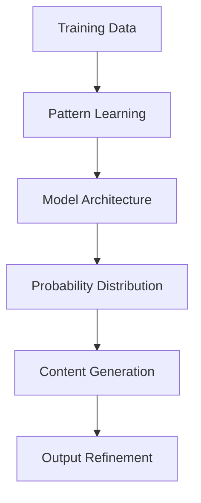

# Generative AI (GenAI) - Developer Notes

## Introduction

Generative AI refers to AI systems that can create new content, including text, images, audio, video, and code. Unlike traditional AI that focuses on analysis and prediction, GenAI generates novel outputs that resemble human-created content.

### Hinglish Explanation
Generative AI woh AI systems hain jo naya content create kar sakte hain - text, images, audio, video, code. Traditional AI analysis aur prediction pe focus karta hai, par GenAI human-created content jaisa novel outputs generate karta hai.

## How Generative AI Works

Generative AI models learn patterns from vast amounts of training data and use this knowledge to generate new content. The core mechanism involves:



**Key Components:**
1. **Training Data**: Large datasets of text, images, or other media
2. **Model Architecture**: Neural networks (Transformers, GANs, Diffusion Models)
3. **Tokenization**: Breaking input into manageable units (words, subwords, pixels)
4. **Probability Modeling**: Learning statistical relationships between tokens
5. **Generation Process**: Sampling from learned probability distributions

### Hinglish Explanation
Generative AI kaise kaam karta hai:
- Vast training data se patterns seekhta hai
- Yeh knowledge use karke naya content generate karta hai
- Core mechanism mein training data, pattern learning, model architecture, probability distribution, aur content generation shamil hain

## How GenAI Differs from Other AI Approaches

| Aspect | Traditional AI | Generative AI |
|--------|----------------|----------------|
| **Primary Function** | Analysis & Prediction | Content Creation |
| **Data Usage** | Structured data for specific tasks | Unstructured data for pattern learning |
| **Output Type** | Classifications, predictions, recommendations | Novel content (text, images, audio) |
| **Training Focus** | Task-specific optimization | General pattern recognition |
| **Evaluation** | Accuracy, precision, recall | Creativity, coherence, quality |
| **Examples** | Spam detection, price prediction | ChatGPT, DALL-E, Midjourney |

**Key Differences:**
- **Purpose**: Traditional AI solves specific problems; GenAI creates new content
- **Approach**: Discriminative vs. Generative modeling
- **Data Requirements**: GenAI needs massive, diverse datasets
- **Computational Resources**: GenAI models are typically much larger and require more compute
- **Evaluation Metrics**: Subjective quality assessment vs. objective performance metrics

### Hinglish Explanation
GenAI other AI approaches se kaise different hai:

**Key Differences:**
- **Purpose**: Traditional AI specific problems solve karta hai; GenAI naya content create karta hai
- **Approach**: Discriminative (classify karna) vs. Generative (create karna) modeling
- **Data Requirements**: GenAI ke liye massive, diverse datasets chahiye
- **Computational Resources**: GenAI models bahut bade hote hain aur zyada compute require karte hain
- **Evaluation**: Subjective quality assessment vs. objective performance metrics

## Types of Generative AI Models

### 1. Text-Based Models
Focus on generating and understanding human language.

**Popular Architectures:**
- **GPT (Generative Pre-trained Transformer)**: Autoregressive text generation
- **BERT (Bidirectional Encoder Representations from Transformers)**: Bidirectional understanding
- **T5 (Text-to-Text Transfer Transformer)**: Unified text-to-text framework

**Examples:**
- ChatGPT, GPT-4 (OpenAI)
- Claude (Anthropic)
- Gemini (Google)
- Llama (Meta)

```python
# Example: Text Generation with Transformers
from transformers import pipeline

# Load text generation pipeline
generator = pipeline('text-generation', model='gpt2')

# Generate text
prompt = "The future of AI will"
result = generator(prompt, max_length=50, num_return_sequences=1)
print(result[0]['generated_text'])
```

### 2. Multimodal Models
Can process and generate content across multiple modalities (text, images, audio, video).

**Key Capabilities:**
- **Text-to-Image**: Generate images from text descriptions (DALL-E, Midjourney)
- **Image-to-Text**: Generate captions or descriptions for images
- **Text-to-Video**: Create video content from text prompts
- **Audio Generation**: Create music, speech, or sound effects

**Popular Models:**
- **DALL-E 3**: Advanced text-to-image generation
- **Stable Diffusion**: Open-source image generation
- **Sora**: Text-to-video generation
- **Whisper**: Speech recognition and translation
- **Jukebox**: Music generation

```python
# Example: Text-to-Image Generation (conceptual)
import requests

def generate_image(prompt):
    # API call to image generation service
    response = requests.post('https://api.example.com/generate-image',
                           json={'prompt': prompt})
    return response.json()['image_url']

# Generate image from text
image_url = generate_image("A futuristic city with flying cars")
print(f"Generated image: {image_url}")
```

### Hinglish Explanation
Generative AI Models ke Types:

#### 1. Text-Based Models
Human language ko generate aur understand karne pe focus karte hain.

**Popular Architectures:**
- **GPT**: Autoregressive text generation
- **BERT**: Bidirectional understanding
- **T5**: Unified text-to-text framework

**Examples:** ChatGPT, Claude, Gemini, Llama

#### 2. Multimodal Models
Multiple modalities (text, images, audio, video) ko process aur generate kar sakte hain.

**Key Capabilities:**
- **Text-to-Image**: Text se images generate karna
- **Image-to-Text**: Images ke liye captions banana
- **Text-to-Video**: Text se video content banana
- **Audio Generation**: Music, speech, sound effects banana

**Popular Models:** DALL-E, Stable Diffusion, Sora, Whisper

## Applications of Generative AI

### Content Creation & Media
- **Text Generation**: Articles, stories, marketing copy, code
- **Image Generation**: Art, design, advertising, product visualization
- **Video Creation**: Short films, animations, educational content
- **Music Composition**: Original songs, background music, soundtracks

### Developer Tools & Productivity
- **Code Generation**: Auto-complete, code suggestions, bug fixes
- **Documentation**: API docs, tutorials, technical writing
- **UI/UX Design**: Wireframes, mockups, design systems
- **Data Analysis**: Report generation, visualization, insights

### Business Applications
- **Marketing**: Personalized content, social media posts, email campaigns
- **Customer Service**: Chatbots, virtual assistants, automated responses
- **Product Design**: Prototyping, 3D modeling, material selection
- **Research**: Literature reviews, hypothesis generation, data synthesis

### Creative Industries
- **Art & Design**: Digital art, fashion design, architecture
- **Entertainment**: Game assets, animation, special effects
- **Education**: Interactive learning materials, simulations
- **Healthcare**: Medical imaging, drug discovery, patient education

### Hinglish Explanation
Generative AI ke Applications:

**Content Creation & Media:**
- Text, images, videos, music ka creation

**Developer Tools:**
- Code generation, documentation, UI design

**Business Applications:**
- Marketing, customer service, product design

**Creative Industries:**
- Art, entertainment, education, healthcare

## Popular Generative AI Frameworks

### Text Generation
- **Hugging Face Transformers**: Open-source library for NLP models
- **OpenAI API**: GPT models for text generation
- **LangChain**: Framework for building LLM applications

### Image Generation
- **Stable Diffusion**: Open-source image generation
- **DALL-E API**: OpenAI's image generation service
- **Midjourney**: AI-powered image creation platform

### Multimodal
- **CLIP**: Connects text and images
- **DALL-E 2/3**: Text-to-image generation
- **Imagen**: Google's text-to-image model

### Hinglish Explanation
Popular Generative AI Frameworks:

**Text Generation:**
- Hugging Face Transformers, OpenAI API, LangChain

**Image Generation:**
- Stable Diffusion, DALL-E API, Midjourney

**Multimodal:**
- CLIP, DALL-E, Imagen

## Getting Started with Generative AI

### Prerequisites
- Python programming skills
- Understanding of machine learning basics
- Access to computational resources (GPU recommended)

### Learning Path
1. Learn Python and basic ML concepts
2. Study transformer architectures
3. Experiment with pre-trained models
4. Fine-tune models for specific tasks
5. Build and deploy GenAI applications

### Resources
- **Hugging Face**: Model hub and documentation
- **OpenAI Platform**: API documentation and examples
- **Papers with Code**: Research papers and implementations
- **Kaggle**: Datasets and competitions

### Hinglish Explanation
Getting Started with Generative AI:

**Prerequisites:** Python skills, ML basics, computational resources

**Learning Path:**
1. Python aur basic ML concepts seekho
2. Transformer architectures study karo
3. Pre-trained models ke saath experiment karo
4. Specific tasks ke liye models fine-tune karo
5. GenAI applications build aur deploy karo

**Resources:** Hugging Face, OpenAI Platform, Papers with Code, Kaggle

## Code Example: Simple Text Generation

```python
from transformers import pipeline

# Initialize text generation pipeline
generator = pipeline('text-generation', model='distilgpt2')

# Generate text
prompt = "Generative AI is"
generated_texts = generator(
    prompt,
    max_length=50,
    num_return_sequences=2,
    temperature=0.7,
    do_sample=True
)

# Print results
for i, text in enumerate(generated_texts):
    print(f"Generated text {i+1}: {text['generated_text']}")
```

## Challenges and Considerations

### Technical Challenges
- **Model Size**: Large models require significant computational resources
- **Training Data**: Need for diverse, high-quality datasets
- **Bias and Fairness**: Models can inherit biases from training data
- **Hallucinations**: Generating incorrect or nonsensical information

### Ethical Considerations
- **Misinformation**: Potential for generating fake content
- **Intellectual Property**: Copyright issues with generated content
- **Job Displacement**: Impact on creative and content creation jobs
- **Privacy**: Data privacy concerns in training and usage

### Hinglish Explanation
Challenges aur Considerations:

**Technical Challenges:**
- Model size, training data quality, bias, hallucinations

**Ethical Considerations:**
- Misinformation, IP issues, job displacement, privacy

## Future of Generative AI

### Emerging Trends
- **Multimodal Models**: Combining text, image, audio, and video
- **Personalized Generation**: Models that adapt to individual users
- **Real-time Generation**: Faster inference and streaming outputs
- **Edge Deployment**: Running models on mobile devices

### Research Directions
- **Controllable Generation**: Better control over generated content
- **Evaluation Metrics**: Improved ways to measure generation quality
- **Energy Efficiency**: Reducing computational requirements
- **Safety Alignment**: Making models more aligned with human values

### Hinglish Explanation
Future of Generative AI:

**Emerging Trends:**
- Multimodal models, personalized generation, real-time generation, edge deployment

**Research Directions:**
- Controllable generation, better evaluation, energy efficiency, safety alignment

## Conclusion

Generative AI represents a paradigm shift in how we create and interact with content. From text generation to multimodal creation, these models are transforming industries and enabling new forms of creativity. As developers, understanding GenAI principles, architectures, and applications will be crucial for building the next generation of AI-powered applications.

Remember to consider ethical implications and responsible development practices when working with generative models.

---

*For more information on AI fundamentals, see: [ai.md](ai.md)*
*For specific model architectures, see: [large-ai-models/](large-ai-models/)*