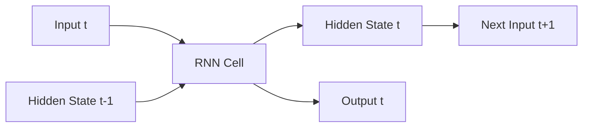
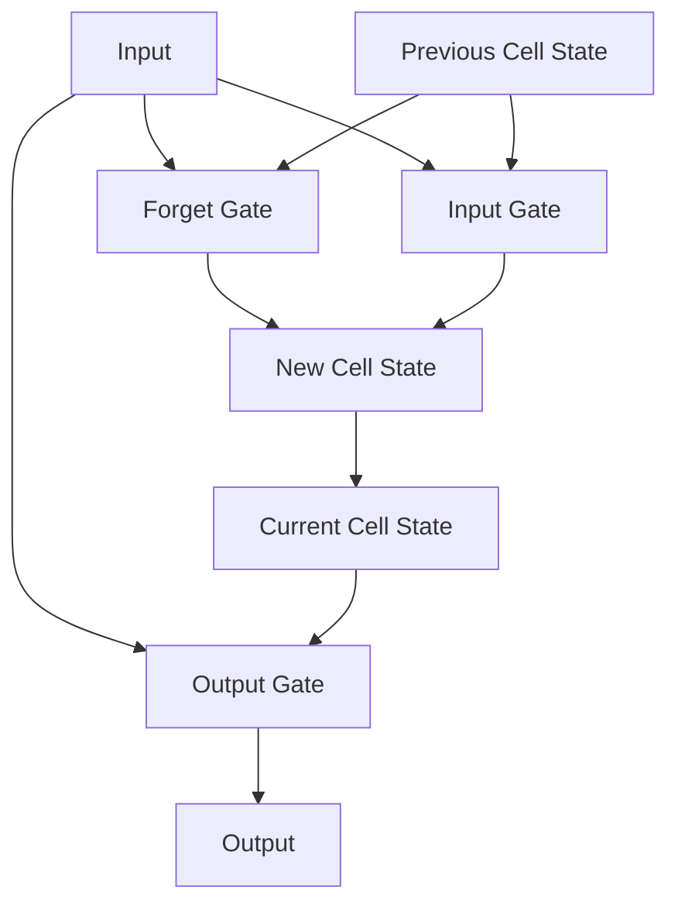
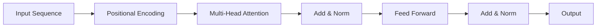
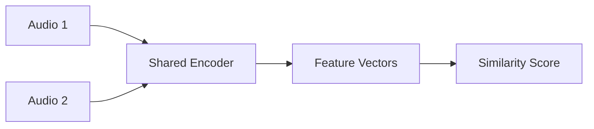
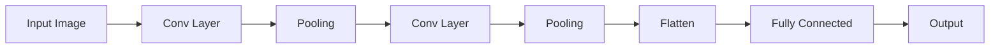
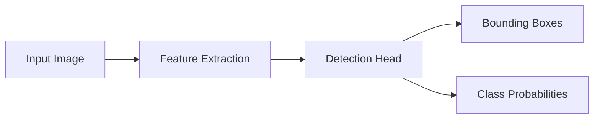

# Large AI Models - Developer Notes

## Introduction

Large AI Models refer to advanced machine learning architectures and techniques that handle complex data processing tasks. From a developer's perspective, understanding these models involves implementing them for language processing, audio/speech recognition, computer vision, and other AI applications. This document covers key large AI models including RNNs, LSTMs, Transformers, audio/speech models, and vision models like CNNs and YOLO.

### Hinglish Explanation
Large AI Models advanced ML architectures hain jo complex data processing tasks handle karte hain. Developer ke liye, inko language processing, audio/speech, computer vision, etc. ke liye implement karna hota hai. Yeh document RNN, LSTM, Transformers, audio/speech models, aur vision models jaise CNN, YOLO ko cover karta hai.

## Recurrent Neural Networks (RNNs)

RNNs are designed to work with sequential data by maintaining an internal state (memory) that captures information about previous inputs.

### How RNNs Work
- Process input sequences one element at a time
- Maintain a hidden state that gets updated at each time step
- Output depends on current input and previous hidden state

### Architecture


### Advantages
- Handle variable-length sequences
- Capture temporal dependencies
- Memory of previous inputs

### Limitations
- Vanishing gradient problem
- Difficulty in learning long-term dependencies
- Computationally expensive for long sequences

### Code Example: Simple RNN for Text Classification

```python
import tensorflow as tf
from tensorflow import keras
import numpy as np

# Sample data
vocab_size = 10000
max_len = 100

# Build model
model = keras.Sequential([
    keras.layers.Embedding(vocab_size, 32, input_length=max_len),
    keras.layers.SimpleRNN(32),
    keras.layers.Dense(1, activation='sigmoid')
])

model.compile(optimizer='adam', loss='binary_crossentropy', metrics=['accuracy'])
print(model.summary())
```

### Hinglish Explanation
RNNs sequential data ke liye design kiye gaye hain, internal state (memory) maintain karte hain jo previous inputs ki information capture karta hai.

**Kaise kaam karte hain**: Input sequences ko one by one process karte hain, hidden state update karte hain har time step pe.

**Advantages**: Variable-length sequences handle karte hain, temporal dependencies capture karte hain.

**Limitations**: Vanishing gradient problem, long-term dependencies mein difficulty.

## Long Short-Term Memory (LSTM)

LSTMs are a type of RNN designed to overcome the vanishing gradient problem and capture long-term dependencies.

### Key Components
- **Forget Gate**: Decides what information to discard
- **Input Gate**: Decides what new information to store
- **Output Gate**: Decides what to output based on cell state

### Architecture


### Advantages over RNN
- Better at capturing long-term dependencies
- Mitigates vanishing gradient problem
- More stable training

### Applications
- Language modeling
- Machine translation
- Speech recognition
- Time series prediction

### Code Example: LSTM for Sentiment Analysis

```python
import tensorflow as tf
from tensorflow import keras

# Build LSTM model
model = keras.Sequential([
    keras.layers.Embedding(10000, 128),
    keras.layers.LSTM(64, dropout=0.2, recurrent_dropout=0.2),
    keras.layers.Dense(1, activation='sigmoid')
])

model.compile(loss='binary_crossentropy', optimizer='adam', metrics=['accuracy'])
print(model.summary())
```

### Hinglish Explanation
LSTMs ek special type ka RNN hai jo vanishing gradient problem ko overcome karta hai aur long-term dependencies capture karta hai.

**Key Components**:
- **Forget Gate**: Kya information discard karna hai decide karta hai
- **Input Gate**: Kya new information store karna hai decide karta hai
- **Output Gate**: Cell state ke basis pe kya output dena hai decide karta hai

**Advantages**: Long-term dependencies better capture karta hai, training stable hai.

## Transformers

Transformers revolutionized NLP by using attention mechanisms instead of recurrence, enabling parallel processing and better handling of long-range dependencies.

### Key Components
- **Multi-Head Attention**: Allows model to focus on different parts of input
- **Positional Encoding**: Adds position information to tokens
- **Feed-Forward Networks**: Process attention outputs
- **Layer Normalization**: Stabilizes training

### Architecture


### Advantages
- Parallel processing (faster training)
- Better long-range dependency modeling
- Scalable to large datasets
- Foundation for models like BERT, GPT

### Code Example: Simple Transformer Block

```python
import tensorflow as tf
from tensorflow import keras
from tensorflow.keras import layers

class TransformerBlock(layers.Layer):
    def __init__(self, embed_dim, num_heads, ff_dim, rate=0.1):
        super(TransformerBlock, self).__init__()
        self.att = layers.MultiHeadAttention(num_heads=num_heads, key_dim=embed_dim)
        self.ffn = keras.Sequential([
            layers.Dense(ff_dim, activation="relu"),
            layers.Dense(embed_dim),
        ])
        self.layernorm1 = layers.LayerNormalization(epsilon=1e-6)
        self.layernorm2 = layers.LayerNormalization(epsilon=1e-6)
        self.dropout1 = layers.Dropout(rate)
        self.dropout2 = layers.Dropout(rate)

    def call(self, inputs, training):
        attn_output = self.att(inputs, inputs)
        attn_output = self.dropout1(attn_output, training=training)
        out1 = self.layernorm1(inputs + attn_output)
        ffn_output = self.ffn(out1)
        ffn_output = self.dropout2(ffn_output, training=training)
        return self.layernorm2(out1 + ffn_output)
```

### Hinglish Explanation
Transformers ne NLP ko revolutionize kiya attention mechanisms use karke, parallel processing enable kiya aur long-range dependencies better handle kiye.

**Key Components**:
- **Multi-Head Attention**: Model ko input ke different parts pe focus karne deta hai
- **Positional Encoding**: Tokens ko position information add karta hai
- **Feed-Forward Networks**: Attention outputs process karta hai

**Advantages**: Parallel processing (fast training), better long-range modeling, scalable.

## Audio and Speech Models

### Variational Autoencoders (VAEs)
VAEs are generative models that learn latent representations of audio data for generation and compression.

#### How VAEs Work
- Encoder compresses input to latent space
- Decoder reconstructs from latent representation
- KL divergence ensures latent space structure

#### Applications in Audio
- Voice conversion
- Audio synthesis
- Noise reduction

### Waveform Models
Models that work directly with raw audio waveforms.

#### Types
- **WaveNet**: Autoregressive model for audio generation
- **WaveRNN**: Faster alternative to WaveNet
- **WaveGlow**: Flow-based model for fast inference

#### Code Example: Simple WaveNet-like Model

```python
import tensorflow as tf
from tensorflow import keras

def wavenet_block(x, filters, kernel_size, dilation_rate):
    x = keras.layers.Conv1D(filters, kernel_size, 
                           padding='causal', 
                           dilation_rate=dilation_rate)(x)
    x = keras.layers.Conv1D(filters, 1, activation='tanh')(x)
    return keras.layers.Conv1D(filters, 1)(x)

# Build simple WaveNet
input_audio = keras.Input(shape=(None, 1))
x = wavenet_block(input_audio, 32, 2, 1)
x = wavenet_block(x, 32, 2, 2)
x = wavenet_block(x, 32, 2, 4)
output = keras.layers.Conv1D(1, 1)(x)

model = keras.Model(input_audio, output)
```

### Siamese Networks
Networks that learn similarity metrics between audio samples.

#### Applications
- Speaker verification
- Audio fingerprinting
- Sound event detection

#### Architecture


### Hinglish Explanation
Audio and Speech Models:

**Variational Autoencoders (VAEs)**: Generative models jo audio data ke latent representations learn karte hain generation aur compression ke liye.

**Waveform Models**: Raw audio waveforms ke saath directly kaam karte hain. Examples: WaveNet, WaveRNN, WaveGlow.

**Siamese Networks**: Audio samples ke beech similarity metrics learn karte hain. Applications: Speaker verification, audio fingerprinting.

## Vision Models

### Convolutional Neural Networks (CNNs)

CNNs are specialized for processing grid-like data such as images.

#### Key Components
- **Convolutional Layers**: Extract features using filters
- **Pooling Layers**: Reduce spatial dimensions
- **Fully Connected Layers**: Classification

#### Architecture


#### Advantages
- Parameter sharing reduces model size
- Translation invariance
- Hierarchical feature learning

#### Code Example: Simple CNN for Image Classification

```python
import tensorflow as tf
from tensorflow import keras

model = keras.Sequential([
    keras.layers.Conv2D(32, (3, 3), activation='relu', input_shape=(28, 28, 1)),
    keras.layers.MaxPooling2D((2, 2)),
    keras.layers.Conv2D(64, (3, 3), activation='relu'),
    keras.layers.MaxPooling2D((2, 2)),
    keras.layers.Flatten(),
    keras.layers.Dense(64, activation='relu'),
    keras.layers.Dense(10, activation='softmax')
])

model.compile(optimizer='adam', loss='categorical_crossentropy', metrics=['accuracy'])
```

### YOLO (You Only Look Once)

YOLO is a real-time object detection system that predicts bounding boxes and class probabilities simultaneously.

#### How YOLO Works
- Divides image into grid cells
- Each cell predicts bounding boxes and class probabilities
- Uses single neural network for detection

#### Advantages
- Real-time performance
- End-to-end training
- Better generalization

#### Architecture


#### Code Example: Using YOLO with OpenCV

```python
import cv2
import numpy as np

# Load YOLO
net = cv2.dnn.readNet("yolov3.weights", "yolov3.cfg")
layer_names = net.getLayerNames()
output_layers = [layer_names[i - 1] for i in net.getUnconnectedOutLayers()]

# Load classes
with open("coco.names", "r") as f:
    classes = [line.strip() for line in f.readlines()]

# Load image
img = cv2.imread("image.jpg")
height, width, channels = img.shape

# Preprocess
blob = cv2.dnn.blobFromImage(img, 0.00392, (416, 416), (0, 0, 0), True, crop=False)
net.setInput(blob)
outs = net.forward(output_layers)

# Process detections
for out in outs:
    for detection in out:
        scores = detection[5:]
        class_id = np.argmax(scores)
        confidence = scores[class_id]
        if confidence > 0.5:
            # Draw bounding box
            center_x = int(detection[0] * width)
            center_y = int(detection[1] * height)
            w = int(detection[2] * width)
            h = int(detection[3] * height)
            x = int(center_x - w / 2)
            y = int(center_y - h / 2)
            cv2.rectangle(img, (x, y), (x + w, y + h), (0, 255, 0), 2)
```

### Hinglish Explanation
Vision Models:

**CNNs**: Images jaise grid-like data process karne ke liye specialized hain. Convolutional layers features extract karte hain, pooling dimensions reduce karta hai.

**YOLO**: Real-time object detection system. Image ko grid cells mein divide karta hai, bounding boxes aur class probabilities predict karta hai simultaneously.

## Best Practices for Large AI Models

### Training Tips
- Use appropriate batch sizes
- Implement gradient clipping
- Use learning rate scheduling
- Monitor for overfitting

### Optimization Techniques
- Mixed precision training
- Model quantization
- Knowledge distillation
- Pruning

### Deployment Considerations
- Model compression
- Edge deployment
- Inference optimization
- Monitoring and maintenance

### Hinglish Explanation
Large AI Models ke Best Practices:

**Training Tips**: Appropriate batch sizes use karo, gradient clipping implement karo, learning rate scheduling use karo, overfitting monitor karo.

**Optimization**: Mixed precision training, model quantization, knowledge distillation, pruning.

**Deployment**: Model compression, edge deployment, inference optimization, monitoring.

## Conclusion

Large AI models like RNNs, LSTMs, Transformers, and specialized architectures for audio and vision have revolutionized AI capabilities. Understanding these models' architectures, strengths, and limitations is crucial for developers working on complex AI applications. Each model type excels in different scenarios, and choosing the right model depends on the specific use case, data characteristics, and computational constraints.

As AI continues to evolve, staying updated with the latest developments in these model architectures will be essential for building cutting-edge applications.

### Hinglish Explanation
Large AI models jaise RNNs, LSTMs, Transformers, aur audio/vision ke specialized architectures ne AI capabilities ko revolutionize kiya hai. Inke architectures, strengths, aur limitations ko understand karna developers ke liye crucial hai jo complex AI applications pe kaam karte hain. Har model type different scenarios mein excel karta hai, aur right model choose karna use case, data characteristics, aur computational constraints pe depend karta hai.

AI evolve hota rahega, toh in model architectures mein latest developments se updated rehna essential hai cutting-edge applications build karne ke liye.

---

*This document provides a comprehensive overview of large AI models from a developer's perspective. For implementation details and advanced techniques, refer to the respective framework documentation.*