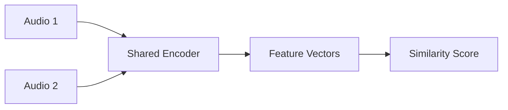

# Audio and Speech Models - Developer Notes

## Introduction

Audio and speech models handle processing, generation, and analysis of audio data and speech signals.

### Variational Autoencoders (VAEs)
VAEs are generative models that learn latent representations of audio data for generation and compression.

#### How VAEs Work
- Encoder compresses input to latent space
- Decoder reconstructs from latent representation
- KL divergence ensures latent space structure

#### Applications in Audio
- Voice conversion
- Audio synthesis
- Noise reduction

### Waveform Models
Models that work directly with raw audio waveforms.

#### Types
- **WaveNet**: Autoregressive model for audio generation
- **WaveRNN**: Faster alternative to WaveNet
- **WaveGlow**: Flow-based model for fast inference

#### Code Example: Simple WaveNet-like Model

```python
import tensorflow as tf
from tensorflow import keras

def wavenet_block(x, filters, kernel_size, dilation_rate):
    x = keras.layers.Conv1D(filters, kernel_size,
                           padding='causal',
                           dilation_rate=dilation_rate)(x)
    x = keras.layers.Conv1D(filters, 1, activation='tanh')(x)
    return keras.layers.Conv1D(filters, 1)(x)

# Build simple WaveNet
input_audio = keras.Input(shape=(None, 1))
x = wavenet_block(input_audio, 32, 2, 1)
x = wavenet_block(x, 32, 2, 2)
x = wavenet_block(x, 32, 2, 4)
output = keras.layers.Conv1D(1, 1)(x)

model = keras.Model(input_audio, output)
```

### Siamese Networks
Networks that learn similarity metrics between audio samples.

#### Applications
- Speaker verification
- Audio fingerprinting
- Sound event detection

#### Architecture


### Hinglish Explanation
Audio and Speech Models:

**Variational Autoencoders (VAEs)**: Generative models jo audio data ke latent representations learn karte hain generation aur compression ke liye.

**Waveform Models**: Raw audio waveforms ke saath directly kaam karte hain. Examples: WaveNet, WaveRNN, WaveGlow.

**Siamese Networks**: Audio samples ke beech similarity metrics learn karte hain. Applications: Speaker verification, audio fingerprinting.