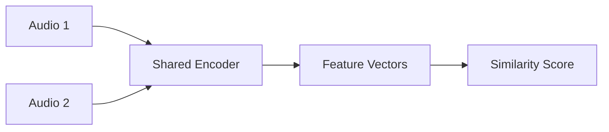

# Audio and Speech Models - Developer Notes

## Introduction

Audio and speech models handle processing, generation, and analysis of audio data and speech signals.

### Variational Autoencoders (VAEs)
VAEs are generative models that learn latent representations of audio data for generation and compression.

#### How VAEs Work
- Encoder compresses input to latent space
- Decoder reconstructs from latent representation
- KL divergence ensures latent space structure

#### Applications in Audio
- Voice conversion
- Audio synthesis
- Noise reduction

### Waveform Models
Models that work directly with raw audio waveforms.

#### Types
- **WaveNet**: Autoregressive model for audio generation
- **WaveRNN**: Faster alternative to WaveNet
- **WaveGlow**: Flow-based model for fast inference

#### Code Example: Simple WaveNet-like Model

```python
import tensorflow as tf
from tensorflow import keras

def wavenet_block(x, filters, kernel_size, dilation_rate):
    x = keras.layers.Conv1D(filters, kernel_size,
                           padding='causal',
                           dilation_rate=dilation_rate)(x)
    x = keras.layers.Conv1D(filters, 1, activation='tanh')(x)
    return keras.layers.Conv1D(filters, 1)(x)

# Build simple WaveNet
input_audio = keras.Input(shape=(None, 1))
x = wavenet_block(input_audio, 32, 2, 1)
x = wavenet_block(x, 32, 2, 2)
x = wavenet_block(x, 32, 2, 4)
output = keras.layers.Conv1D(1, 1)(x)

model = keras.Model(input_audio, output)
```

### Siamese Networks
Networks that learn similarity metrics between audio samples.

#### Applications
- Speaker verification
- Audio fingerprinting
- Sound event detection

#### Architecture


#### Detailed Flowchart Node Explanation

##### A: Audio 1
- **Purpose**: First audio sample in comparison pair
- **Format**: Raw waveform, spectrogram, or MFCC features
- **Dimensions**: Variable length audio sequence
- **Example**: Speaker A's voice sample for verification
- **Preprocessing**: Normalization, feature extraction

##### B: Audio 2
- **Purpose**: Second audio sample for comparison
- **Format**: Same as Audio 1
- **Dimensions**: Matching length or padded to same size
- **Example**: Voice sample to verify against Audio 1
- **Use Case**: Same speaker verification or different speaker rejection

##### C: Shared Encoder
- **Purpose**: Feature extraction network applied identically to both audio samples
- **Architecture**: CNN/RNN layers for audio processing
- **Weights**: Same parameters used for both inputs
- **Function**: Map variable-length audio to fixed-dimensional embeddings
- **Output**: Compact feature representations

##### D: Feature Vectors
- **Purpose**: Learned embeddings from both audio samples
- **Dimensions**: Fixed size (e.g., 128, 256, 512 dimensions)
- **Content**: Speaker characteristics, acoustic features, semantic content
- **Training**: Optimized to make similar audio have similar vectors
- **Pair Output**: Two vectors for distance computation

##### E: Similarity Score
- **Purpose**: Quantify similarity between the two audio embeddings
- **Metrics**: Cosine similarity, Euclidean distance, or learned distance
- **Range**: Depends on metric (similarity: [-1,1], distance: [0,∞))
- **Threshold**: Decision boundary for same/different classification
- **Training**: Contrastive loss minimizes distance for similar pairs

#### Siamese Network Data Flow Summary
1. **Audio 1 & Audio 2** → Pair of audio samples to compare
2. **Shared Encoder** → Same network processes both audio inputs
3. **Feature Vectors** → Fixed-dimensional embeddings
4. **Similarity Score** → Distance/similarity measurement
5. **Output** → Similarity prediction for verification

#### Hinglish Explanation
Siamese Network Architecture ke har component ka purpose:

**A: Audio 1**: Comparison pair ka pehla audio sample

**B: Audio 2**: Comparison pair ka dusra audio sample

**C: Shared Encoder**: Dono audio samples pe same network apply hota hai

**D: Feature Vectors**: Learned embeddings jo audio characteristics represent karte hain

**E: Similarity Score**: Dono embeddings ke beech similarity ka measure

### Hinglish Explanation
Audio and Speech Models:

**Variational Autoencoders (VAEs)**: Generative models jo audio data ke latent representations learn karte hain generation aur compression ke liye.

**Waveform Models**: Raw audio waveforms ke saath directly kaam karte hain. Examples: WaveNet, WaveRNN, WaveGlow.

**Siamese Networks**: Audio samples ke beech similarity metrics learn karte hain. Applications: Speaker verification, audio fingerprinting.