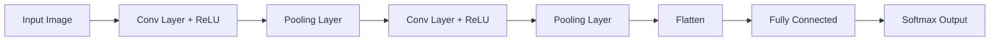

# Convolutional Neural Networks (CNNs) - Developer Notes

## Introduction

Convolutional Neural Networks are specialized deep learning architectures designed for processing grid-like data, particularly images and spatial data.

### Core Concepts
- **Local Receptive Fields**: Neurons connect to local regions of input
- **Parameter Sharing**: Same weights used across spatial locations
- **Hierarchical Feature Learning**: Learn simple to complex features

### Key Components

#### Convolutional Layer
- **Filters/Kernels**: Small matrices that slide over input
- **Stride**: Step size for filter movement
- **Padding**: Add zeros around input to control output size

#### Pooling Layer
- **Max Pooling**: Take maximum value in each window
- **Average Pooling**: Take average value in each window
- **Purpose**: Reduce spatial dimensions, provide translation invariance

#### Fully Connected Layer
- Traditional neural network layers
- Classification based on learned features

### Architecture


### Code Example: CNN for Image Classification

```python
import tensorflow as tf
from tensorflow import keras

def create_cnn_model(input_shape=(28, 28, 1), num_classes=10):
    model = keras.Sequential([
        # First convolutional block
        keras.layers.Conv2D(32, (3, 3), activation='relu', input_shape=input_shape),
        keras.layers.BatchNormalization(),
        keras.layers.MaxPooling2D((2, 2)),
        keras.layers.Dropout(0.25),
        
        # Second convolutional block
        keras.layers.Conv2D(64, (3, 3), activation='relu'),
        keras.layers.BatchNormalization(),
        keras.layers.MaxPooling2D((2, 2)),
        keras.layers.Dropout(0.25),
        
        # Third convolutional block
        keras.layers.Conv2D(128, (3, 3), activation='relu'),
        keras.layers.BatchNormalization(),
        keras.layers.MaxPooling2D((2, 2)),
        keras.layers.Dropout(0.25),
        
        # Classification head
        keras.layers.Flatten(),
        keras.layers.Dense(512, activation='relu'),
        keras.layers.BatchNormalization(),
        keras.layers.Dropout(0.5),
        keras.layers.Dense(num_classes, activation='softmax')
    ])
    
    return model

# Create and compile model
model = create_cnn_model()
model.compile(optimizer='adam',
              loss='categorical_crossentropy',
              metrics=['accuracy'])

print(model.summary())
```

### Advanced CNN Architectures

#### LeNet-5
- Pioneering CNN architecture
- Used for handwritten digit recognition
- 5 layers: Conv, Pool, Conv, Pool, FC

#### AlexNet
- Winner of ImageNet 2012
- Introduced ReLU activation
- Used dropout for regularization

#### VGGNet
- Very deep networks (16-19 layers)
- Small 3x3 filters throughout
- Excellent for feature extraction

#### ResNet
- Residual connections to combat vanishing gradients
- Can train very deep networks (100+ layers)
- Skip connections: H(x) = F(x) + x

### Training Best Practices
- **Data Augmentation**: Rotation, flipping, scaling, color jittering
- **Batch Normalization**: Stabilize training, allow higher learning rates
- **Regularization**: Dropout, L2 regularization
- **Learning Rate Scheduling**: Decay learning rate during training

### Applications
- **Image Classification**: Object recognition, scene understanding
- **Object Detection**: Locate and classify objects in images
- **Image Segmentation**: Pixel-level classification
- **Medical Imaging**: Disease detection, image analysis
- **Autonomous Vehicles**: Scene understanding, obstacle detection

### Advantages
- Excellent for spatial data
- Parameter efficient due to weight sharing
- Translation invariant
- Hierarchical feature learning

### Challenges
- Require large amounts of labeled data
- Computationally intensive to train
- Interpretability issues
- Sensitive to input distribution shifts

### Hinglish Explanation
Convolutional Neural Networks (CNNs) grid-like data, especially images process karne ke liye specialized deep learning architectures hain.

**Key Components**:
- **Convolutional Layer**: Filters input pe slide karte hain, local features extract karte hain
- **Pooling Layer**: Spatial dimensions reduce karta hai, translation invariance provide karta hai
- **Fully Connected Layer**: Classification ke liye traditional layers

**Architecture**: Conv + ReLU → Pool → Conv + ReLU → Pool → Flatten → FC → Output

**Applications**: Image classification, object detection, medical imaging.

**Advantages**: Spatial data ke liye excellent, parameter efficient, hierarchical learning.

**Challenges**: Large labeled data required, computationally intensive.