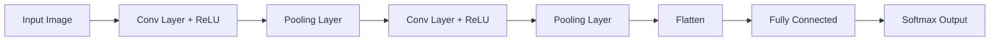

# Convolutional Neural Networks (CNNs) - Developer Notes

## Introduction

Convolutional Neural Networks are specialized deep learning architectures designed for processing grid-like data, particularly images and spatial data.

### Core Concepts
- **Local Receptive Fields**: Neurons connect to local regions of input
- **Parameter Sharing**: Same weights used across spatial locations
- **Hierarchical Feature Learning**: Learn simple to complex features

### Key Components

#### Convolutional Layer
- **Filters/Kernels**: Small matrices that slide over input
- **Stride**: Step size for filter movement
- **Padding**: Add zeros around input to control output size

#### Pooling Layer
- **Max Pooling**: Take maximum value in each window
- **Average Pooling**: Take average value in each window
- **Purpose**: Reduce spatial dimensions, provide translation invariance

#### Fully Connected Layer
- Traditional neural network layers
- Classification based on learned features

### Architecture


### Detailed Flowchart Node Explanation

#### A: Input Image
- **Purpose**: Raw image data entry point
- **Format**: Typically 3D tensor (Height × Width × Channels)
- **Example**: 224×224×3 for RGB color images, 28×28×1 for grayscale MNIST
- **Preprocessing**: Images are usually normalized (0-1 range) and resized to fixed dimensions
- **Data Type**: Float32 for GPU processing

#### B: Conv Layer + ReLU
- **Conv Layer Purpose**: Extract spatial features using learnable filters
- **Key Parameters**:
  - **Filters**: Number of feature maps (e.g., 32, 64, 128)
  - **Kernel Size**: Filter dimensions (e.g., 3×3, 5×5)
  - **Stride**: Step size for filter movement (usually 1)
  - **Padding**: 'same' to maintain spatial dimensions
- **Operation**: Convolution + bias + activation
- **ReLU Purpose**: Introduce non-linearity, prevent vanishing gradients
- **Output**: Feature maps highlighting edges, textures, patterns

#### C: Pooling Layer
- **Purpose**: Reduce spatial dimensions, provide translation invariance
- **Types**: Max Pooling (most common) or Average Pooling
- **Parameters**:
  - **Pool Size**: Window size (e.g., 2×2)
  - **Stride**: Usually same as pool size
- **Benefits**: Reduces computation, prevents overfitting, focuses on dominant features
- **Output**: Downsampled feature maps

#### D: Conv Layer + ReLU (Second)
- **Purpose**: Extract higher-level features from pooled feature maps
- **Increased Filters**: More filters (e.g., 64) to capture complex patterns
- **Same Components**: Convolution, bias, ReLU activation
- **Hierarchical Learning**: Learns combinations of lower-level features
- **Output**: More abstract feature representations

#### E: Pooling Layer (Second)
- **Purpose**: Further reduce spatial dimensions before classification
- **Same Operation**: Max/Average pooling with 2×2 windows
- **Progressive Reduction**: Gradually decrease spatial resolution
- **Output**: Compact feature representations

#### F: Flatten
- **Purpose**: Convert 3D feature maps to 1D vector for dense layers
- **Operation**: Reshape (H×W×C) → (H×W×C,) 
- **Example**: (7×7×128) → (6272,)
- **No Parameters**: Pure reshaping operation
- **Output**: 1D feature vector

#### G: Fully Connected
- **Purpose**: Learn non-linear combinations of all features for classification
- **Parameters**:
  - **Units**: Number of neurons (e.g., 512, 256)
  - **Activation**: Usually ReLU for hidden layers
- **Connections**: Every input connected to every output neuron
- **Feature Integration**: Combine spatial features into decision-making
- **Output**: High-level feature representations

#### H: Softmax Output
- **Purpose**: Convert logits to probability distribution over classes
- **Formula**: softmax(x_i) = e^(x_i) / Σ e^(x_j)
- **Units**: Equal to number of classes (e.g., 10 for CIFAR-10)
- **Output Range**: Probabilities summing to 1.0
- **Interpretation**: Confidence scores for each class

### Flowchart Data Flow Summary
1. **Input (224×224×3)** → Raw RGB image
2. **Conv+ReLU (224×224×32)** → Low-level features (edges, colors)
3. **Pool (112×112×32)** → Reduced spatial size, translation invariance
4. **Conv+ReLU (112×112×64)** → Mid-level features (textures, shapes)
5. **Pool (56×56×64)** → Further reduction
6. **Flatten (200704,)** → 1D vector for classification
7. **Dense (512,)** → Feature integration
8. **Softmax (10,)** → Class probabilities

### Hinglish Explanation
CNN Architecture ke har node ka purpose:

**A: Input Image**: Raw image data, jaise 224x224 pixels ka RGB image

**B: Conv Layer + ReLU**: Spatial features extract karta hai using filters, ReLU non-linearity add karta hai

**C: Pooling Layer**: Spatial dimensions reduce karta hai, translation invariance provide karta hai

**D: Second Conv + ReLU**: Higher-level features learn karta hai, complex patterns detect karta hai

**E: Second Pooling**: Aur spatial reduction, compact representation banata hai

**F: Flatten**: 3D feature maps ko 1D vector mein convert karta hai dense layers ke liye

**G: Fully Connected**: Saare features ko combine karke classification ke liye use karta hai

**H: Softmax Output**: Logits ko probabilities mein convert karta hai, har class ke liye confidence score deta hai

### Code Example: CNN for Image Classification

```python
import tensorflow as tf
from tensorflow import keras

def create_cnn_model(input_shape=(28, 28, 1), num_classes=10):
    model = keras.Sequential([
        # First convolutional block
        keras.layers.Conv2D(32, (3, 3), activation='relu', input_shape=input_shape),
        keras.layers.BatchNormalization(),
        keras.layers.MaxPooling2D((2, 2)),
        keras.layers.Dropout(0.25),
        
        # Second convolutional block
        keras.layers.Conv2D(64, (3, 3), activation='relu'),
        keras.layers.BatchNormalization(),
        keras.layers.MaxPooling2D((2, 2)),
        keras.layers.Dropout(0.25),
        
        # Third convolutional block
        keras.layers.Conv2D(128, (3, 3), activation='relu'),
        keras.layers.BatchNormalization(),
        keras.layers.MaxPooling2D((2, 2)),
        keras.layers.Dropout(0.25),
        
        # Classification head
        keras.layers.Flatten(),
        keras.layers.Dense(512, activation='relu'),
        keras.layers.BatchNormalization(),
        keras.layers.Dropout(0.5),
        keras.layers.Dense(num_classes, activation='softmax')
    ])
    
    return model

# Create and compile model
model = create_cnn_model()
model.compile(optimizer='adam',
              loss='categorical_crossentropy',
              metrics=['accuracy'])

print(model.summary())
```

### Advanced CNN Architectures

#### LeNet-5
- Pioneering CNN architecture
- Used for handwritten digit recognition
- 5 layers: Conv, Pool, Conv, Pool, FC

#### AlexNet
- Winner of ImageNet 2012
- Introduced ReLU activation
- Used dropout for regularization

#### VGGNet
- Very deep networks (16-19 layers)
- Small 3x3 filters throughout
- Excellent for feature extraction

#### ResNet
- Residual connections to combat vanishing gradients
- Can train very deep networks (100+ layers)
- Skip connections: H(x) = F(x) + x

### Training Best Practices
- **Data Augmentation**: Rotation, flipping, scaling, color jittering
- **Batch Normalization**: Stabilize training, allow higher learning rates
- **Regularization**: Dropout, L2 regularization
- **Learning Rate Scheduling**: Decay learning rate during training

### Applications
- **Image Classification**: Object recognition, scene understanding
- **Object Detection**: Locate and classify objects in images
- **Image Segmentation**: Pixel-level classification
- **Medical Imaging**: Disease detection, image analysis
- **Autonomous Vehicles**: Scene understanding, obstacle detection

### Advantages
- Excellent for spatial data
- Parameter efficient due to weight sharing
- Translation invariant
- Hierarchical feature learning

### Challenges
- Require large amounts of labeled data
- Computationally intensive to train
- Interpretability issues
- Sensitive to input distribution shifts

### Hinglish Explanation
Convolutional Neural Networks (CNNs) grid-like data, especially images process karne ke liye specialized deep learning architectures hain.

**Key Components**:
- **Convolutional Layer**: Filters input pe slide karte hain, local features extract karte hain
- **Pooling Layer**: Spatial dimensions reduce karta hai, translation invariance provide karta hai
- **Fully Connected Layer**: Classification ke liye traditional layers

**Architecture**: Conv + ReLU → Pool → Conv + ReLU → Pool → Flatten → FC → Output

**Applications**: Image classification, object detection, medical imaging.

**Advantages**: Spatial data ke liye excellent, parameter efficient, hierarchical learning.

**Challenges**: Large labeled data required, computationally intensive.