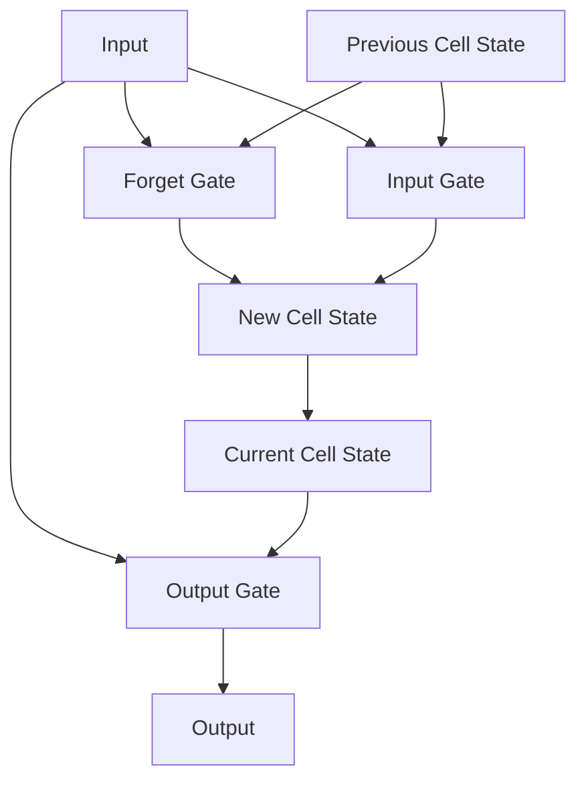

# Long Short-Term Memory (LSTM) - Developer Notes

## Introduction

LSTMs are a type of RNN designed to overcome the vanishing gradient problem and capture long-term dependencies.

### Key Components
- **Forget Gate**: Decides what information to discard
- **Input Gate**: Decides what new information to store
- **Output Gate**: Decides what to output based on cell state

### Architecture


### Advantages over RNN
- Better at capturing long-term dependencies
- Mitigates vanishing gradient problem
- More stable training

### Applications
- Language modeling
- Machine translation
- Speech recognition
- Time series prediction

### Code Example: LSTM for Sentiment Analysis

```python
import tensorflow as tf
from tensorflow import keras

# Build LSTM model
model = keras.Sequential([
    keras.layers.Embedding(10000, 128),
    keras.layers.LSTM(64, dropout=0.2, recurrent_dropout=0.2),
    keras.layers.Dense(1, activation='sigmoid')
])

model.compile(loss='binary_crossentropy', optimizer='adam', metrics=['accuracy'])
print(model.summary())
```

### Hinglish Explanation
LSTMs ek special type ka RNN hai jo vanishing gradient problem ko overcome karta hai aur long-term dependencies capture karta hai.

**Key Components**:
- **Forget Gate**: Kya information discard karna hai decide karta hai
- **Input Gate**: Kya new information store karna hai decide karta hai
- **Output Gate**: Cell state ke basis pe kya output dena hai decide karta hai

**Advantages**: Long-term dependencies better capture karta hai, training stable hai.