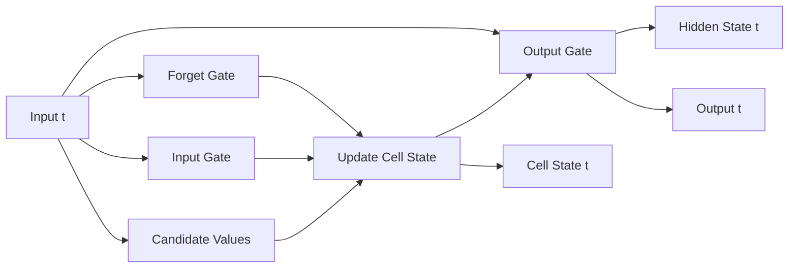

# Long Short-Term Memory (LSTM) - Developer Notes

## Introduction

LSTMs are a type of RNN designed to overcome the vanishing gradient problem and capture long-term dependencies.

### Key Components
- **Forget Gate**: Decides what information to discard
- **Input Gate**: Decides what new information to store
- **Output Gate**: Decides what to output based on cell state

### Architecture


### Detailed Flowchart Node Explanation

#### A: Input t
- **Purpose**: Current time step input data
- **Format**: Vector representation (word embedding, features, etc.)
- **Dimensions**: (batch_size, input_dim)
- **Flows to**: All LSTM gates for processing

#### B: Forget Gate
- **Purpose**: Decides what information to discard from previous cell state
- **Computation**: f_t = σ(W_f * [h_{t-1}, x_t] + b_f)
- **Output**: Values between 0 and 1 (forget percentages)
- **Function**: Multiplies with previous cell state to forget irrelevant information

#### C: Input Gate
- **Purpose**: Controls what new information to store in cell state
- **Computation**: i_t = σ(W_i * [h_{t-1}, x_t] + b_i)
- **Output**: Values between 0 and 1 (input percentages)
- **Function**: Filters which candidate values to add to cell state

#### D: Candidate Values
- **Purpose**: Creates new candidate values to be added to cell state
- **Computation**: ~C_t = tanh(W_C * [h_{t-1}, x_t] + b_C)
- **Output**: Candidate values in range [-1, 1]
- **Function**: Generates potential new information for cell state

#### E: Update Cell State
- **Purpose**: Updates the long-term memory of the LSTM
- **Computation**: C_t = f_t * C_{t-1} + i_t * ~C_t
- **Components**:
  - **Forget**: f_t * C_{t-1} (removes irrelevant information)
  - **Add**: i_t * ~C_t (adds new relevant information)
- **Output**: Updated cell state C_t

#### F: Output Gate
- **Purpose**: Controls what parts of cell state to output as hidden state
- **Computation**: o_t = σ(W_o * [h_{t-1}, x_t] + b_o)
- **Output**: Values between 0 and 1 (output percentages)
- **Function**: Filters cell state to produce hidden state

#### G: Hidden State t
- **Purpose**: Short-term memory and current output representation
- **Computation**: h_t = o_t * tanh(C_t)
- **Dimensions**: (batch_size, hidden_dim)
- **Use**: Passed to next time step and used for predictions

#### H: Output t
- **Purpose**: Final prediction or feature representation at time step t
- **Computation**: Usually o_t = W_ho * h_t + b_o (optional linear layer)
- **Dimensions**: (batch_size, output_dim)
- **Use**: Sequence prediction, classification

#### I: Cell State t
- **Purpose**: Long-term memory that flows through entire sequence
- **Content**: Accumulated information with gradient flow protection
- **Persistence**: Can maintain information for long durations
- **Protection**: Gates prevent vanishing gradients

### LSTM Data Flow Summary
1. **Input t** → Distributed to all gates
2. **Forget Gate** → Decides what to forget from previous cell state
3. **Input Gate** → Controls what new information to add
4. **Candidate Values** → Creates potential new information
5. **Update Cell State** → Combines forgetting and adding operations
6. **Output Gate** → Controls what to output from cell state
7. **Hidden State t** → Filtered cell state for current time step
8. **Output t** → Final prediction at time step t
9. **Cell State t** → Protected long-term memory for next time step

### Hinglish Explanation
LSTM Architecture ke har gate aur node ka purpose:

**A: Input t**: Current time step ka input data, saare gates mein jaata hai

**B: Forget Gate**: Decide karta hai previous cell state se kya bhoolna hai (0-1 ke beech values)

**C: Input Gate**: Decide karta hai kya naya information store karna hai (0-1 ke beech values)

**D: Candidate Values**: Naye potential values create karta hai jo cell state mein add ho sakte hain

**E: Update Cell State**: Long-term memory update karta hai - forget aur add dono operations combine karta hai

**F: Output Gate**: Decide karta hai cell state se kya output karna hai (0-1 ke beech values)

**G: Hidden State t**: Short-term memory jo next time step ko pass hota hai

**H: Output t**: Current time step pe final prediction

**I: Cell State t**: Long-term memory jo sequence ke through flow karta hai aur gradients protect karta hai

### Advantages over RNN
- Better at capturing long-term dependencies
- Mitigates vanishing gradient problem
- More stable training

### Applications
- Language modeling
- Machine translation
- Speech recognition
- Time series prediction

### Code Example: LSTM for Sentiment Analysis

```python
import tensorflow as tf
from tensorflow import keras

# Build LSTM model
model = keras.Sequential([
    keras.layers.Embedding(10000, 128),
    keras.layers.LSTM(64, dropout=0.2, recurrent_dropout=0.2),
    keras.layers.Dense(1, activation='sigmoid')
])

model.compile(loss='binary_crossentropy', optimizer='adam', metrics=['accuracy'])
print(model.summary())
```

### Hinglish Explanation
LSTMs ek special type ka RNN hai jo vanishing gradient problem ko overcome karta hai aur long-term dependencies capture karta hai.

**Key Components**:
- **Forget Gate**: Kya information discard karna hai decide karta hai
- **Input Gate**: Kya new information store karna hai decide karta hai
- **Output Gate**: Cell state ke basis pe kya output dena hai decide karta hai

**Advantages**: Long-term dependencies better capture karta hai, training stable hai.