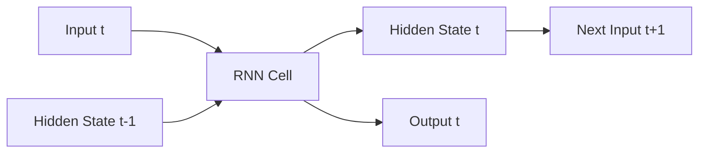

# Recurrent Neural Networks (RNNs) - Developer Notes

## Introduction

RNNs are designed to work with sequential data by maintaining an internal state (memory) that captures information about previous inputs.

### How RNNs Work
- Process input sequences one element at a time
- Maintain a hidden state that gets updated at each time step
- Output depends on current input and previous hidden state

### Architecture


### Advantages
- Handle variable-length sequences
- Capture temporal dependencies
- Memory of previous inputs

### Limitations
- Vanishing gradient problem
- Difficulty in learning long-term dependencies
- Computationally expensive for long sequences

### Code Example: Simple RNN for Text Classification

```python
import tensorflow as tf
from tensorflow import keras
import numpy as np

# Sample data
vocab_size = 10000
max_len = 100

# Build model
model = keras.Sequential([
    keras.layers.Embedding(vocab_size, 32, input_length=max_len),
    keras.layers.SimpleRNN(32),
    keras.layers.Dense(1, activation='sigmoid')
])

model.compile(optimizer='adam', loss='binary_crossentropy', metrics=['accuracy'])
print(model.summary())
```

### Hinglish Explanation
RNNs sequential data ke liye design kiye gaye hain, internal state (memory) maintain karte hain jo previous inputs ki information capture karta hai.

**Kaise kaam karte hain**: Input sequences ko one by one process karte hain, hidden state update karte hain har time step pe.

**Advantages**: Variable-length sequences handle karte hain, temporal dependencies capture karte hain.

**Limitations**: Vanishing gradient problem, long-term dependencies mein difficulty.