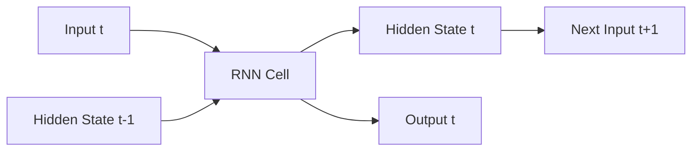

# Recurrent Neural Networks (RNNs) - Developer Notes

## Introduction

RNNs are designed to work with sequential data by maintaining an internal state (memory) that captures information about previous inputs.

### How RNNs Work
- Process input sequences one element at a time
- Maintain a hidden state that gets updated at each time step
- Output depends on current input and previous hidden state

### Architecture


### Detailed Flowchart Node Explanation

#### A: Input t
- **Purpose**: Current time step input data
- **Format**: Vector representation of input at time t
- **Example**: Word embedding, pixel values, sensor readings
- **Dimensions**: Usually (batch_size, input_dim)

#### B: RNN Cell
- **Purpose**: Core computation unit that combines current input with previous memory
- **Operation**: h_t = activation(W_ih * x_t + W_hh * h_{t-1} + b)
- **Parameters**:
  - **W_ih**: Input-to-hidden weight matrix
  - **W_hh**: Hidden-to-hidden weight matrix
  - **b**: Bias vector
- **Activation**: Usually tanh or ReLU
- **Output**: Produces both hidden state and output

#### C: Hidden State t-1
- **Purpose**: Memory from previous time step
- **Content**: Encoded information from all previous inputs
- **Initialization**: Usually zeros for the first time step
- **Dimensions**: (batch_size, hidden_dim)

#### D: Hidden State t
- **Purpose**: Updated memory containing information from current and all previous inputs
- **Computation**: Combines current input with previous hidden state
- **Dimensions**: Same as input hidden state (batch_size, hidden_dim)
- **Passes to**: Next time step as h_{t-1}

#### E: Output t
- **Purpose**: Prediction or feature representation at current time step
- **Computation**: Usually o_t = W_ho * h_t + b_o (optional linear transformation)
- **Use Cases**: Sequence prediction, classification at each time step
- **Dimensions**: (batch_size, output_dim)

#### F: Next Input t+1
- **Purpose**: Input for the subsequent time step
- **Connection**: Shows the sequential nature of RNN processing
- **Flow**: Hidden state t becomes hidden state t-1 for next iteration

### RNN Data Flow Summary
1. **Input t** → Current time step data
2. **Hidden State t-1** → Previous memory (initially zeros)
3. **RNN Cell** → Combines input + memory → new memory + output
4. **Hidden State t** → Updated memory for next time step
5. **Output t** → Prediction at current time step
6. **Next Input t+1** → Process repeats for sequence

### Hinglish Explanation
RNN Architecture ke har node ka purpose:

**A: Input t**: Current time step ka input data, jaise word embedding ya sensor reading

**B: RNN Cell**: Core computation jo current input aur previous memory combine karta hai

**C: Hidden State t-1**: Previous time step se memory, pehle time step pe zero hota hai

**D: Hidden State t**: Updated memory jo current aur saare previous inputs ki information contain karta hai

**E: Output t**: Current time step pe prediction ya feature representation

**F: Next Input t+1**: Agle time step ka input, sequential processing show karta hai

### Advantages
- Handle variable-length sequences
- Capture temporal dependencies
- Memory of previous inputs

### Limitations
- Vanishing gradient problem
- Difficulty in learning long-term dependencies
- Computationally expensive for long sequences

### Code Example: Simple RNN for Text Classification

```python
import tensorflow as tf
from tensorflow import keras
import numpy as np

# Sample data
vocab_size = 10000
max_len = 100

# Build model
model = keras.Sequential([
    keras.layers.Embedding(vocab_size, 32, input_length=max_len),
    keras.layers.SimpleRNN(32),
    keras.layers.Dense(1, activation='sigmoid')
])

model.compile(optimizer='adam', loss='binary_crossentropy', metrics=['accuracy'])
print(model.summary())
```

### Hinglish Explanation
RNNs sequential data ke liye design kiye gaye hain, internal state (memory) maintain karte hain jo previous inputs ki information capture karta hai.

**Kaise kaam karte hain**: Input sequences ko one by one process karte hain, hidden state update karte hain har time step pe.

**Advantages**: Variable-length sequences handle karte hain, temporal dependencies capture karte hain.

**Limitations**: Vanishing gradient problem, long-term dependencies mein difficulty.