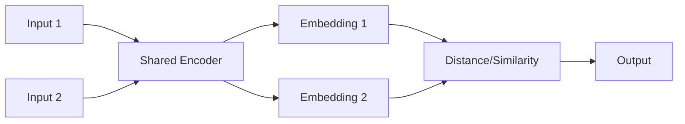

# Siamese Networks - Developer Notes

## Introduction

Siamese Networks are neural network architectures that learn similarity metrics between pairs of inputs, particularly useful for verification and matching tasks.

### How Siamese Networks Work
- **Shared Weights**: Same neural network applied to both inputs
- **Feature Extraction**: Convert inputs to fixed-dimensional embeddings
- **Similarity Measurement**: Compare embeddings using distance metrics
- **Contrastive Loss**: Train to minimize distance for similar pairs, maximize for dissimilar pairs

### Architecture


### Detailed Flowchart Node Explanation

#### A: Input 1
- **Purpose**: First input in the comparison pair
- **Format**: Audio waveform, spectrogram, or feature representation
- **Dimensions**: Varies by application (e.g., (time_steps, features) for audio)
- **Example**: Audio sample from speaker A

#### B: Input 2
- **Purpose**: Second input in the comparison pair
- **Format**: Same format as Input 1
- **Dimensions**: Same as Input 1
- **Example**: Audio sample to compare (same speaker or different)

#### C: Shared Encoder
- **Purpose**: Feature extraction network applied to both inputs identically
- **Architecture**: CNN/RNN layers that process raw inputs
- **Weights**: Same weights used for both Input 1 and Input 2
- **Output**: Fixed-dimensional embedding vectors
- **Function**: Maps variable-length inputs to consistent feature space

#### D: Embedding 1
- **Purpose**: Learned feature representation of Input 1
- **Dimensions**: Fixed size (e.g., 128, 256, 512 dimensions)
- **Content**: Compact representation capturing essential characteristics
- **Training**: Optimized to make similar inputs have similar embeddings

#### E: Embedding 2
- **Purpose**: Learned feature representation of Input 2
- **Dimensions**: Same as Embedding 1
- **Content**: Feature vector from the same encoder network
- **Comparison**: Will be compared with Embedding 1

#### F: Distance/Similarity
- **Purpose**: Quantify similarity between the two embeddings
- **Metrics**:
  - **Euclidean Distance**: L2 norm between vectors
  - **Cosine Similarity**: Angle between vectors
  - **Manhattan Distance**: L1 norm between vectors
- **Output**: Scalar value representing similarity/dissimilarity
- **Range**: Depends on metric (distance: [0,∞), similarity: [-1,1])

#### G: Output
- **Purpose**: Final prediction for the pair comparison
- **Format**: Probability or binary classification
- **Interpretation**:
  - **Similarity Score**: How similar the inputs are
  - **Verification Result**: Same/different speaker, same/different class
- **Training Target**: Ground truth labels (similar=1, dissimilar=0)

### Siamese Network Data Flow Summary
1. **Input 1 & Input 2** → Pair of items to compare
2. **Shared Encoder** → Same network processes both inputs
3. **Embedding 1 & Embedding 2** → Feature representations
4. **Distance/Similarity** → Quantify relationship between embeddings
5. **Output** → Similarity prediction or verification result

### Hinglish Explanation
Siamese Network Architecture ke har component ka purpose:

**A: Input 1**: Comparison pair ka pehla input (e.g., speaker A ka audio)

**B: Input 2**: Comparison pair ka dusra input (compare karne ke liye)

**C: Shared Encoder**: Dono inputs pe same network apply hota hai, features extract karta hai

**D: Embedding 1**: Input 1 ka learned feature representation

**E: Embedding 2**: Input 2 ka learned feature representation

**F: Distance/Similarity**: Dono embeddings ke beech distance ya similarity calculate karta hai

**G: Output**: Final prediction - kitne similar hain ya same class ke hain

### Key Components
- **Shared Encoder**: Convolutional or fully-connected network
- **Distance Metric**: Euclidean distance, cosine similarity, etc.
- **Loss Function**: Contrastive loss or triplet loss

### Applications in Audio
- **Speaker Verification**: Verify if two audio samples are from same speaker
- **Audio Fingerprinting**: Identify songs or audio clips
- **Sound Event Detection**: Classify and match audio events
- **Voice Authentication**: Biometric authentication using voice

### Code Example: Siamese Network for Audio Similarity

```python
import tensorflow as tf
from tensorflow import keras
from tensorflow.keras import layers

def create_base_network(input_shape):
    """Create the shared encoder network"""
    input_tensor = keras.Input(shape=input_shape)
    
    # Convolutional layers for audio processing
    x = layers.Conv1D(64, 3, activation='relu')(input_tensor)
    x = layers.MaxPooling1D(2)(x)
    x = layers.Conv1D(128, 3, activation='relu')(x)
    x = layers.MaxPooling1D(2)(x)
    x = layers.Conv1D(256, 3, activation='relu')(x)
    x = layers.GlobalMaxPooling1D()(x)
    
    # Dense layers
    x = layers.Dense(512, activation='relu')(x)
    x = layers.Dropout(0.3)(x)
    x = layers.Dense(256, activation='relu')(x)
    x = layers.Dropout(0.3)(x)
    output = layers.Dense(128, activation='relu')(x)  # Embedding dimension
    
    return keras.Model(input_tensor, output)

def euclidean_distance(vects):
    """Calculate Euclidean distance between two vectors"""
    x, y = vects
    sum_square = tf.reduce_sum(tf.square(x - y), axis=1, keepdims=True)
    return tf.sqrt(tf.maximum(sum_square, tf.keras.backend.epsilon()))

def contrastive_loss(y_true, y_pred):
    """Contrastive loss function"""
    margin = 1
    square_pred = tf.square(y_pred)
    margin_square = tf.square(tf.maximum(margin - y_pred, 0))
    return tf.reduce_mean(y_true * square_pred + (1 - y_true) * margin_square)

# Create Siamese network
input_shape = (1000, 1)  # Example: 1000 time steps, 1 channel
base_network = create_base_network(input_shape)

input_a = keras.Input(shape=input_shape)
input_b = keras.Input(shape=input_shape)

processed_a = base_network(input_a)
processed_b = base_network(input_b)

distance = layers.Lambda(euclidean_distance)([processed_a, processed_b])
output = layers.Dense(1, activation='sigmoid')(distance)

siamese_model = keras.Model([input_a, input_b], output)
siamese_model.compile(loss=contrastive_loss, optimizer='adam', metrics=['accuracy'])
```

### Training Data Preparation
- **Positive Pairs**: Similar audio samples (same speaker/song)
- **Negative Pairs**: Dissimilar audio samples
- **Data Augmentation**: Add noise, time stretching, pitch shifting

### Evaluation Metrics
- **Accuracy**: Classification accuracy for verification
- **Precision/Recall**: For detection tasks
- **EER (Equal Error Rate)**: For verification systems

### Advantages
- One-shot learning capability
- Robust to variations in input
- Efficient for similarity-based tasks

### Challenges
- Requires careful pair generation
- Sensitive to embedding quality
- Training can be unstable

### Hinglish Explanation
Siamese Networks neural network architectures hain jo pairs of inputs ke beech similarity metrics learn karte hain, verification aur matching tasks ke liye useful.

**Kaise kaam karte hain**: Same network dono inputs pe apply hota hai, embeddings extract kiye jaate hain, distance metrics se compare kiye jaate hain.

**Key Components**: Shared encoder, distance metric (Euclidean/cosine), contrastive loss.

**Audio Applications**: Speaker verification, audio fingerprinting, sound event detection.

**Advantages**: One-shot learning, robust to variations.

**Challenges**: Careful pair generation required, training unstable ho sakta hai.