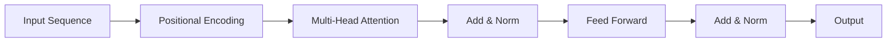

# Transformers - Developer Notes

## Introduction

Transformers revolutionized NLP by using attention mechanisms instead of recurrence, enabling parallel processing and better handling of long-range dependencies.

### Key Components
- **Multi-Head Attention**: Allows model to focus on different parts of input
- **Positional Encoding**: Adds position information to tokens
- **Feed-Forward Networks**: Process attention outputs
- **Layer Normalization**: Stabilizes training

### Architecture


### Advantages
- Parallel processing (faster training)
- Better long-range dependency modeling
- Scalable to large datasets
- Foundation for models like BERT, GPT

### Code Example: Simple Transformer Block

```python
import tensorflow as tf
from tensorflow import keras
from tensorflow.keras import layers

class TransformerBlock(layers.Layer):
    def __init__(self, embed_dim, num_heads, ff_dim, rate=0.1):
        super(TransformerBlock, self).__init__()
        self.att = layers.MultiHeadAttention(num_heads=num_heads, key_dim=embed_dim)
        self.ffn = keras.Sequential([
            layers.Dense(ff_dim, activation="relu"),
            layers.Dense(embed_dim),
        ])
        self.layernorm1 = layers.LayerNormalization(epsilon=1e-6)
        self.layernorm2 = layers.LayerNormalization(epsilon=1e-6)
        self.dropout1 = layers.Dropout(rate)
        self.dropout2 = layers.Dropout(rate)

    def call(self, inputs, training):
        attn_output = self.att(inputs, inputs)
        attn_output = self.dropout1(attn_output, training=training)
        out1 = self.layernorm1(inputs + attn_output)
        ffn_output = self.ffn(out1)
        ffn_output = self.dropout2(ffn_output, training=training)
        return self.layernorm2(out1 + ffn_output)
```

### Hinglish Explanation
Transformers ne NLP ko revolutionize kiya attention mechanisms use karke, parallel processing enable kiya aur long-range dependencies better handle kiye.

**Key Components**:
- **Multi-Head Attention**: Model ko input ke different parts pe focus karne deta hai
- **Positional Encoding**: Tokens ko position information add karta hai
- **Feed-Forward Networks**: Attention outputs process karta hai

**Advantages**: Parallel processing (fast training), better long-range modeling, scalable.