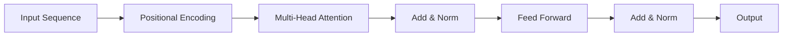

# Transformers - Developer Notes

## Introduction

Transformers revolutionized NLP by using attention mechanisms instead of recurrence, enabling parallel processing and better handling of long-range dependencies.

### Key Components
- **Multi-Head Attention**: Allows model to focus on different parts of input
- **Positional Encoding**: Adds position information to tokens
- **Feed-Forward Networks**: Process attention outputs
- **Layer Normalization**: Stabilizes training

### Architecture


### Detailed Flowchart Node Explanation

#### A: Input Sequence
- **Purpose**: Raw input tokens (words, subwords, or characters)
- **Format**: Sequence of token embeddings
- **Dimensions**: (batch_size, seq_length, embed_dim)
- **Example**: ["Hello", "world"] → [emb1, emb2]

#### B: Positional Encoding
- **Purpose**: Adds position information to token embeddings
- **Computation**: PE(pos, 2i) = sin(pos/10000^(2i/d)) and PE(pos, 2i+1) = cos(pos/10000^(2i/d))
- **Why needed**: Transformers have no recurrence, so position must be explicitly encoded
- **Output**: Position-aware embeddings (same dimensions as input)

#### C: Multi-Head Attention
- **Purpose**: Allows model to focus on different parts of the input simultaneously
- **Components**:
  - **Multiple heads**: Each learns different attention patterns
  - **Query, Key, Value**: Q = xW_Q, K = xW_K, V = xW_V
  - **Attention**: softmax(QK^T / sqrt(d_k)) * V
- **Output**: Context-aware representations
- **Dimensions**: Same as input (batch_size, seq_length, embed_dim)

#### D: Add & Norm
- **Purpose**: Residual connection + layer normalization for stable training
- **Computation**: LayerNorm(x + MultiHeadAttention(x))
- **Benefits**: Prevents vanishing gradients, stabilizes training
- **Output**: Normalized attention output with residual connection

#### E: Feed Forward
- **Purpose**: Position-wise feed-forward network for additional processing
- **Computation**: FFN(x) = max(0, xW1 + b1)W2 + b2 (typically 2-layer with ReLU)
- **Architecture**: Usually 4x expansion in hidden dimension
- **Output**: Enhanced representations (same embed_dim)

#### F: Add & Norm
- **Purpose**: Second residual connection + normalization
- **Computation**: LayerNorm(attention_output + FeedForward(attention_output))
- **Function**: Combines attention and feed-forward processing
- **Output**: Final processed representations for this layer

#### G: Output
- **Purpose**: Processed sequence ready for next layer or final prediction
- **Content**: Context-aware, position-encoded representations
- **Dimensions**: (batch_size, seq_length, embed_dim)
- **Use**: Input to next transformer block or task-specific head

### Transformer Data Flow Summary
1. **Input Sequence** → Raw token embeddings
2. **Positional Encoding** → Adds position information
3. **Multi-Head Attention** → Learns relationships between all positions
4. **Add & Norm** → Stabilizes with residual + normalization
5. **Feed Forward** → Additional non-linear processing per position
6. **Add & Norm** → Final stabilization for this block
7. **Output** → Enhanced representations for next layer

### Hinglish Explanation
Transformer Architecture ke har component ka purpose:

**A: Input Sequence**: Raw input tokens jaise words ya subwords

**B: Positional Encoding**: Token embeddings mein position information add karta hai (kyunki recurrence nahi hai)

**C: Multi-Head Attention**: Model ko input ke different parts pe simultaneously focus karne deta hai

**D: Add & Norm**: Residual connection aur layer normalization se training stable karta hai

**E: Feed Forward**: Har position pe additional processing karta hai (usually 2-layer network)

**F: Add & Norm**: Dusra residual connection jo attention aur feed-forward combine karta hai

**G: Output**: Next layer ya final prediction ke liye ready processed sequence

### Advantages
- Parallel processing (faster training)
- Better long-range dependency modeling
- Scalable to large datasets
- Foundation for models like BERT, GPT

### Code Example: Simple Transformer Block

```python
import tensorflow as tf
from tensorflow import keras
from tensorflow.keras import layers

class TransformerBlock(layers.Layer):
    def __init__(self, embed_dim, num_heads, ff_dim, rate=0.1):
        super(TransformerBlock, self).__init__()
        self.att = layers.MultiHeadAttention(num_heads=num_heads, key_dim=embed_dim)
        self.ffn = keras.Sequential([
            layers.Dense(ff_dim, activation="relu"),
            layers.Dense(embed_dim),
        ])
        self.layernorm1 = layers.LayerNormalization(epsilon=1e-6)
        self.layernorm2 = layers.LayerNormalization(epsilon=1e-6)
        self.dropout1 = layers.Dropout(rate)
        self.dropout2 = layers.Dropout(rate)

    def call(self, inputs, training):
        attn_output = self.att(inputs, inputs)
        attn_output = self.dropout1(attn_output, training=training)
        out1 = self.layernorm1(inputs + attn_output)
        ffn_output = self.ffn(out1)
        ffn_output = self.dropout2(ffn_output, training=training)
        return self.layernorm2(out1 + ffn_output)
```

### Hinglish Explanation
Transformers ne NLP ko revolutionize kiya attention mechanisms use karke, parallel processing enable kiya aur long-range dependencies better handle kiye.

**Key Components**:
- **Multi-Head Attention**: Model ko input ke different parts pe focus karne deta hai
- **Positional Encoding**: Tokens ko position information add karta hai
- **Feed-Forward Networks**: Attention outputs process karta hai

**Advantages**: Parallel processing (fast training), better long-range modeling, scalable.