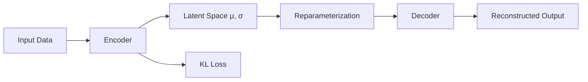

# Variational Autoencoders (VAEs) - Developer Notes

## Introduction

Variational Autoencoders are generative models that learn latent representations of data, particularly useful for audio and image generation.

### How VAEs Work
- **Encoder**: Compresses input data into a latent space representation
- **Latent Space**: Probabilistic distribution (mean and variance)
- **Decoder**: Reconstructs data from latent representation
- **KL Divergence**: Regularization term ensuring latent space structure

### Architecture


### Detailed Flowchart Node Explanation

#### A: Input Data
- **Purpose**: Raw input data to be encoded
- **Format**: Images, audio waveforms, or other high-dimensional data
- **Dimensions**: Varies by data type (e.g., images: (batch_size, height, width, channels))
- **Preprocessing**: Usually normalized/standardized

#### B: Encoder
- **Purpose**: Compresses input data into latent distribution parameters
- **Architecture**: Neural network (CNN for images, RNN for sequences)
- **Output**: Two vectors - mean (μ) and log variance (log σ²)
- **Function**: Learns to represent data in lower-dimensional space

#### C: Latent Space μ, σ
- **Purpose**: Probabilistic representation of the data
- **Components**:
  - **μ (mean)**: Center of the distribution
  - **σ (standard deviation)**: Spread of the distribution
- **Dimensions**: (batch_size, latent_dim)
- **Regularization**: KL divergence encourages standard normal distribution

#### D: Reparameterization
- **Purpose**: Enables backpropagation through stochastic sampling
- **Computation**: z = μ + σ * ε, where ε ~ N(0,1)
- **Trick**: Samples from distribution without breaking gradient flow
- **Output**: Deterministic latent vector z for decoder input

#### E: Decoder
- **Purpose**: Reconstructs original data from latent representation
- **Architecture**: Mirror of encoder (transpose CNN, etc.)
- **Input**: Reparameterized latent vector z
- **Function**: Maps from latent space back to data space

#### F: Reconstructed Output
- **Purpose**: Generated approximation of original input
- **Format**: Same as input data dimensions
- **Quality**: Measured by reconstruction loss (MSE, binary cross-entropy)
- **Use**: Training target and generation output

#### G: KL Loss
- **Purpose**: Regularization term for latent space structure
- **Computation**: KL(q(z|x) || p(z)) = -0.5 * Σ(1 + log σ² - μ² - σ²)
- **Function**: Encourages latent distributions to match standard normal
- **Balance**: Trades off with reconstruction loss via β parameter

### VAE Data Flow Summary
1. **Input Data** → Raw data (images, audio, etc.)
2. **Encoder** → Learns distribution parameters (μ, σ)
3. **Latent Space μ, σ** → Probabilistic representation
4. **Reparameterization** → Enables gradient flow through sampling
5. **Decoder** → Reconstructs data from latent vector
6. **Reconstructed Output** → Generated approximation
7. **KL Loss** → Regularizes latent space to be normal distribution

### Hinglish Explanation
VAE Architecture ke har component ka purpose:

**A: Input Data**: Raw input data jaise images ya audio waveforms

**B: Encoder**: Input data ko latent distribution parameters (μ, σ) mein compress karta hai

**C: Latent Space μ, σ**: Data ka probabilistic representation - mean aur standard deviation

**D: Reparameterization**: Stochastic sampling mein backpropagation enable karta hai

**E: Decoder**: Latent representation se original data reconstruct karta hai

**F: Reconstructed Output**: Original input ka generated approximation

**G: KL Loss**: Latent space ko regularize karta hai taaki normal distribution follow kare

### Key Components
- **Reparameterization Trick**: Allows backpropagation through stochastic nodes
- **ELBO Loss**: Evidence Lower Bound = Reconstruction Loss + KL Divergence

### Applications in Audio
- Voice conversion and synthesis
- Audio denoising and enhancement
- Music generation

### Code Example: Simple VAE for Audio

```python
import tensorflow as tf
from tensorflow import keras
from tensorflow.keras import layers

class Sampling(layers.Layer):
    def call(self, inputs):
        z_mean, z_log_var = inputs
        batch = tf.shape(z_mean)[0]
        dim = tf.shape(z_mean)[1]
        epsilon = tf.keras.backend.random_normal(shape=(batch, dim))
        return z_mean + tf.exp(0.5 * z_log_var) * epsilon

# Encoder
latent_dim = 2
encoder_inputs = keras.Input(shape=(784,))
x = layers.Dense(256, activation="relu")(encoder_inputs)
z_mean = layers.Dense(latent_dim, name="z_mean")(x)
z_log_var = layers.Dense(latent_dim, name="z_log_var")(x)
z = Sampling()([z_mean, z_log_var])
encoder = keras.Model(encoder_inputs, [z_mean, z_log_var, z], name="encoder")

# Decoder
latent_inputs = keras.Input(shape=(latent_dim,))
x = layers.Dense(256, activation="relu")(latent_inputs)
decoder_outputs = layers.Dense(784, activation="sigmoid")(x)
decoder = keras.Model(latent_inputs, decoder_outputs, name="decoder")

# VAE Model
class VAE(keras.Model):
    def __init__(self, encoder, decoder, **kwargs):
        super(VAE, self).__init__(**kwargs)
        self.encoder = encoder
        self.decoder = decoder
        self.total_loss_tracker = keras.metrics.Mean(name="total_loss")
        self.reconstruction_loss_tracker = keras.metrics.Mean(name="reconstruction_loss")
        self.kl_loss_tracker = keras.metrics.Mean(name="kl_loss")

    @property
    def metrics(self):
        return [
            self.total_loss_tracker,
            self.reconstruction_loss_tracker,
            self.kl_loss_tracker,
        ]

    def train_step(self, data):
        with tf.GradientTape() as tape:
            z_mean, z_log_var, z = self.encoder(data)
            reconstruction = self.decoder(z)
            reconstruction_loss = tf.reduce_mean(
                tf.reduce_sum(
                    keras.losses.binary_crossentropy(data, reconstruction), axis=(1, 2)
                )
            )
            kl_loss = -0.5 * (1 + z_log_var - tf.square(z_mean) - tf.exp(z_log_var))
            kl_loss = tf.reduce_mean(tf.reduce_sum(kl_loss, axis=1))
            total_loss = reconstruction_loss + kl_loss
        grads = tape.gradient(total_loss, self.trainable_weights)
        self.optimizer.apply_gradients(zip(grads, self.trainable_weights))
        self.total_loss_tracker.update_state(total_loss)
        self.reconstruction_loss_tracker.update_state(reconstruction_loss)
        self.kl_loss_tracker.update_state(kl_loss)
        return {
            "loss": self.total_loss_tracker.result(),
            "reconstruction_loss": self.reconstruction_loss_tracker.result(),
            "kl_loss": self.kl_loss_tracker.result(),
        }
```

### Advantages
- Generative capabilities
- Unsupervised learning
- Smooth latent space interpolation

### Challenges
- Blurry reconstructions
- Mode collapse in some variants
- Training instability

### Hinglish Explanation
Variational Autoencoders (VAEs) generative models hain jo data ke latent representations learn karte hain, especially audio aur images ke liye useful.

**Kaise kaam karte hain**: Encoder input ko latent space mein compress karta hai, decoder reconstruct karta hai, KL divergence latent space ko structure deta hai.

**Key Components**: Reparameterization trick backpropagation allow karta hai, ELBO loss reconstruction aur KL combine karta hai.

**Applications**: Voice conversion, audio synthesis, music generation.