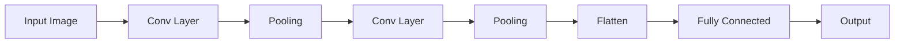
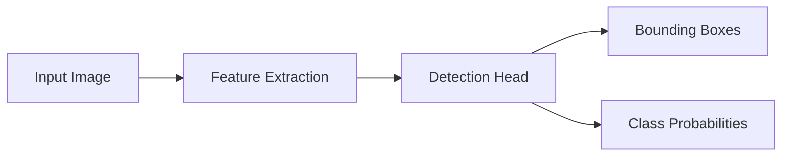

# Vision Models - Developer Notes

## Introduction

Vision models handle processing, analysis, and understanding of visual data such as images and videos.

### Convolutional Neural Networks (CNNs)

CNNs are specialized for processing grid-like data such as images.

#### Key Components
- **Convolutional Layers**: Extract features using filters
- **Pooling Layers**: Reduce spatial dimensions
- **Fully Connected Layers**: Classification

#### Architecture


#### Detailed Flowchart Node Explanation

##### A: Input Image
- **Purpose**: Raw visual data input
- **Format**: 2D/3D tensor (height × width × channels)
- **Dimensions**: Varies (e.g., 224×224×3 for RGB images)
- **Preprocessing**: Normalization, resizing, data augmentation
- **Type**: RGB, grayscale, or multi-channel images

##### B: Conv Layer
- **Purpose**: Extract local features using learnable filters
- **Operation**: Convolution with kernels across input
- **Parameters**: Kernel size (3×3, 5×5), stride, padding
- **Output**: Feature maps highlighting patterns (edges, textures)
- **Activation**: ReLU to introduce non-linearity

##### C: Pooling
- **Purpose**: Reduce spatial dimensions and computational load
- **Types**: Max pooling (keeps maximum values) or average pooling
- **Operation**: Downsample feature maps (typically 2×2 windows)
- **Benefits**: Translation invariance, reduced parameters
- **Output**: Smaller feature maps with retained important features

##### D: Conv Layer
- **Purpose**: Extract higher-level features from pooled maps
- **Architecture**: Deeper convolution with more filters
- **Filters**: Increased number (64, 128, 256) for complex features
- **Hierarchy**: Learns object parts, shapes, semantic features
- **Same Operation**: Convolution + activation as first conv layer

##### E: Pooling
- **Purpose**: Further dimension reduction before classification
- **Function**: Same as first pooling but on deeper features
- **Stride**: Usually 2×2 for 50% dimension reduction
- **Invariance**: Makes network robust to small translations
- **Output**: Compact feature representation

##### F: Flatten
- **Purpose**: Convert 2D feature maps to 1D vector
- **Operation**: Reshape multi-dimensional tensor to vector
- **Dimensions**: (batch_size, height × width × channels)
- **Purpose**: Prepare for fully connected layers
- **No Learning**: Pure reshaping operation

##### G: Fully Connected
- **Purpose**: Learn global patterns and relationships
- **Architecture**: Dense layer connecting all neurons
- **Parameters**: Large weight matrix (flattened_size × hidden_units)
- **Function**: Combine features for final classification
- **Regularization**: Dropout to prevent overfitting

##### H: Output
- **Purpose**: Final classification probabilities
- **Format**: Softmax probabilities for each class
- **Dimensions**: (batch_size, num_classes)
- **Training**: Cross-entropy loss against ground truth labels
- **Inference**: Argmax for predicted class

#### CNN Data Flow Summary
1. **Input Image** → Raw visual data
2. **Conv Layer** → Local feature extraction
3. **Pooling** → Spatial dimension reduction
4. **Conv Layer** → Higher-level feature extraction
5. **Pooling** → Further reduction
6. **Flatten** → Convert to 1D vector
7. **Fully Connected** → Global pattern learning
8. **Output** → Class probabilities

#### Hinglish Explanation
CNN Architecture ke har component ka purpose:

**A: Input Image**: Raw visual data input

**B: Conv Layer**: Local features extract karta hai using learnable filters

**C: Pooling**: Spatial dimensions reduce karta hai aur computation kam karta hai

**D: Conv Layer**: Higher-level features extract karta hai (object parts, shapes)

**E: Pooling**: Aur dimension reduction for efficiency

**F: Flatten**: 2D feature maps ko 1D vector mein convert karta hai

**G: Fully Connected**: Global patterns learn karta hai for classification

**H: Output**: Final class probabilities (softmax)

#### Advantages
- Parameter sharing reduces model size
- Translation invariance
- Hierarchical feature learning

#### Code Example: Simple CNN for Image Classification

```python
import tensorflow as tf
from tensorflow import keras

model = keras.Sequential([
    keras.layers.Conv2D(32, (3, 3), activation='relu', input_shape=(28, 28, 1)),
    keras.layers.MaxPooling2D((2, 2)),
    keras.layers.Conv2D(64, (3, 3), activation='relu'),
    keras.layers.MaxPooling2D((2, 2)),
    keras.layers.Flatten(),
    keras.layers.Dense(64, activation='relu'),
    keras.layers.Dense(10, activation='softmax')
])

model.compile(optimizer='adam', loss='categorical_crossentropy', metrics=['accuracy'])
```

### YOLO (You Only Look Once)

YOLO is a real-time object detection system that predicts bounding boxes and class probabilities simultaneously.

#### How YOLO Works
- Divides image into grid cells
- Each cell predicts bounding boxes and class probabilities
- Uses single neural network for detection

#### Advantages
- Real-time performance
- End-to-end training
- Better generalization

#### Architecture


#### Detailed Flowchart Node Explanation

##### A: Input Image
- **Purpose**: Raw image for object detection
- **Dimensions**: Variable size, resized to network input (416×416, 608×608)
- **Format**: RGB channels, normalized [0,1]
- **Preprocessing**: Letterbox resizing to maintain aspect ratio
- **Input**: Single image processed in one forward pass

##### B: Feature Extraction
- **Purpose**: Extract hierarchical features from input image
- **Architecture**: Backbone network (Darknet, ResNet, etc.)
- **Layers**: Convolutional layers with downsampling
- **Output**: Multi-scale feature maps
- **Function**: Learn edges, textures, object parts, semantic features

##### C: Detection Head
- **Purpose**: Transform features into detection predictions
- **Architecture**: Additional convolutional layers
- **Input**: Feature maps from backbone
- **Function**: Predict bounding boxes, classes, and confidences
- **Output**: Detection tensor with all predictions

##### D: Bounding Boxes
- **Purpose**: Predicted locations of objects in image
- **Format**: (x, y, width, height) coordinates
- **Representation**: Relative to image dimensions [0,1]
- **Anchor Boxes**: Predefined box shapes for different object sizes
- **Multiple Predictions**: Each location predicts multiple boxes

##### E: Class Probabilities
- **Purpose**: Predicted class labels for detected objects
- **Format**: Probability distribution over object classes
- **Classes**: Dataset-specific (COCO: 80, VOC: 20, custom)
- **Computation**: Softmax over class scores
- **Output**: Confidence scores for each class per bounding box

#### YOLO Data Flow Summary
1. **Input Image** → Raw image for detection
2. **Feature Extraction** → Learn hierarchical visual features
3. **Detection Head** → Generate detection predictions
4. **Bounding Boxes** → Object location predictions
5. **Class Probabilities** → Object class predictions

#### Hinglish Explanation
YOLO Architecture ke har component ka purpose:

**A: Input Image**: Object detection ke liye raw image

**B: Feature Extraction**: Image se hierarchical features extract karta hai

**C: Detection Head**: Features ko detection predictions mein convert karta hai

**D: Bounding Boxes**: Image mein objects ki predicted locations

**E: Class Probabilities**: Detected objects ke liye class probabilities

#### Code Example: Using YOLO with OpenCV

```python
import cv2
import numpy as np

# Load YOLO
net = cv2.dnn.readNet("yolov3.weights", "yolov3.cfg")
layer_names = net.getLayerNames()
output_layers = [layer_names[i - 1] for i in net.getUnconnectedOutLayers()]

# Load classes
with open("coco.names", "r") as f:
    classes = [line.strip() for line in f.readlines()]

# Load image
img = cv2.imread("image.jpg")
height, width, channels = img.shape

# Preprocess
blob = cv2.dnn.blobFromImage(img, 0.00392, (416, 416), (0, 0, 0), True, crop=False)
net.setInput(blob)
outs = net.forward(output_layers)

# Process detections
for out in outs:
    for detection in out:
        scores = detection[5:]
        class_id = np.argmax(scores)
        confidence = scores[class_id]
        if confidence > 0.5:
            # Draw bounding box
            center_x = int(detection[0] * width)
            center_y = int(detection[1] * height)
            w = int(detection[2] * width)
            h = int(detection[3] * height)
            x = int(center_x - w / 2)
            y = int(center_y - h / 2)
            cv2.rectangle(img, (x, y), (x + w, y + h), (0, 255, 0), 2)
```

### Hinglish Explanation
Vision Models:

**CNNs**: Images jaise grid-like data process karne ke liye specialized hain. Convolutional layers features extract karte hain, pooling dimensions reduce karta hai.

**YOLO**: Real-time object detection system. Image ko grid cells mein divide karta hai, bounding boxes aur class probabilities predict karta hai simultaneously.