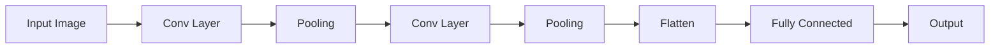
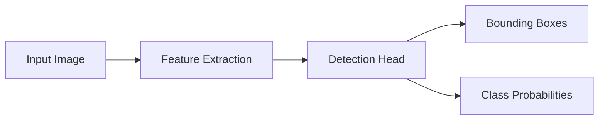

# Vision Models - Developer Notes

## Introduction

Vision models handle processing, analysis, and understanding of visual data such as images and videos.

### Convolutional Neural Networks (CNNs)

CNNs are specialized for processing grid-like data such as images.

#### Key Components
- **Convolutional Layers**: Extract features using filters
- **Pooling Layers**: Reduce spatial dimensions
- **Fully Connected Layers**: Classification

#### Architecture


#### Advantages
- Parameter sharing reduces model size
- Translation invariance
- Hierarchical feature learning

#### Code Example: Simple CNN for Image Classification

```python
import tensorflow as tf
from tensorflow import keras

model = keras.Sequential([
    keras.layers.Conv2D(32, (3, 3), activation='relu', input_shape=(28, 28, 1)),
    keras.layers.MaxPooling2D((2, 2)),
    keras.layers.Conv2D(64, (3, 3), activation='relu'),
    keras.layers.MaxPooling2D((2, 2)),
    keras.layers.Flatten(),
    keras.layers.Dense(64, activation='relu'),
    keras.layers.Dense(10, activation='softmax')
])

model.compile(optimizer='adam', loss='categorical_crossentropy', metrics=['accuracy'])
```

### YOLO (You Only Look Once)

YOLO is a real-time object detection system that predicts bounding boxes and class probabilities simultaneously.

#### How YOLO Works
- Divides image into grid cells
- Each cell predicts bounding boxes and class probabilities
- Uses single neural network for detection

#### Advantages
- Real-time performance
- End-to-end training
- Better generalization

#### Architecture


#### Code Example: Using YOLO with OpenCV

```python
import cv2
import numpy as np

# Load YOLO
net = cv2.dnn.readNet("yolov3.weights", "yolov3.cfg")
layer_names = net.getLayerNames()
output_layers = [layer_names[i - 1] for i in net.getUnconnectedOutLayers()]

# Load classes
with open("coco.names", "r") as f:
    classes = [line.strip() for line in f.readlines()]

# Load image
img = cv2.imread("image.jpg")
height, width, channels = img.shape

# Preprocess
blob = cv2.dnn.blobFromImage(img, 0.00392, (416, 416), (0, 0, 0), True, crop=False)
net.setInput(blob)
outs = net.forward(output_layers)

# Process detections
for out in outs:
    for detection in out:
        scores = detection[5:]
        class_id = np.argmax(scores)
        confidence = scores[class_id]
        if confidence > 0.5:
            # Draw bounding box
            center_x = int(detection[0] * width)
            center_y = int(detection[1] * height)
            w = int(detection[2] * width)
            h = int(detection[3] * height)
            x = int(center_x - w / 2)
            y = int(center_y - h / 2)
            cv2.rectangle(img, (x, y), (x + w, y + h), (0, 255, 0), 2)
```

### Hinglish Explanation
Vision Models:

**CNNs**: Images jaise grid-like data process karne ke liye specialized hain. Convolutional layers features extract karte hain, pooling dimensions reduce karta hai.

**YOLO**: Real-time object detection system. Image ko grid cells mein divide karta hai, bounding boxes aur class probabilities predict karta hai simultaneously.