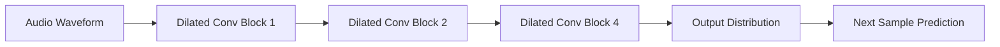

# Waveform Models - Developer Notes

## Introduction

Waveform models work directly with raw audio waveforms, processing audio as sequential time-domain signals.

### Key Characteristics
- Process audio as 1D sequences
- Maintain temporal resolution
- Capture fine-grained audio details

### Popular Waveform Models

#### WaveNet
- **Architecture**: Dilated convolutional network with causal convolutions
- **Key Feature**: Autoregressive generation of audio samples
- **Advantages**: High-quality audio synthesis
- **Limitations**: Slow inference due to sequential generation

#### Architecture


#### Code Example: Simplified WaveNet Block

```python
import tensorflow as tf
from tensorflow import keras

def wavenet_block(x, filters, kernel_size, dilation_rate):
    # Causal convolution
    x = keras.layers.Conv1D(filters, kernel_size, 
                           padding='causal', 
                           dilation_rate=dilation_rate)(x)
    # Gated activation
    tanh_out = keras.layers.Conv1D(filters, 1, activation='tanh')(x)
    sigm_out = keras.layers.Conv1D(filters, 1, activation='sigmoid')(x)
    x = keras.layers.Multiply()([tanh_out, sigm_out])
    # Skip connection
    skip = keras.layers.Conv1D(filters, 1)(x)
    # Residual connection
    residual = keras.layers.Conv1D(filters, 1)(x)
    return keras.layers.Add()([x, residual]), skip

# Build WaveNet stack
def build_wavenet(num_blocks=4, num_layers=10):
    input_audio = keras.Input(shape=(None, 1))
    skips = []
    
    x = input_audio
    for block in range(num_blocks):
        for layer in range(num_layers):
            dilation = 2 ** layer
            x, skip = wavenet_block(x, 32, 2, dilation)
            skips.append(skip)
    
    # Sum all skip connections
    total_skip = keras.layers.Add()(skips)
    total_skip = keras.layers.ReLU()(total_skip)
    total_skip = keras.layers.Conv1D(1, 1, activation='relu')(total_skip)
    total_skip = keras.layers.Conv1D(1, 1)(total_skip)
    
    # Output logits for 256 possible values (8-bit mu-law)
    output = keras.layers.Conv1D(256, 1)(total_skip)
    output = keras.layers.Softmax()(output)
    
    return keras.Model(input_audio, output)
```

#### WaveRNN
- **Architecture**: Recurrent network with dual RNNs
- **Key Feature**: Faster inference than WaveNet
- **Advantages**: Real-time generation capability
- **Trade-off**: Slightly lower audio quality

#### WaveGlow
- **Architecture**: Flow-based generative model
- **Key Feature**: Parallel generation (non-autoregressive)
- **Advantages**: Fast inference, high quality
- **Use Case**: Voice conversion and synthesis

### Training Considerations
- **Data Preparation**: Mu-law quantization for discrete audio
- **Loss Function**: Categorical cross-entropy for next sample prediction
- **Teacher Forcing**: Use ground truth for training stability

### Applications
- Text-to-speech synthesis
- Music generation
- Audio super-resolution
- Voice conversion

### Advantages of Waveform Models
- Preserve temporal fine structure
- No lossy compression artifacts
- Direct control over waveform generation

### Challenges
- High computational requirements
- Long training times
- Memory-intensive for long sequences

### Hinglish Explanation
Waveform Models raw audio waveforms ke saath directly kaam karte hain, audio ko 1D sequential signals ke roop mein process karte hain.

**Popular Models**:
- **WaveNet**: Dilated convolutions se high-quality audio generate karta hai, par slow inference
- **WaveRNN**: Faster inference ke liye recurrent network
- **WaveGlow**: Parallel generation ke liye flow-based model

**Applications**: TTS, music generation, voice conversion.

**Advantages**: Temporal structure preserve karta hai, direct waveform control.

**Challenges**: High computation, long training.