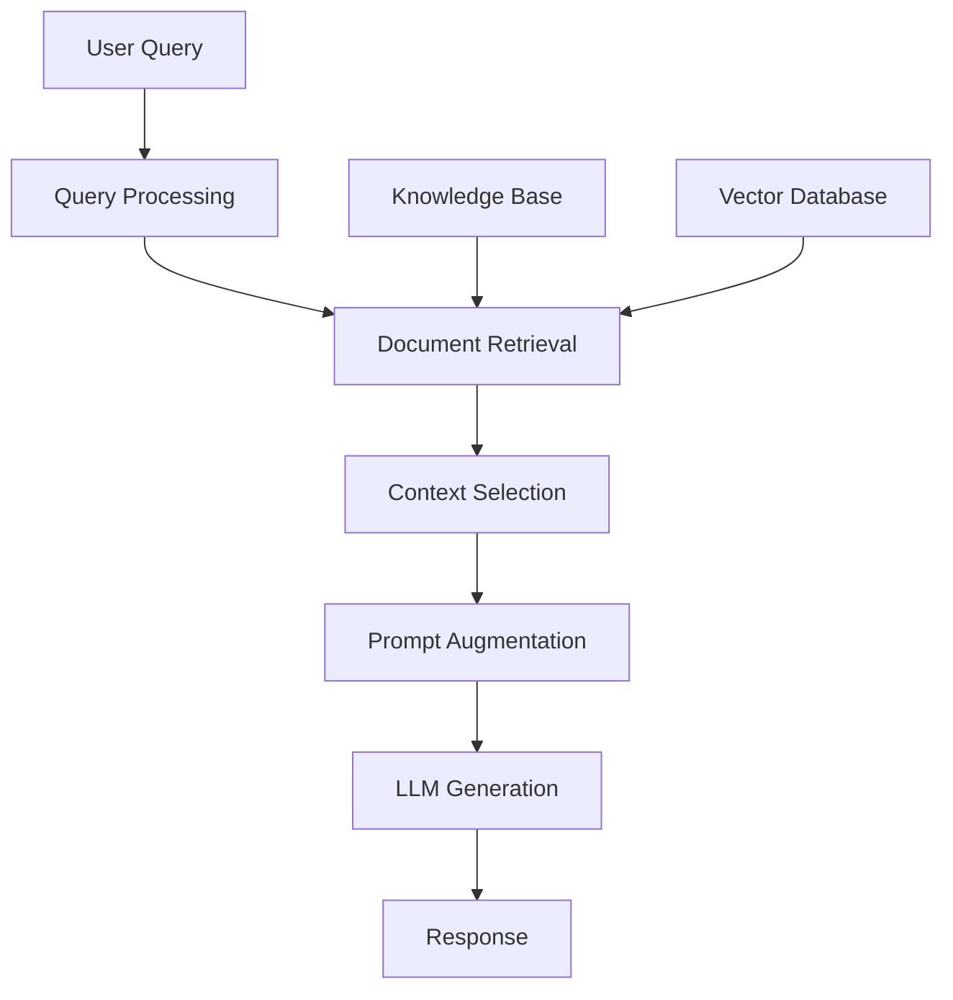

# Retrieval-Augmented Generation (RAG) - Developer Notes

## Introduction

Retrieval-Augmented Generation (RAG) combines retrieval-based systems with generative AI models. It retrieves relevant information from a knowledge base before generating responses, enabling more accurate and contextually relevant outputs.

### Hinglish Explanation
RAG retrieval-based systems aur generative AI models ko combine karta hai. Knowledge base se relevant information retrieve karne ke baad responses generate karta hai.

**Key Benefits:**
- Improved accuracy with up-to-date information
- Reduced hallucinations through grounded responses
- Easy domain adaptation
- Better explainability with source tracing

## How RAG Works

RAG operates in two stages:

### Stage 1: Retrieval
1. Query processing and transformation
2. Document search from knowledge base
3. Ranking by relevance
4. Context selection

### Stage 2: Generation
1. Context integration with query
2. Enhanced prompt creation
3. LLM response generation
4. Post-processing and formatting



## Core Components

### 1. Knowledge Base
- Document collection and preprocessing
- Text chunking and storage
- Vector database or traditional storage

### 2. Retrieval System
- Embedding models for text-to-vector conversion
- Vector database for similarity search
- Ranking and relevance scoring

### 3. Generation Model
- Large Language Models (GPT, Claude, Llama)
- Prompt engineering techniques
- Context-aware response generation

### 4. Orchestration Layer
- Query processing and routing
- Multi-document context management
- Response synthesis

## Types of RAG Architectures

### 1. Naive RAG
- Simple retrieval followed by generation
- Basic pipeline for straightforward use cases

### 2. Advanced RAG
- Query rewriting and expansion
- Multi-step retrieval and refinement
- Context compression and re-ranking

### 3. Modular RAG
- Routing for different query types
- Fusion of multiple retrievers
- Memory and tool integration

## Implementation Example

```python
from langchain.vectorstores import FAISS
from langchain.embeddings import OpenAIEmbeddings
from langchain.llms import OpenAI
from langchain.chains import RetrievalQA

# Load and process documents
documents = load_documents("knowledge_base/")

# Create embeddings and vector store
embeddings = OpenAIEmbeddings()
vectorstore = FAISS.from_documents(documents, embeddings)

# Create RAG chain
qa_chain = RetrievalQA.from_chain_type(
    llm=OpenAI(),
    chain_type="stuff",
    retriever=vectorstore.as_retriever()
)

# Query the system
query = "What is machine learning?"
response = qa_chain.run(query)
print(response)
```

## Popular Frameworks

- **LangChain**: Comprehensive RAG pipelines and integrations
- **LlamaIndex**: Data ingestion, indexing, and querying
- **Haystack**: Modular components and scalable architecture
- **Pinecone/Weaviate**: Vector databases for efficient retrieval

## Use Cases

### Enterprise Applications
- Customer support chatbots with accurate information
- Document Q&A systems for internal knowledge
- Compliance checking with regulatory documents

### Content Creation
- Research assistance with fact verification
- Writing support with contextual suggestions
- Educational content with personalized materials

### Specialized Domains
- Healthcare: Medical diagnosis with literature
- Finance: Market analysis with current data
- Legal: Contract analysis and research

## Best Practices

### Data Preparation
- Focus on high-quality, relevant documents
- Optimal chunk sizes (500-1000 tokens)
- Regular knowledge base updates

### Retrieval Optimization
- Choose domain-appropriate embedding models
- Use cosine similarity for relevance
- Implement re-ranking for better results

### Generation Enhancement
- Clear prompt instructions for context usage
- Manage context window limitations
- Include source citations

## Challenges

- **Retrieval Quality**: Finding truly relevant information
- **Context Length**: Limited LLM context windows
- **Latency**: Additional retrieval step increases response time
- **Maintenance**: Keeping knowledge bases current

## Getting Started

### Prerequisites
- Python programming skills
- Basic understanding of LLMs and embeddings
- Familiarity with vector databases

### Learning Path
1. Learn retrieval and generation concepts
2. Choose a framework (LangChain/LlamaIndex)
3. Experiment with document processing
4. Build a basic RAG system
5. Implement advanced techniques

### Resources
- LangChain documentation
- LlamaIndex guides
- Hugging Face models
- Pinecone tutorials

## Conclusion

RAG enhances LLMs by incorporating external knowledge sources, providing more accurate and reliable responses. It's essential for building production AI applications that require up-to-date, factual information.

---

*For Generative AI fundamentals, see: [generative-ai.md](generative-ai.md)*
*For Large AI Models, see: [large-ai-models/](large-ai-models/)*
