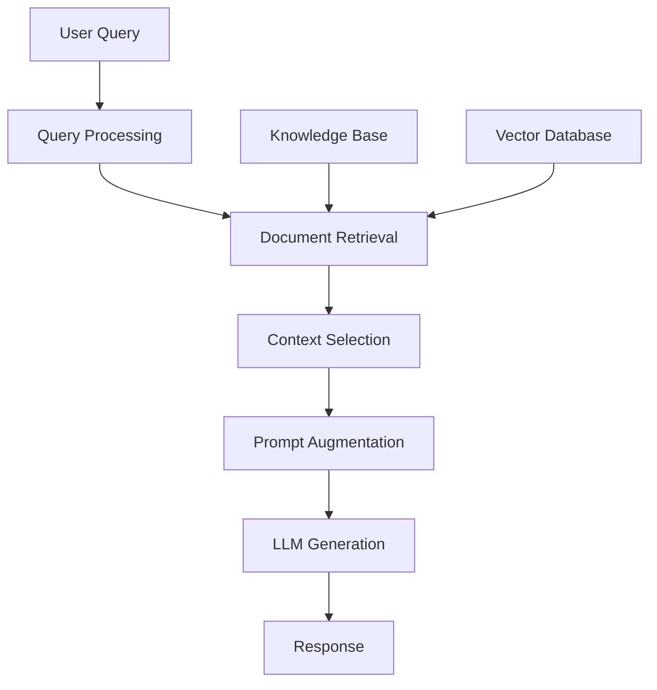

# Retrieval-Augmented Generation (RAG) - Developer Notes

## Introduction

Retrieval-Augmented Generation (RAG) combines retrieval-based systems with generative AI models. It retrieves relevant information from a knowledge base before generating responses, enabling more accurate and contextually relevant outputs.

### Hinglish Explanation
RAG retrieval-based systems aur generative AI models ko combine karta hai. Knowledge base se relevant information retrieve karne ke baad responses generate karta hai.

**Key Benefits:**
- Improved accuracy with up-to-date information
- Reduced hallucinations through grounded responses
- Easy domain adaptation
- Better explainability with source tracing

## How RAG Works

RAG operates in two stages:

### Stage 1: Retrieval
1. Query processing and transformation
2. Document search from knowledge base
3. Ranking by relevance
4. Context selection

### Stage 2: Generation
1. Context integration with query
2. Enhanced prompt creation
3. LLM response generation
4. Post-processing and formatting



## Core Components

### 1. Knowledge Base
- Document collection and preprocessing
- Text chunking and storage
- Vector database or traditional storage

### 2. Retrieval System
- Embedding models for text-to-vector conversion
- Vector database for similarity search
- Ranking and relevance scoring

### 3. Generation Model
- Large Language Models (GPT, Claude, Llama)
- Prompt engineering techniques
- Context-aware response generation

### 4. Orchestration Layer
- Query processing and routing
- Multi-document context management
- Response synthesis

## Types of RAG Architectures

### 1. Naive RAG
- Simple retrieval followed by generation
- Basic pipeline for straightforward use cases

### 2. Advanced RAG
- Query rewriting and expansion
- Multi-step retrieval and refinement
- Context compression and re-ranking

### 3. Modular RAG
- Routing for different query types
- Fusion of multiple retrievers
- Memory and tool integration

## Implementation Example

```python
from langchain.vectorstores import FAISS
from langchain.embeddings import OpenAIEmbeddings
from langchain.llms import OpenAI
from langchain.chains import RetrievalQA

# Load and process documents
documents = load_documents("knowledge_base/")

# Create embeddings and vector store
embeddings = OpenAIEmbeddings()
vectorstore = FAISS.from_documents(documents, embeddings)

# Create RAG chain
qa_chain = RetrievalQA.from_chain_type(
    llm=OpenAI(),
    chain_type="stuff",
    retriever=vectorstore.as_retriever()
)

# Query the system
query = "What is machine learning?"
response = qa_chain.run(query)
print(response)
```

## Popular Frameworks

- **LangChain**: Comprehensive RAG pipelines and integrations
- **LlamaIndex**: Data ingestion, indexing, and querying
- **Haystack**: Modular components and scalable architecture
- **Pinecone/Weaviate**: Vector databases for efficient retrieval

## Use Cases

### Enterprise Applications
- Customer support chatbots with accurate information
- Document Q&A systems for internal knowledge
- Compliance checking with regulatory documents

### Content Creation
- Research assistance with fact verification
- Writing support with contextual suggestions
- Educational content with personalized materials

### Specialized Domains
- Healthcare: Medical diagnosis with literature
- Finance: Market analysis with current data
- Legal: Contract analysis and research

## Best Practices

### Data Preparation
- Focus on high-quality, relevant documents
- Optimal chunk sizes (500-1000 tokens)
- Regular knowledge base updates

### Retrieval Optimization
- Choose domain-appropriate embedding models
- Use cosine similarity for relevance
- Implement re-ranking for better results

### Generation Enhancement
- Clear prompt instructions for context usage
- Manage context window limitations
- Include source citations

## Challenges

- **Retrieval Quality**: Finding truly relevant information
- **Context Length**: Limited LLM context windows
- **Latency**: Additional retrieval step increases response time
- **Maintenance**: Keeping knowledge bases current

## Getting Started

### Prerequisites
- Python programming skills
- Basic understanding of LLMs and embeddings
- Familiarity with vector databases

### Learning Path
1. Learn retrieval and generation concepts
2. Choose a framework (LangChain/LlamaIndex)
3. Experiment with document processing
4. Build a basic RAG system
5. Implement advanced techniques

### Resources
- LangChain documentation
- LlamaIndex guides
- Hugging Face models
- Pinecone tutorials

## Conclusion

RAG enhances LLMs by incorporating external knowledge sources, providing more accurate and reliable responses. It's essential for building production AI applications that require up-to-date, factual information.

---

*For Generative AI fundamentals, see: [generative-ai.md](generative-ai.md)*
*For Large AI Models, see: [large-ai-models/](large-ai-models/)*

### 1. Knowledge Base
- **Document Collection**: Source documents, articles, manuals, etc.
- **Preprocessing**: Text cleaning, chunking, and formatting
- **Storage**: Vector databases or traditional databases

### 2. Retrieval System
- **Embedding Model**: Converts text to vector representations
- **Vector Database**: Stores and searches document embeddings
- **Similarity Search**: Finds relevant documents using vector similarity

### 3. Generation Model
- **Large Language Model**: GPT, Claude, Llama, etc.
- **Prompt Engineering**: Techniques to effectively use retrieved context
- **Response Generation**: Creating coherent and accurate responses

### 4. Orchestration Layer
- **Query Processing**: Understanding and reformulating user queries
- **Context Management**: Handling multiple retrieved documents
- **Response Synthesis**: Combining information from multiple sources

### Hinglish Explanation
RAG ke Core Components:

**1. Knowledge Base**
- Source documents, articles, manuals, etc.
- Text cleaning, chunking, aur formatting
- Vector databases ya traditional databases mein storage

**2. Retrieval System**
- Text ko vector representations mein convert karne wala embedding model
- Document embeddings ko store aur search karne wala vector database
- Vector similarity use karke relevant documents dhundhta hai

**3. Generation Model**
- Large Language Model (GPT, Claude, Llama, etc.)
- Retrieved context ko effectively use karne ke liye prompt engineering
- Coherent aur accurate responses create karna

**4. Orchestration Layer**
- User queries ko understand aur reformulate karna
- Multiple retrieved documents ko handle karna
- Multiple sources se information combine karna

## Types of RAG Architectures

### 1. Naive RAG
- Simple retrieval followed by generation
- Basic implementation with straightforward pipeline
- Good for simple use cases

### 2. Advanced RAG
- **Query Rewriting**: Reformulating queries for better retrieval
- **Multi-step Retrieval**: Iterative retrieval and refinement
- **Context Compression**: Summarizing retrieved information
- **Re-ranking**: Advanced ranking of retrieved documents

### 3. Modular RAG
- **Routing**: Different retrieval strategies for different query types
- **Fusion**: Combining results from multiple retrievers
- **Memory**: Incorporating conversation history
- **Tool Integration**: Using external tools and APIs

### 4. Graph RAG
- **Knowledge Graphs**: Structured relationships between entities
- **Graph Traversal**: Navigating connected information
- **Entity Linking**: Connecting mentions to knowledge graph nodes

### Hinglish Explanation
RAG Architectures ke Types:

**1. Naive RAG**
- Simple retrieval followed by generation
- Straightforward pipeline wala basic implementation
- Simple use cases ke liye good

**2. Advanced RAG**
- Better retrieval ke liye queries ko rewrite karna
- Iterative retrieval aur refinement
- Retrieved information ko summarize karna
- Retrieved documents ka advanced ranking

**3. Modular RAG**
- Different query types ke liye different retrieval strategies
- Multiple retrievers ke results ko combine karna
- Conversation history incorporate karna
- External tools aur APIs ka use

**4. Graph RAG**
- Entities ke beech structured relationships
- Connected information mein navigate karna
- Knowledge graph nodes se mentions ko connect karna

## Implementation Approaches

### Basic RAG Pipeline

```python
from langchain.vectorstores import FAISS
from langchain.embeddings import OpenAIEmbeddings
from langchain.llms import OpenAI
from langchain.chains import RetrievalQA

# 1. Load and process documents
documents = load_documents("knowledge_base/")

# 2. Create embeddings
embeddings = OpenAIEmbeddings()
vectorstore = FAISS.from_documents(documents, embeddings)

# 3. Create retrieval chain
qa_chain = RetrievalQA.from_chain_type(
    llm=OpenAI(),
    chain_type="stuff",
    retriever=vectorstore.as_retriever()
)

# 4. Query the system
query = "What is machine learning?"
response = qa_chain.run(query)
print(response)
```

### Advanced RAG with LangChain

```python
from langchain.document_loaders import DirectoryLoader
from langchain.text_splitter import RecursiveCharacterTextSplitter
from langchain.vectorstores import Chroma
from langchain.embeddings import HuggingFaceEmbeddings
from langchain.llms import HuggingFacePipeline
from langchain.chains import ConversationalRetrievalChain
from langchain.memory import ConversationBufferMemory

# Document processing
loader = DirectoryLoader('./docs', glob="**/*.md")
documents = loader.load()

text_splitter = RecursiveCharacterTextSplitter(
    chunk_size=1000,
    chunk_overlap=200
)
splits = text_splitter.split_documents(documents)

# Vector store
embeddings = HuggingFaceEmbeddings()
vectorstore = Chroma.from_documents(splits, embeddings)

# LLM setup
llm = HuggingFacePipeline.from_model_id(
    model_id="microsoft/DialoGPT-medium",
    task="text-generation"
)

# Memory for conversation
memory = ConversationBufferMemory(
    memory_key="chat_history",
    return_messages=True
)

# RAG chain
qa_chain = ConversationalRetrievalChain.from_llm(
    llm=llm,
    retriever=vectorstore.as_retriever(),
    memory=memory
)

# Interactive querying
while True:
    query = input("Ask a question: ")
    if query.lower() == 'quit':
        break
    result = qa_chain({"question": query})
    print(f"Answer: {result['answer']}")
```

### Custom RAG with Transformers

```python
import torch
from transformers import AutoTokenizer, AutoModel
from sklearn.metrics.pairwise import cosine_similarity
import numpy as np

class RAGSystem:
    def __init__(self, documents, model_name="sentence-transformers/all-MiniLM-L6-v2"):
        self.documents = documents
        self.tokenizer = AutoTokenizer.from_pretrained(model_name)
        self.model = AutoModel.from_pretrained(model_name)
        self.document_embeddings = self._encode_documents()

    def _encode_documents(self):
        """Encode all documents to embeddings"""
        embeddings = []
        for doc in self.documents:
            inputs = self.tokenizer(doc, return_tensors="pt",
                                  truncation=True, padding=True, max_length=512)
            with torch.no_grad():
                outputs = self.model(**inputs)
                embedding = outputs.last_hidden_state.mean(dim=1).numpy()
            embeddings.append(embedding[0])
        return np.array(embeddings)

    def retrieve(self, query, top_k=3):
        """Retrieve most relevant documents"""
        query_inputs = self.tokenizer(query, return_tensors="pt",
                                    truncation=True, padding=True, max_length=512)
        with torch.no_grad():
            query_outputs = self.model(**query_inputs)
            query_embedding = query_outputs.last_hidden_state.mean(dim=1).numpy()

        similarities = cosine_similarity(query_embedding, self.document_embeddings)[0]
        top_indices = np.argsort(similarities)[-top_k:][::-1]

        return [self.documents[i] for i in top_indices]

    def generate_response(self, query, retrieved_docs):
        """Generate response using retrieved context"""
        context = "\n".join(retrieved_docs)
        prompt = f"Context: {context}\n\nQuestion: {query}\n\nAnswer:"

        # Use a generative model (simplified example)
        # In practice, you'd use a proper LLM here
        return f"Based on the retrieved information: {context[:200]}..."

# Usage
documents = [
    "Machine learning is a subset of AI that enables systems to learn from data.",
    "Deep learning uses neural networks with multiple layers.",
    "Supervised learning requires labeled training data."
]

rag = RAGSystem(documents)
query = "What is machine learning?"
retrieved = rag.retrieve(query)
response = rag.generate_response(query, retrieved)
print(response)
```

## Popular RAG Frameworks and Tools

### LangChain
- **Features**: Comprehensive RAG pipeline, multiple integrations
- **Use Cases**: Production RAG applications, complex workflows
- **Strengths**: Extensive documentation, active community

### LlamaIndex (formerly GPT Index)
- **Features**: Data ingestion, indexing, and querying
- **Use Cases**: Document Q&A, knowledge base creation
- **Strengths**: Easy to use, good for beginners

### Haystack
- **Features**: Modular RAG components, scalable architecture
- **Use Cases**: Enterprise search, document analysis
- **Strengths**: Production-ready, extensive customization

### Pinecone & Weaviate
- **Features**: Vector databases for efficient similarity search
- **Use Cases**: High-performance retrieval, large-scale applications
- **Strengths**: Managed services, advanced indexing

### Hinglish Explanation
Popular RAG Frameworks aur Tools:

**LangChain**
- Comprehensive RAG pipeline, multiple integrations
- Production RAG applications, complex workflows
- Extensive documentation, active community

**LlamaIndex**
- Data ingestion, indexing, aur querying
- Document Q&A, knowledge base creation
- Easy to use, beginners ke liye good

**Haystack**
- Modular RAG components, scalable architecture
- Enterprise search, document analysis
- Production-ready, extensive customization

**Pinecone & Weaviate**
- Efficient similarity search ke liye vector databases
- High-performance retrieval, large-scale applications
- Managed services, advanced indexing

## Use Cases and Applications

### Customer Support
- **Intelligent Chatbots**: Context-aware customer service
- **Knowledge Base Q&A**: Instant answers from documentation
- **Ticket Resolution**: Automated support with accurate information

### Content Creation
- **Research Assistance**: Fact-checking and information gathering
- **Writing Support**: Contextual suggestions and citations
- **Educational Content**: Personalized learning materials

### Enterprise Applications
- **Document Analysis**: Legal document review, contract analysis
- **Compliance Checking**: Regulatory compliance verification
- **Internal Knowledge**: Employee onboarding and training

### Healthcare
- **Medical Diagnosis**: Symptom analysis with medical literature
- **Drug Information**: Medication details and interactions
- **Research Synthesis**: Latest medical research summaries

### Finance
- **Market Analysis**: Financial report analysis and insights
- **Risk Assessment**: Portfolio risk evaluation with market data
- **Regulatory Compliance**: Financial regulation monitoring

### Hinglish Explanation
Use Cases aur Applications:

**Customer Support**
- Context-aware customer service wale intelligent chatbots
- Documentation se instant answers
- Accurate information ke saath automated support

**Content Creation**
- Fact-checking aur information gathering
- Contextual suggestions aur citations
- Personalized learning materials

**Enterprise Applications**
- Legal document review, contract analysis
- Regulatory compliance verification
- Employee onboarding aur training

**Healthcare**
- Medical literature ke saath symptom analysis
- Medication details aur interactions
- Latest medical research summaries

**Finance**
- Financial report analysis aur insights
- Market data ke saath portfolio risk evaluation
- Financial regulation monitoring

## Best Practices for RAG Implementation

### Data Preparation
- **Quality over Quantity**: Focus on high-quality, relevant documents
- **Chunking Strategy**: Optimal chunk sizes (500-1000 tokens)
- **Metadata Enrichment**: Add timestamps, sources, and categories
- **Regular Updates**: Keep knowledge base current

### Retrieval Optimization
- **Embedding Selection**: Choose domain-appropriate embedding models
- **Similarity Metrics**: Cosine similarity, dot product, or hybrid approaches
- **Re-ranking**: Use cross-encoders for better relevance
- **Diversity**: Ensure diverse retrieved documents

### Generation Enhancement
- **Prompt Engineering**: Clear instructions for using retrieved context
- **Context Window Management**: Handle long contexts effectively
- **Response Validation**: Fact-checking generated responses
- **Citation Requirements**: Include source references

### Performance and Scalability
- **Caching**: Cache frequent queries and embeddings
- **Indexing**: Efficient indexing for fast retrieval
- **Batch Processing**: Process multiple queries efficiently
- **Monitoring**: Track retrieval quality and response accuracy

### Hinglish Explanation
RAG Implementation ke Best Practices:

**Data Preparation**
- High-quality, relevant documents pe focus
- Optimal chunk sizes (500-1000 tokens)
- Timestamps, sources, aur categories add karo
- Knowledge base ko current rakhiye

**Retrieval Optimization**
- Domain-appropriate embedding models choose karo
- Cosine similarity, dot product, ya hybrid approaches
- Better relevance ke liye cross-encoders use karo
- Diverse retrieved documents ensure karo

**Generation Enhancement**
- Retrieved context use karne ke liye clear instructions
- Long contexts ko effectively handle karo
- Generated responses ko fact-check karo
- Source references include karo

**Performance and Scalability**
- Frequent queries aur embeddings ko cache karo
- Fast retrieval ke liye efficient indexing
- Multiple queries ko efficiently process karo
- Retrieval quality aur response accuracy track karo

## Challenges and Limitations

### Technical Challenges
- **Retrieval Quality**: Finding truly relevant information
- **Context Length**: Limited context windows in LLMs
- **Latency**: Additional retrieval step increases response time
- **Scalability**: Handling large knowledge bases efficiently

### Quality Issues
- **Hallucinations**: Still possible despite retrieved context
- **Bias Propagation**: Biases in retrieved documents
- **Outdated Information**: Stale knowledge bases
- **Context Fragmentation**: Incomplete information from chunks

### Implementation Challenges
- **Data Privacy**: Handling sensitive information
- **Cost Management**: Embedding generation and storage costs
- **Integration Complexity**: Fitting RAG into existing systems
- **Maintenance Overhead**: Keeping knowledge bases updated

### Hinglish Explanation
Challenges aur Limitations:

**Technical Challenges**
- Truly relevant information dhundhna
- LLMs mein limited context windows
- Additional retrieval step se response time increase
- Large knowledge bases ko efficiently handle karna

**Quality Issues**
- Retrieved context ke bawajood hallucinations possible
- Retrieved documents mein biases
- Stale knowledge bases se outdated information
- Chunks se incomplete information

**Implementation Challenges**
- Sensitive information handle karna
- Embedding generation aur storage costs
- Existing systems mein RAG ko fit karna
- Knowledge bases ko updated rakhne ka overhead

## Future Directions

### Advanced Architectures
- **Multi-modal RAG**: Combining text, images, and other modalities
- **Agent-based RAG**: RAG systems that can use tools and APIs
- **Self-improving RAG**: Systems that learn from user feedback
- **Federated RAG**: Distributed knowledge across organizations

### Research Areas
- **Retrieval Optimization**: Better similarity measures and ranking
- **Context Compression**: Efficient long-context handling
- **Knowledge Integration**: Seamless integration of multiple sources
- **Evaluation Metrics**: Comprehensive RAG evaluation frameworks

### Industry Trends
- **Enterprise Adoption**: RAG in production enterprise applications
- **Edge Deployment**: RAG systems running on edge devices
- **Personalization**: User-specific knowledge bases and preferences
- **Multilingual Support**: RAG systems for multiple languages

### Hinglish Explanation
Future Directions:

**Advanced Architectures**
- Text, images, aur other modalities ko combine karna
- Tools aur APIs use kar sakne wale RAG systems
- User feedback se learn karne wale systems
- Organizations ke beech distributed knowledge

**Research Areas**
- Better similarity measures aur ranking
- Efficient long-context handling
- Multiple sources ka seamless integration
- Comprehensive RAG evaluation frameworks

**Industry Trends**
- Production enterprise applications mein RAG
- Edge devices pe running RAG systems
- User-specific knowledge bases aur preferences
- Multiple languages ke liye RAG systems

## Getting Started with RAG

### Prerequisites
- Python programming skills
- Understanding of LLMs and embeddings
- Basic knowledge of vector databases
- Familiarity with API usage

### Learning Path
1. **Learn Basics**: Understand retrieval and generation concepts
2. **Choose Framework**: Select appropriate RAG framework (LangChain, LlamaIndex)
3. **Data Preparation**: Learn document processing and chunking
4. **Embedding Models**: Experiment with different embedding approaches
5. **Build Simple RAG**: Create basic retrieval-augmented generation system
6. **Advanced Techniques**: Implement re-ranking, query expansion, etc.
7. **Production Deployment**: Learn scaling and monitoring

### Resources
- **LangChain Documentation**: Comprehensive RAG tutorials
- **LlamaIndex Guides**: Step-by-step implementation examples
- **Hugging Face Models**: Pre-trained embeddings and LLMs
- **Pinecone Documentation**: Vector database best practices

### Hinglish Explanation
RAG ke saath Getting Started:

**Prerequisites**
- Python programming skills
- LLMs aur embeddings ka understanding
- Vector databases ka basic knowledge
- API usage se familiarity

**Learning Path**
1. Retrieval aur generation concepts seekho
2. Appropriate RAG framework choose karo (LangChain, LlamaIndex)
3. Document processing aur chunking seekho
4. Different embedding approaches ke saath experiment karo
5. Basic retrieval-augmented generation system banao
6. Re-ranking, query expansion, etc. implement karo
7. Scaling aur monitoring seekho

**Resources**
- LangChain Documentation: Comprehensive RAG tutorials
- LlamaIndex Guides: Step-by-step implementation examples
- Hugging Face Models: Pre-trained embeddings aur LLMs
- Pinecone Documentation: Vector database best practices

## Code Example: Complete RAG System

```python
import os
from langchain.document_loaders import TextLoader
from langchain.text_splitter import CharacterTextSplitter
from langchain.embeddings import OpenAIEmbeddings
from langchain.vectorstores import FAISS
from langchain.llms import OpenAI
from langchain.chains import RetrievalQA
from langchain.prompts import PromptTemplate

# Set up OpenAI API key
os.environ["OPENAI_API_KEY"] = "your-api-key-here"

def create_rag_system(documents_path):
    """Create a complete RAG system"""

    # Load documents
    loader = TextLoader(documents_path)
    documents = loader.load()

    # Split documents into chunks
    text_splitter = CharacterTextSplitter(
        chunk_size=1000,
        chunk_overlap=200,
        separator="\n"
    )
    texts = text_splitter.split_documents(documents)

    # Create embeddings and vector store
    embeddings = OpenAIEmbeddings()
    vectorstore = FAISS.from_documents(texts, embeddings)

    # Create custom prompt template
    template = """
    Use the following pieces of context to answer the question at the end.
    If you don't know the answer, just say that you don't know, don't try to make up an answer.

    Context: {context}

    Question: {question}

    Answer the question based only on the provided context. Provide a detailed and accurate answer.
    """

    prompt = PromptTemplate(
        template=template,
        input_variables=["context", "question"]
    )

    # Create RAG chain
    qa_chain = RetrievalQA.from_chain_type(
        llm=OpenAI(temperature=0),
        chain_type="stuff",
        retriever=vectorstore.as_retriever(search_kwargs={"k": 3}),
        chain_type_kwargs={"prompt": prompt},
        return_source_documents=True
    )

    return qa_chain

# Usage example
if __name__ == "__main__":
    # Create RAG system
    rag_system = create_rag_system("knowledge_base.txt")

    # Ask questions
    questions = [
        "What is machine learning?",
        "How does deep learning work?",
        "What are the types of supervised learning?"
    ]

    for question in questions:
        print(f"\nQuestion: {question}")
        result = rag_system({"query": question})
        print(f"Answer: {result['result']}")
        print(f"Sources: {len(result['source_documents'])} documents retrieved")
```

## Conclusion

Retrieval-Augmented Generation represents a significant advancement in AI capabilities, bridging the gap between parametric knowledge in LLMs and external, up-to-date information sources. By combining the strengths of retrieval systems and generative models, RAG enables more accurate, reliable, and contextually appropriate responses.

As RAG technology continues to evolve, it will play an increasingly important role in enterprise applications, customer service, content creation, and knowledge management systems. Understanding RAG principles and implementation approaches is essential for developers working with modern AI applications.

---

*For more information on Generative AI fundamentals, see: [generative-ai.md](generative-ai.md)*
*For Large Language Models and architectures, see: [large-ai-models/](large-ai-models/)*