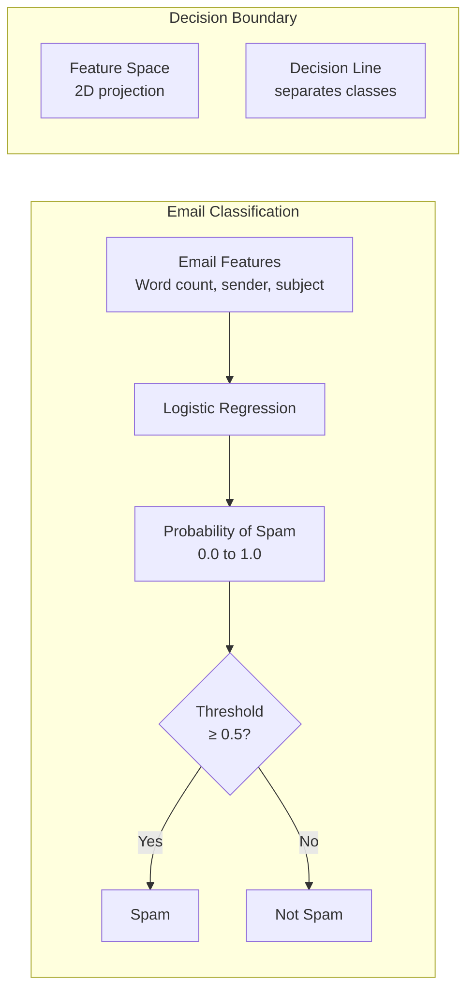
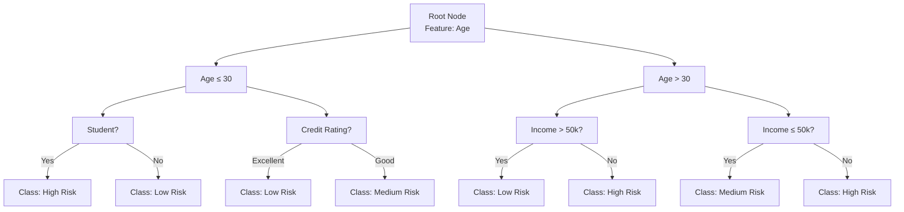
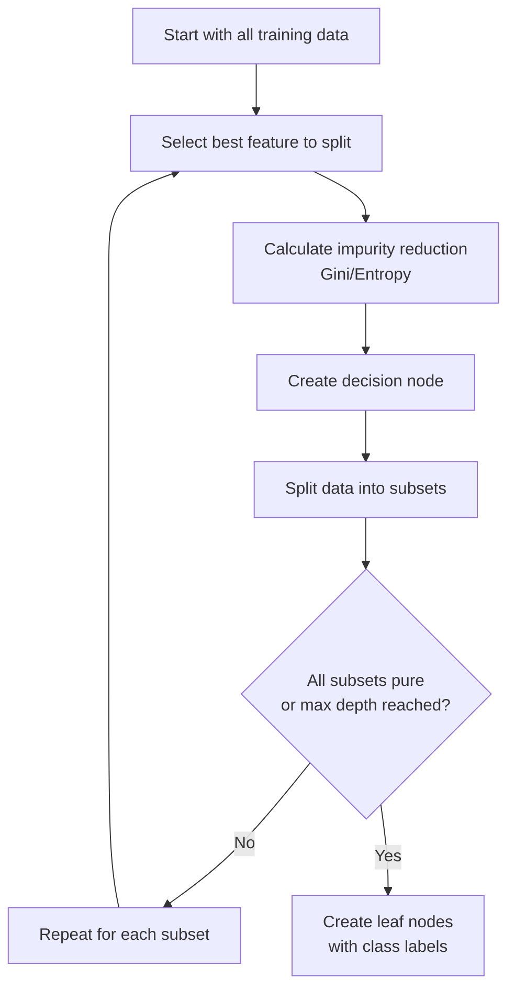
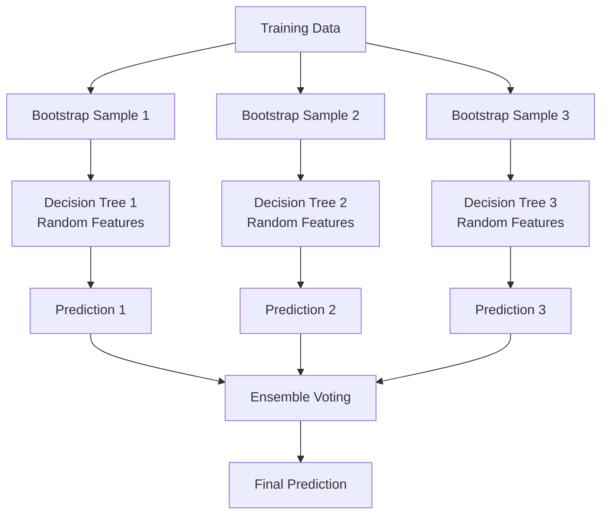
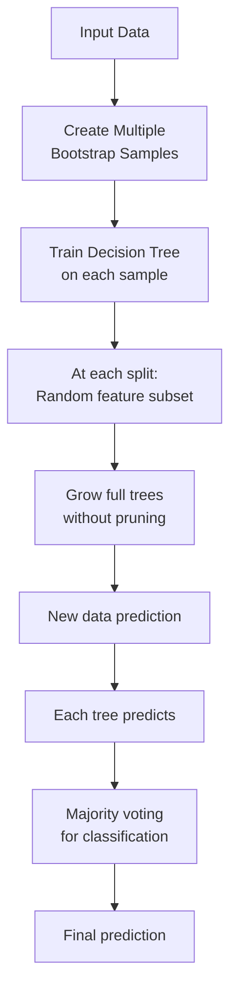
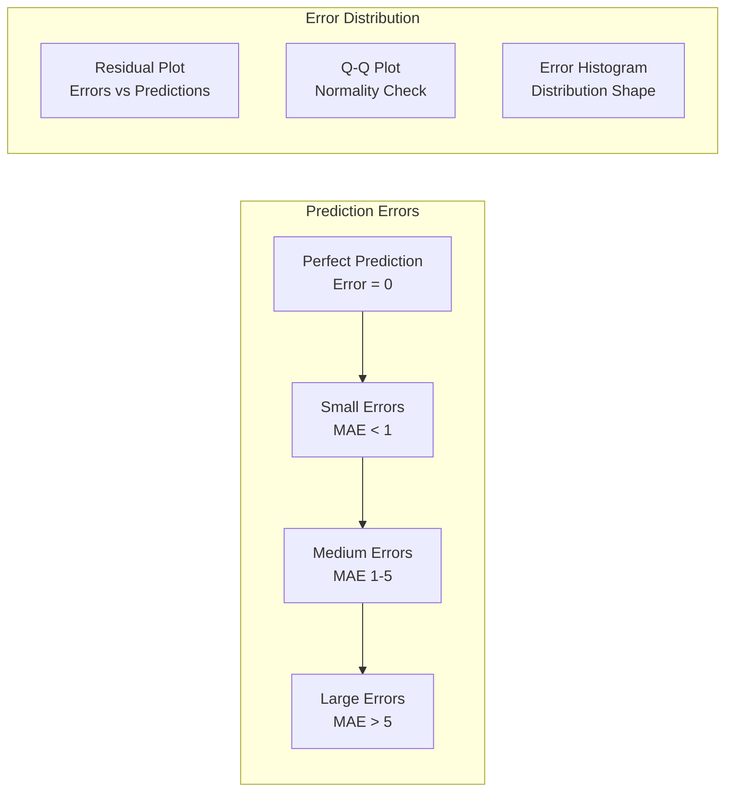

# Supervised Learning - Developer Notes

## Introduction

Supervised learning is a type of machine learning where models learn from labeled training data to make predictions on new, unseen data. The algorithm learns the relationship between input features and target outputs.

### Hinglish Explanation
Supervised learning ek machine learning technique hai jismein models labeled training data se learn karte hain aur new, unseen data pe predictions karte hain. Algorithm input features aur target outputs ke beech relationship seekhta hai.

## Regression
Regression predicts continuous numerical values. It finds the relationship between variables to predict outcomes like prices, temperatures, or quantities.

**Types of Regression:**
- **Linear Regression**: Simple straight-line relationship
- **Polynomial Regression**: Curved relationships
- **Ridge/Lasso Regression**: Regularized linear regression

```mermaid
graph TD
    A[Input Features<br/>x₁, x₂, x₃] --> B[Regression Model<br/>f(x) = w₁x₁ + w₂x₂ + ... + b]
    B --> C[Continuous Output<br/>ŷ (predicted value)]
    D[Training Data<br/>Labeled examples] --> B
    C --> E[Loss Function<br/>MSE = Σ(y - ŷ)²/n]
    E --> F[Gradient Descent<br/>Update weights]
    F --> B
```

**Regression Graph Example:**
```mermaid
graph LR
    subgraph "House Price Prediction"
    A[House Size (sq ft)] --> B[Linear Regression Model]
    B --> C[Predicted Price ($)]
    end

    subgraph "Sample Data Points"
    D[(1000, $200k)]
    E[(1500, $280k)]
    F[(2000, $350k)]
    end

    subgraph "Regression Line"
    G[y = 0.15x + 50k]
    end
```

```python
# Comprehensive Regression Example
import numpy as np
import matplotlib.pyplot as plt
from sklearn.linear_model import LinearRegression
from sklearn.metrics import mean_squared_error, r2_score

# Generate sample data
np.random.seed(42)
X = np.random.rand(100, 1) * 10
y = 2.5 * X.flatten() + 1.5 + np.random.randn(100) * 2

# Train model
model = LinearRegression()
model.fit(X, y)

# Predictions
y_pred = model.predict(X)

# Metrics
mse = mean_squared_error(y, y_pred)
r2 = r2_score(y, y_pred)

print(f"Mean Squared Error: {mse:.2f}")
print(f"R² Score: {r2:.2f}")
print(f"Slope: {model.coef_[0]:.2f}")
print(f"Intercept: {model.intercept_:.2f}")

# Plotting (conceptual)
# plt.scatter(X, y, color='blue', label='Actual')
# plt.plot(X, y_pred, color='red', label='Predicted')
# plt.xlabel('X values')
# plt.ylabel('Y values')
# plt.legend()
# plt.show()
```

### Hinglish Explanation
Regression continuous numerical values predict karta hai. Yeh variables ke beech relationship dhundhta hai prices, temperatures, ya quantities jaise outcomes predict karne ke liye.

## Classification
Classification predicts discrete categorical labels. It assigns data points to predefined classes or categories.

**Types of Classification:**
- **Binary Classification**: Two classes (Yes/No, Spam/Not Spam)
- **Multi-class Classification**: Multiple classes (Digits 0-9, Animal types)
- **Multi-label Classification**: Multiple labels per instance

```mermaid
graph TD
    A[Input Features<br/>x₁, x₂, x₃] --> B[Classification Model<br/>Decision Function]
    B --> C[Class Probabilities<br/>P(Class₁), P(Class₂), ...]
    C --> D[Predicted Class<br/>argmax(P)]
    E[Training Data<br/>Labeled examples] --> B
    D --> F[Loss Function<br/>Cross-Entropy Loss]
    F --> G[Optimization<br/>Update parameters]
    G --> B
```

**Classification Graph Example:**


```python
# Comprehensive Classification Example
import numpy as np
from sklearn.datasets import make_classification
from sklearn.linear_model import LogisticRegression
from sklearn.model_selection import train_test_split
from sklearn.metrics import accuracy_score, classification_report

# Generate sample data
X, y = make_classification(n_samples=1000, n_features=2, n_informative=2,
                          n_redundant=0, n_clusters_per_class=1, random_state=42)

# Split data
X_train, X_test, y_train, y_test = train_test_split(X, y, test_size=0.3, random_state=42)

# Train model
model = LogisticRegression(random_state=42)
model.fit(X_train, y_train)

# Predictions
y_pred = model.predict(X_test)
y_pred_proba = model.predict_proba(X_test)

# Metrics
accuracy = accuracy_score(y_test, y_pred)
print(f"Accuracy: {accuracy:.2f}")
print("\nClassification Report:")
print(classification_report(y_test, y_pred))

# Sample predictions
print("\nSample Predictions:")
for i in range(5):
    print(f"True: {y_test[i]}, Predicted: {y_pred[i]}, Probability: {y_pred_proba[i][1]:.3f}")
```

### Hinglish Explanation
Classification discrete categorical labels predict karta hai. Yeh data points ko predefined classes ya categories mein assign karta hai.

## Decision Tree Classification
Decision trees are flowchart-like structures where each internal node represents a feature test, each branch represents an outcome, and each leaf node represents a class label.

**How Decision Trees Work:**
1. **Root Node**: Best feature to split on
2. **Internal Nodes**: Feature tests with branches
3. **Leaf Nodes**: Final class predictions
4. **Splitting Criteria**: Gini impurity, Information gain, etc.



**Decision Tree Algorithm:**


```python
# Decision Tree Classification Example
import numpy as np
from sklearn.datasets import load_iris
from sklearn.tree import DecisionTreeClassifier, plot_tree
from sklearn.model_selection import train_test_split
from sklearn.metrics import accuracy_score, confusion_matrix
import matplotlib.pyplot as plt

# Load data
iris = load_iris()
X, y = iris.data, iris.target
feature_names = iris.feature_names
class_names = iris.target_names

# Split data
X_train, X_test, y_train, y_test = train_test_split(X, y, test_size=0.3, random_state=42)

# Train Decision Tree
dt_model = DecisionTreeClassifier(max_depth=3, random_state=42)
dt_model.fit(X_train, y_train)

# Predictions
y_pred = dt_model.predict(X_test)

# Metrics
accuracy = accuracy_score(y_test, y_pred)
print(f"Decision Tree Accuracy: {accuracy:.2f}")
print("\nConfusion Matrix:")
print(confusion_matrix(y_test, y_pred))

# Feature importance
print("\nFeature Importance:")
for name, importance in zip(feature_names, dt_model.feature_importances_):
    print(f"{name}: {importance:.3f}")

# Visualize tree (conceptual)
# plt.figure(figsize=(20,10))
# plot_tree(dt_model, feature_names=feature_names, class_names=class_names,
#           filled=True, rounded=True)
# plt.show()
```

### Hinglish Explanation
Decision trees flowchart-like structures hain jismein har internal node ek feature test represent karta hai, har branch ek outcome, aur har leaf node ek class label.

## Random Forest
Random Forest is an ensemble learning method that constructs multiple decision trees and merges their results. It reduces overfitting and improves accuracy.

**Key Concepts:**
- **Bootstrap Sampling**: Random sampling with replacement
- **Feature Randomness**: Random feature subset at each split
- **Voting/Averaging**: Combine predictions from all trees



**Random Forest Process:**


```python
# Random Forest Classification Example
import numpy as np
from sklearn.datasets import load_iris
from sklearn.ensemble import RandomForestClassifier
from sklearn.model_selection import train_test_split, cross_val_score
from sklearn.metrics import accuracy_score, classification_report

# Load data
iris = load_iris()
X, y = iris.data, iris.target
feature_names = iris.feature_names
class_names = iris.target_names

# Split data
X_train, X_test, y_train, y_test = train_test_split(X, y, test_size=0.3, random_state=42)

# Train Random Forest
rf_model = RandomForestClassifier(
    n_estimators=100,      # Number of trees
    max_depth=3,          # Maximum depth of trees
    random_state=42,
    n_jobs=-1             # Use all processors
)

rf_model.fit(X_train, y_train)

# Predictions
y_pred = rf_model.predict(X_test)
y_pred_proba = rf_model.predict_proba(X_test)

# Metrics
accuracy = accuracy_score(y_test, y_pred)
print(f"Random Forest Accuracy: {accuracy:.2f}")

# Cross-validation scores
cv_scores = cross_val_score(rf_model, X, y, cv=5)
print(f"Cross-validation scores: {cv_scores}")
print(f"Mean CV score: {cv_scores.mean():.2f} (+/- {cv_scores.std() * 2:.2f})")

# Feature importance
print("\nFeature Importance:")
for name, importance in zip(feature_names, rf_model.feature_importances_):
    print(f"{name}: {importance:.3f}")

# Individual tree analysis
print(f"\nNumber of trees: {len(rf_model.estimators_)}")
print(f"Sample tree depth: {rf_model.estimators_[0].get_depth()}")
```

### Hinglish Explanation
Random Forest ek ensemble learning method hai jo multiple decision trees construct karta hai aur unke results merge karta hai. Yeh overfitting reduce karta hai aur accuracy improve karta hai.

## Sequence Error (Error Metrics)
Sequence error refers to evaluation metrics used to measure the performance of models, especially in sequence prediction tasks like time series forecasting or NLP.

**Common Error Metrics:**

1. **Mean Absolute Error (MAE)**
   - Average absolute differences between predictions and actual values
   - Formula: MAE = Σ|yᵢ - ŷᵢ| / n
   - Range: [0, ∞), lower is better

2. **Mean Squared Error (MSE)**
   - Average squared differences between predictions and actual values
   - Formula: MSE = Σ(yᵢ - ŷᵢ)² / n
   - Penalizes large errors more heavily

3. **Root Mean Squared Error (RMSE)**
   - Square root of MSE
   - Formula: RMSE = √(Σ(yᵢ - ŷᵢ)² / n)
   - Same units as original data

4. **Mean Absolute Percentage Error (MAPE)**
   - Percentage error relative to actual values
   - Formula: MAPE = (100/n) × Σ|(yᵢ - ŷᵢ)/yᵢ|
   - Useful for comparing across different scales

```mermaid
graph TD
    A[Actual Values<br/>y₁, y₂, ..., yn] --> B[Predicted Values<br/>ŷ₁, ŷ₂, ..., ŷn]
    A --> C[Errors<br/>eᵢ = yᵢ - ŷᵢ]

    C --> D[MAE<br/>Σ|eᵢ| / n]
    C --> E[MSE<br/>Σ(eᵢ)² / n]
    C --> F[RMSE<br/>√(MSE)]
    C --> G[MAPE<br/>100 × Σ|eᵢ/yᵢ| / n]

    D --> H[Error Metrics]
    E --> H
    F --> H
    G --> H
```

**Error Analysis Graph:**


```python
# Sequence Error Metrics Example
import numpy as np
from sklearn.metrics import mean_absolute_error, mean_squared_error
import matplotlib.pyplot as plt

def calculate_sequence_errors(y_true, y_pred):
    """
    Calculate various error metrics for sequence predictions
    """
    # Convert to numpy arrays
    y_true = np.array(y_true)
    y_pred = np.array(y_pred)

    # Basic metrics
    mae = mean_absolute_error(y_true, y_pred)
    mse = mean_squared_error(y_true, y_pred)
    rmse = np.sqrt(mse)

    # MAPE (avoid division by zero)
    mask = y_true != 0
    mape = np.mean(np.abs((y_true[mask] - y_pred[mask]) / y_true[mask])) * 100

    # Additional metrics
    max_error = np.max(np.abs(y_true - y_pred))
    median_abs_error = np.median(np.abs(y_true - y_pred))

    return {
        'MAE': mae,
        'MSE': mse,
        'RMSE': rmse,
        'MAPE': mape,
        'Max_Error': max_error,
        'Median_Abs_Error': median_abs_error
    }

# Example usage
# Simulated time series data
np.random.seed(42)
true_values = np.sin(np.linspace(0, 4*np.pi, 100)) + np.random.normal(0, 0.1, 100)
predicted_values = true_values + np.random.normal(0, 0.2, 100)  # Add some noise

# Calculate errors
errors = calculate_sequence_errors(true_values, predicted_values)

print("Sequence Error Metrics:")
for metric, value in errors.items():
    print(f"{metric}: {value:.4f}")

# Error analysis
residuals = true_values - predicted_values
print(f"\nResidual Statistics:")
print(f"Mean residual: {np.mean(residuals):.4f}")
print(f"Std residual: {np.std(residuals):.4f}")
print(f"Residual range: [{np.min(residuals):.4f}, {np.max(residuals):.4f}]")

# Plotting concepts (would create visualizations)
# plt.figure(figsize=(12, 4))
# plt.subplot(1, 3, 1)
# plt.plot(true_values, label='True')
# plt.plot(predicted_values, label='Predicted')
# plt.title('Predictions vs True Values')
# plt.legend()

# plt.subplot(1, 3, 2)
# plt.scatter(predicted_values, residuals)
# plt.xlabel('Predicted Values')
# plt.ylabel('Residuals')
# plt.title('Residual Plot')

# plt.subplot(1, 3, 3)
# plt.hist(residuals, bins=20)
# plt.xlabel('Residual Value')
# plt.ylabel('Frequency')
# plt.title('Error Distribution')

# plt.tight_layout()
# plt.show()
```

### Hinglish Explanation
Sequence error evaluation metrics hai jo models ki performance measure karte hain, especially sequence prediction tasks mein jaise time series forecasting ya NLP.

## Applications
- **Finance**: Stock price prediction, risk assessment
- **Healthcare**: Disease diagnosis, patient outcome prediction
- **Marketing**: Customer churn prediction, recommendation systems
- **Manufacturing**: Quality control, predictive maintenance

### Hinglish Explanation
Applications mein finance, healthcare, marketing, aur manufacturing included hain.

## Advantages
- **Predictive Power**: Can make accurate predictions on new data
- **Interpretability**: Many models (like decision trees) are easy to understand
- **Versatility**: Works with various types of data and problems
- **Performance**: Often achieves high accuracy with good data

### Hinglish Explanation
Advantages mein predictive power, interpretability, versatility, aur performance included hain.

## Challenges
- **Data Requirements**: Needs labeled training data
- **Overfitting**: Models can memorize training data
- **Feature Engineering**: Requires good feature selection
- **Scalability**: Some algorithms don't scale well with large datasets

### Hinglish Explanation
Challenges mein data requirements, overfitting, feature engineering, aur scalability included hain.

## Best Practices
- **Data Quality**: Ensure clean, representative training data
- **Feature Selection**: Choose relevant features, avoid overfitting
- **Cross-Validation**: Use proper validation techniques
- **Model Selection**: Choose appropriate algorithm for your problem
- **Regularization**: Use techniques to prevent overfitting
- **Evaluation**: Use multiple metrics, not just accuracy

### Hinglish Explanation
Best practices mein data quality, feature selection, cross-validation, model selection, regularization, aur evaluation included hain.